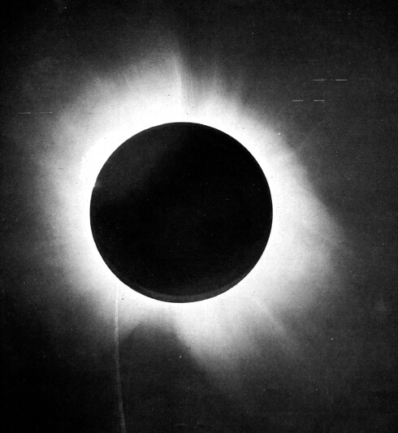

Special relativity left gravity out: Newton's attraction acted instantly, and in the 1905 theory nothing could outrun light. Between 1907 and 1915 **[Albert Einstein](kloom:e/albert-einstein)** rebuilt gravity so that it was not a force at all but the shape of space and time: matter curves spacetime, and bodies move along the straightest paths the curved spacetime allows. Every test put to this **general relativity** since has passed.

## The happiest thought

In 1907, still at the patent office in Bern, Einstein had what he later called his "happiest thought": a person falling freely from a roof would not feel their own weight. In a closed box, falling freely and floating in empty space cannot be told apart. This is the **equivalence principle**. It explains why all bodies fall alike, which Newton had simply assumed, and it predicts two things: clocks lower down in a gravitational field run slower, and light is bent by gravity.

Turning the principle into a theory took eight years and mathematics Einstein did not know. In 1912, back in Zurich, he asked his old classmate **[Marcel Grossmann](kloom:e/marcel-grossmann)**, by then a professor of mathematics, for help with the geometry of curved spaces built by Riemann, Ricci and Levi-Civita. Their _Entwurf_ ("outline") of 1913 described gravity by a curved metric, but its field equations were wrong.

## November 1915

In November 1915 he gave four papers to the Prussian Academy in Berlin, on the 4th, 11th, 18th and 25th, each correcting the last. On the 18th he showed that the theory explained a puzzle astronomers had carried since 1859: the perihelion of **[Mercury](kloom:e/mercury-planet)**, its closest point to the Sun, creeps round faster than the pull of the other planets allows. **Urbain Le Verrier** had put the excess at 38″ a century; Simon Newcomb revised it to 43″. Einstein's theory gave 43″, with nothing adjusted to fit. On the 25th he presented the final field equations.

The mathematician **[David Hilbert](kloom:e/david-hilbert)**, who had heard Einstein lecture in Göttingen that summer and wrote to him all November, submitted a paper on the 20th that derived gravitational equations from a single variational principle. Some have argued that Hilbert had the equations first. The printer's proofs of his paper, dated 6 December and studied only in the 1990s, show a theory that was not yet generally covariant and do not contain the final equations; Hilbert revised it before it appeared in March 1916. Leo Corry, Jürgen Renn and John Stachel, writing on the proofs in 1997, concluded that Hilbert had not anticipated Einstein. Friedwardt Winterberg answered that a missing piece of one page might have held them, a reading most historians reject. The consensus now gives the field equations to Einstein and the elegant action from which they follow to Hilbert.

## The eclipse of 1919

The theory predicted that starlight grazing the Sun is bent by 1.75″, twice what the equivalence principle alone gives. It can be seen only when the Moon hides the Sun. For the total eclipse of 29 May 1919 the Astronomer Royal, Frank Dyson, sent two expeditions: **[Arthur Eddington](kloom:e/arthur-eddington)** to the island of Príncipe, off West Africa, and two Greenwich astronomers to Sobral, in Brazil. On 6 November they announced that the stars had moved, and Einstein became famous.

The results were not clean, and the story has been told two ways. Clouds spoiled most of Eddington's plates. At Sobral a small 4-inch lens gave 1.98″, while the main astrographic telescope gave 0.93″, near the smaller prediction, and was set aside because its images were blurred. In 1980 the philosophers John Earman and Clark Glymour argued that the discarded plates were dropped because they gave the wrong answer. The historian Daniel Kennefick points to a 1979 remeasurement of the Sobral plates, which put the astrographic result at 1.55″ and supported the published conclusion. Only radio measurements from the late 1960s settled the value precisely.

| Deflection at the limb             | Seconds of arc |
| ---------------------------------- | -------------: |
| Half value (no curvature of space) |           0.87 |
| Einstein's prediction, 1915        |           1.75 |
| Sobral, 4-inch lens, 1919          |           1.98 |
| Príncipe, 1919                     |           1.61 |
| Sobral, astrographic, 1919         |           0.93 |
| Sobral, astrographic, remeasured   |           1.55 |

The same bending, by a whole cluster of galaxies rather than one star, is the gravitational lens through which telescopes now see the faintest galaxies.

## Clocks

Einstein's slower clocks were the hardest prediction to test. In 1959 Robert Pound and Glen Rebka proposed to measure them in a tower at Harvard, 22.5 metres tall, using the sharp gamma-ray line of iron-57. The **[Pound–Rebka experiment](kloom:e/pound-rebka-experiment)**, published in 1960, found the frequency shift over that height, two and a half parts in 10¹⁵, and matched the prediction to within about ten per cent.

Today the effect is engineering. A clock in a **[GPS](kloom:e/global-positioning-system)** satellite, far above the ground, runs fast because it sits higher in the Earth's gravity and slow because it moves; gravity wins. Neil Ashby's figures put the net gain at 4.4647 parts in 10¹⁰, which works out (the arithmetic is ours) to about 38.6 microseconds a day. Each satellite clock is set before launch to tick at 10.22999999543 MHz rather than 10.23. The laser reflector that **[Apollo 11](kloom:e/apollo-11)** left on the Moon in July 1969, ranged ever since, shows that the Earth and the Moon fall towards the Sun alike, as the equivalence principle says they must.

Solved for a single star, Einstein's equations held something he did not believe in: a region from which not even light can escape, the subject of the next frame, **black holes**.
