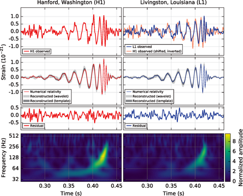
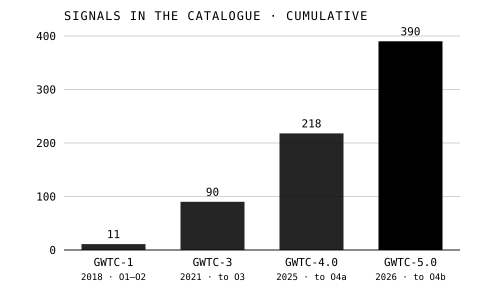

A gravitational wave is a ripple in spacetime itself, spreading from moving masses at the speed of light. As one passes, it stretches space one way and squeezes it the other, by an amount so small that Einstein, who predicted the waves in 1916, doubted anyone would ever measure it, and for a time decided the waves did not exist at all. At 09:50:45 UTC on 14 September 2015, two detectors in the United States measured one.

## Were they real?

Einstein found the waves in 1916 in an approximate form of his equations, and worked out how much energy an orbiting pair of masses should lose to them. In 1936, with Nathan Rosen, he decided they were an artefact of the approximation and submitted a paper to _Physical Review_ saying so. The journal's anonymous referee, Howard Percy Robertson, found the mistake. Einstein answered angrily that he saw no reason to address the referee's "erroneous" opinion, then accepted the objection when Leopold Infeld brought it to him, and published a corrected version.

The doubt outlived him. At the conference on gravitation in Chapel Hill, North Carolina, in January 1957, Felix Pirani showed how a passing wave would move free particles relative to one another. **[Richard Feynman](kloom:e/richard-feynman)**, who was there, turned that into the _sticky bead argument_: two beads on a rigid rod, one fixed and one free to slide with a little friction. The wave moves the free bead back and forth, but the rod's atoms hold it at its length, so the bead rubs, and "by friction make[s] heat". A wave that can heat something carries energy, so it is real. He recalled being surprised to find a whole day given to the question and the "experts" confused. Hermann Bondi published a version soon after, and the argument is often credited to him.

In the 1960s Joseph Weber built the first detectors, metal cylinders that a passing wave should set ringing. In 1969 he announced that they had rung. Nobody else's bars did, and by the 1970s his claims were largely discredited.

## A clock in orbit

The first evidence came from the sky. In 1974 Russell Hulse and Joseph Taylor, using the 305-metre dish at Arecibo in Puerto Rico, found a pulsar in a binary system: the **[Hulse–Taylor pulsar](kloom:e/hulse-taylor-pulsar)**, a neutron star spinning 17 times a second in a 7.75-hour orbit round another neutron star. Its pulses are a clock, and over the years the clock showed the orbit shrinking as the pair lost energy. In 2016, from 35 years of timing, Joel Weisberg and Yuping Huang put the observed decay at 0.9983 ± 0.0016 times what general relativity predicts. Hulse and Taylor shared the 1993 Nobel Prize in Physics.

## Hearing it

**[LIGO](kloom:e/ligo)**, the Laser Interferometer Gravitational-Wave Observatory, has two detectors 3,002 km apart, at Hanford in Washington and Livingston in Louisiana. Each is an interferometer of the kind Michelson built (the frame on **Michelson and Morley** tells that story) with arms 4 km long: laser light runs up and down both arms and is recombined, and a wave that lengthens one arm while shortening the other changes how the two beams meet. The plate draws the principle, hugely exaggerated. Built by Caltech and MIT with money from the National Science Foundation, it ran from 2002 to 2010 and found nothing, and was rebuilt as Advanced LIGO.

Advanced LIGO was still in an engineering run, three days before its first formal observing run, when the signal now called **[GW150914](kloom:e/first-observation-of-gravitational-waves)** arrived, at Livingston seven milliseconds before Hanford. It rose in a fifth of a second from 35 to 250 cycles a second, a "chirp", with a peak strain of 1.0 × 10⁻²¹. It matched the waveform general relativity gives for two black holes, of 36 and 29 Suns, spiralling together into one of 62. The missing three Suns' worth of mass left as gravitational waves. The discovery was announced on 11 February 2016, and in 2017 **Rainer Weiss**, **[Kip Thorne](kloom:e/kip-thorne)** and Barry Barish won the Nobel Prize for it.

On 17 August 2017, with Virgo in Italy now listening too, **[GW170817](kloom:e/gw170817)** lasted about a hundred seconds: two neutron stars merging about 40 megaparsecs, some 130 million light-years, away. A burst of gamma rays reached the Fermi satellite 1.7 seconds after the merger, which ties the speed of gravity to the speed of light to within a few parts in 10¹⁵. Eleven hours later telescopes found the glow of the debris in the galaxy NGC 4993, a **[kilonova](kloom:e/kilonova)**, powered by freshly made heavy elements; such mergers are now thought to be the main source of the gold and platinum in the universe. Some seventy observatories watched it.

## The catalogue

As of 29 September 2026, the most recent catalogue from the LIGO, Virgo and KAGRA collaborations, GWTC-5.0, published on 26 May 2026, holds **390** signals, counting those more likely than not to be astrophysical. It runs to 28 January 2025. The last part of the fourth observing run, which ended on 18 November 2025, found another 68 candidates, still being analysed when GWTC-5.0 appeared.

| Catalogue | Released | Runs covered             | Signals |
| --------- | -------- | ------------------------ | ------: |
| GWTC-1    | 2018     | O1–O2 (2015–17)          |      11 |
| GWTC-3    | 2021     | to the end of O3 (2020)  |      90 |
| GWTC-4.0  | 2025     | to the end of O4a (2024) |     218 |
| GWTC-5.0  | 2026     | to the end of O4b (2025) |     390 |

Gravity is the one force the quantum has not absorbed. The other revolution that began in 1900 is where the next part of the story goes: **the quantum**.
