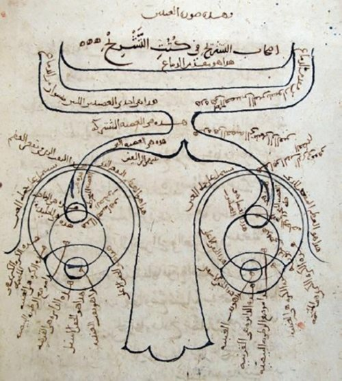

The reader in [Cairo](kloom:e/cairo) who admired the Almagest and doubted it was **[Ibn
al-Haytham](kloom:e/ibn-al-haytham)**, born in Basra around 965 and known to Latin Europe as Alhacen,
later Alhazen. He wrote on geometry, number and astronomy, but the work that
outlived him was about seeing: the _Kitāb al-Manāẓir_, the [_Book of
Optics_](kloom:e/book-of-optics), seven books written, by the usual dating, between 1011 and 1021. It
asked what happens when we look at something, and answered with experiments
and geometry together.

## A story from Cairo

In a story first told two centuries after him, he came to Egypt offering
the Fatimid caliph **al-Hakim** a scheme to regulate the Nile. Travelling
upriver, he saw that it could not work and said so. To escape a ruler known
for his cruelty he feigned madness, and was kept in his house until
al-Hakim died in 1021. The versions disagree in their details; the
historian A. I. Sabra judged it a story "which may well be true". Afterwards
he lived beside the Azhar Mosque in Cairo, teaching and earning his keep by
copying Arabic translations of Greek classics, [Euclid](kloom:e/euclid)'s _Elements_ and the
Almagest among them.

## Light comes in

Two ancient accounts of vision were on offer. **Euclid** and [Ptolemy](kloom:e/ptolemy) had the
eye send out rays that feel their way to what it sees: the _emission_
theory, which suited geometry, since a cone of rays from the eye explains
perspective. Aristotle's followers had something pass from the object into
the eye instead, but gave it no geometry. Ibn al-Haytham argued against
emission. Looking at the Sun hurts the eye, and it is hard to believe that
the eye reaches the stars
the instant the eyelids open. Following al-Kindi, he took every point of a
lit body to send out light and colour along every straight line, and so
into the eye.

That raised its own problem. If every point of an object sends rays to every
part of the eye, the picture should be a blur. His answer was that we see
only by the ray that meets the eye's surface at right angles, one from each
point, making a cone with its tip inside the eye; oblique rays are refracted
and weakened. It was wrong in detail, but no theory of its day was so
complete. It joined Euclid's geometry, Galen's anatomy of the eye and
Aristotle's inward-travelling forms into one account.

## The dark room

The plate draws one of his arguments that light and colour do not mingle in
the air. Set several candles in different places before a small opening
into a dark room, with a white wall inside facing it. Each candle throws its
own spot on the wall, on the straight line from its flame through the
opening, so the spots come out in reverse order. Shield one candle and only
its spot goes out; lift the shield and it returns. This is the [_camera
obscura_](kloom:e/camera-obscura), known before him in China and to Aristotle's school. Ibn
al-Haytham gave the first clear analysis of it, and in a separate essay used
one to watch the crescent of a partly eclipsed Sun, varying the size and
shape of the hole to see what changed.

That habit, testing a claim by changing one condition at a time, runs
through the book. Book VII measures refraction with an instrument adapted
from one of Ptolemy's, and explains the bending by supposing that light is a
motion that goes more slowly in denser bodies. He did not find the law of
refraction; Sabra judged that he was not looking for one, and he noted that
the angles do not keep a constant ratio.

## Doubts

Later, between about 1025 and 1028, he wrote _al-Shukūk ʿalā Baṭlamyūs_,
the _Doubts concerning Ptolemy_. It set the Almagest, the _Planetary
Hypotheses_ and the _Optics_ against each other and found them
contradicting themselves, above all over the **[equant](kloom:e/equant)**, a point about which
a body turns evenly although it is not the centre of its circle. "Ptolemy
assumed an arrangement that cannot exist," he wrote: to imagine a circle in
the heavens does not make a planet move on it. In the same book, in Sabra's
translation, he said what a reader owes a book: the seeker after truth is
the one who "suspects his faith" in the ancients, and should "make himself
an enemy of all that he reads", and of himself too. He meant to repair
Ptolemy, not to replace him: a late model of the planets, which survives
only in part, kept the Earth at rest and the planets on circles, but did
without the equant.

## Alhazen in Latin

The _Optics_ was put into Latin as _De aspectibus_ by an unknown translator
in the late twelfth or early thirteenth century. Roger Bacon, Witelo and
John Pecham built the medieval science of _perspectiva_ on it, and Chaucer
named him beside Witelo as an authority on strange mirrors. In 1572
**[Friedrich Risner](kloom:e/friedrich-risner)** printed it in Basel, and Sabra credits that edition
with bringing it to Kepler, Descartes and Huygens. **Kepler**'s optics of
1604 was titled a supplement to Witelo, and it moved the image from the lens
to the retina inside the framework Alhacen had built.

While optics was finding its method, motion was still Aristotle's. The
next attempt to measure it came in fourteenth-century Oxford, with **the
Merton calculators**.
