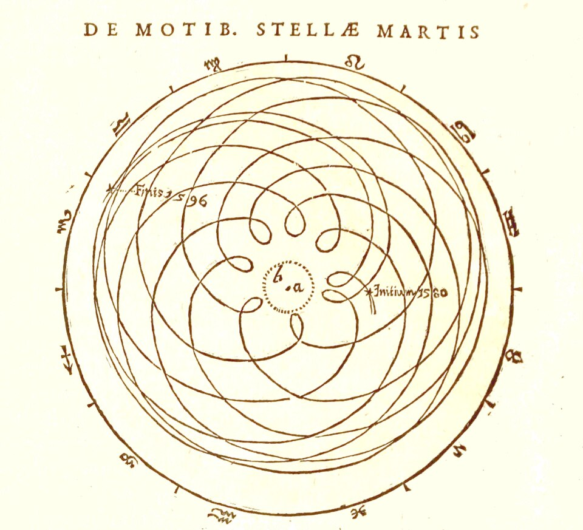
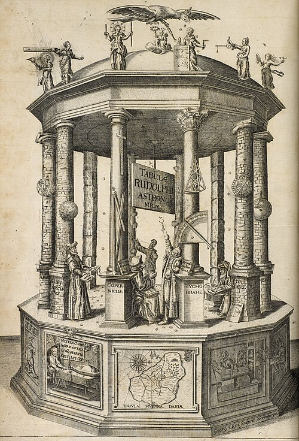

On 1 January 1600 a mathematics teacher from Graz set out for Prague, to
work for the best observer in Europe. **[Johannes Kepler](kloom:e/johannes-kepler)** was a Copernican
with a theory to test. **[Tycho Brahe](kloom:e/tycho-brahe)** had more than twenty years of
measurements of the planets, made with the naked eye at his observatory on
the island of Hven, to an accuracy approaching one minute of arc. Neither
could do the other's work. Between them they ended the circle, which had
ruled astronomy since Plato: the book of 1609 that did it is subtitled
"from the observations of the noble Tycho Brahe".

Kepler's theory came from his first book, the _Mysterium Cosmographicum_
of 1596. It fitted the six planets' orbits between the five [Platonic
solids](kloom:e/platonic-solid), nested one inside another, and matched the sizes Copernicus had
found to within about ten per cent. He hoped better observations would
make the fit exact, and sent the book to Tycho, who was looking for a
mathematical assistant. Tycho set him to work on Mars, and died on 24
October 1601. Two days later Kepler was imperial mathematician to the
Emperor Rudolf II, with Tycho's observations in his hands.

## My war with Mars

Mars was the hard case. Its orbit is the most eccentric of any planet but
Mercury, and it had defeated Tycho's own assistants. Kepler first built a
model of the old kind, a circle with an equant, and fitted it to all of
Tycho's twelve observations of Mars opposite the Sun to within two minutes of arc.
Then he tested it on the planet's distances, and it failed: moved to agree
with them, it put Mars eight minutes of arc from where Tycho had seen it,
about a quarter of the Moon's width by our reckoning. That was more than
Tycho's errors could explain, and Kepler would not ignore it: "these eight
minutes alone will lead us along a path to the reform of the whole of
Astronomy."

The work filled nearly a thousand surviving folio sheets of arithmetic, and
he called it "my war with Mars". He found the second of his laws first: a
planet moves faster near the Sun, so that the line from the Sun to it
sweeps out equal areas in equal times. The shape took some forty more
attempts, most of them ovals, until late in 1604 he tried an ellipse, with
the Sun at one focus. He had set the ellipse aside at first, thinking it a
different curve from the one his figures gave. "Ah, what a foolish bird I
have been!" The book, [_Astronomia nova_](kloom:e/astronomia-nova), was finished in 1607 and printed in
Heidelberg in 1609. For the first time a planet's path was a curve in space,
driven by a force from the Sun, not a combination of circles.

The plate draws the result for Mars: the ellipse, so nearly a circle that
the difference is not visible, and the Sun well off its center. Two sectors
cut in equal times, one at each end, have equal areas. The empty focus sits
about where Ptolemy's equant had sat, which is part of why the equant had worked
so well: the astronomer Ismaël Bullialdus later kept the ellipse and
replaced the area law with even motion about the empty focus.

## The harmony of the world

What are now called [Kepler's laws](kloom:e/keplers-laws-of-planetary-motion) were not complete until the third, and
Kepler found that one while he was writing a book about music and geometry,
the [_Harmonices Mundi_](kloom:e/harmonice-mundi) of 1619. In his own telling, the idea came on 8
March 1618, failed a calculation, and came back on 15 May. "At first I
believed I was dreaming." For any two planets, the squares of their periods
are as the cubes of their mean distances from the Sun.

| Planet  | Mean distance (AU) | Period (days) | Distance³ ÷ period² (10⁻⁶) |
| ------- | -----------------: | ------------: | -------------------------: |
| Mercury |              0.389 |         87.77 |                       7.64 |
| Venus   |              0.724 |        224.70 |                       7.52 |
| Earth   |              1.000 |        365.25 |                       7.50 |
| Mars    |              1.524 |        686.95 |                       7.50 |
| Jupiter |               5.20 |      4,332.62 |                       7.49 |
| Saturn  |              9.510 |      10,759.2 |                       7.43 |

The table gives the values Kepler worked with, as the Wikipedia article on
his laws reconstructs them. The last column is the same for every planet,
to within about three per cent. Kepler did not say why; the reason, a force
from the Sun falling off as the square of the distance, waited for Newton
and his contemporaries in the 1660s and after.

## Tables and logarithms

His official task was the tables of the planets that Tycho had promised
the emperor. They needed endless multiplication. When Kepler met John
Napier's [logarithms](kloom:e/logarithm), in 1616 by his biographer J. V. Field's account and
1617 by Wikipedia's, his old teacher Michael Mästlin told him it was
unseemly for a mathematician to rejoice over an aid to calculation, and
unwise to trust a method nobody understood. Kepler wrote his own proof, from
Euclid, and his own tables.

The war came to him too. In 1626 the siege of Linz burned the print shop
where the tables were being set, and he moved the work to Ulm, paying for it
himself. The [_Rudolphine Tables_](kloom:e/rudolphine-tables) came out in September 1627, a thousand
copies, with 1,005 of Tycho's stars and tables of logarithms. They were
accurate for decades, as no tables had been, and that was an argument for
the laws: in 1631 Pierre Gassendi, on Kepler's prediction, saw Mercury
cross the Sun, the first such transit ever observed. Kepler died in
Regensburg in 1630, still trying to collect what the emperor owed him.

In 1610, while Kepler was between his first two laws and his third, a
professor at Padua turned a spyglass on the sky, and Kepler was the first
to vouch for what he saw.
