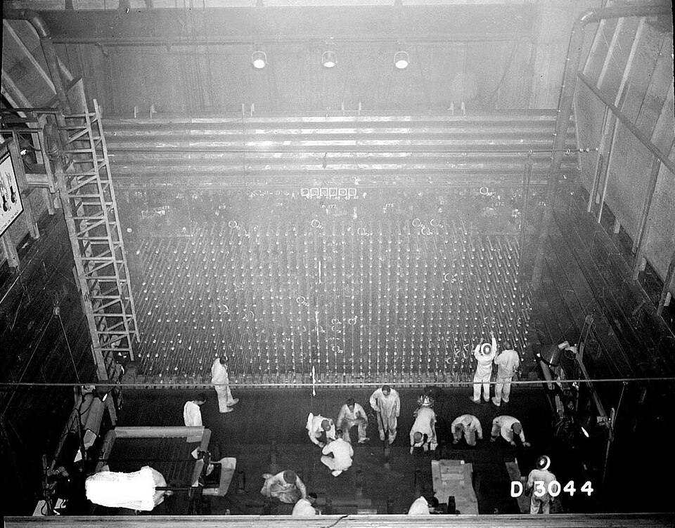

Fission made a bomb possible in principle, and the physicists who fled
Europe knew that German physicists knew it too. In July 1939 Leo Szilard
and Eugene Wigner drove out to Long Island to see **Albert Einstein**, who
had not thought of it: "Daran habe ich gar nicht gedacht." The letter that
Szilard drafted and Einstein signed, dated 2 August, warned President
Roosevelt that a chain reaction in a large mass of uranium might make
"extremely powerful bombs of a new type". The [Einstein–Szilard letter](kloom:e/einstein-szilard-letter)
reached Roosevelt on 11 October, and he set up a committee on uranium,
which moved slowly. The decisive push came from Britain: in
March 1940 Otto Frisch and Rudolf Peierls, refugees in Birmingham,
calculated that the critical mass of pure uranium-235 was not tons but of
the order of ten kilograms, small enough for an airplane.

In June 1942 the US Army Corps of Engineers took the program over, as the
Manhattan District, and on 23 September Brigadier General **Leslie Groves**
took command. The **[Manhattan Project](kloom:e/manhattan-project)**, as it came to be called, built
the first nuclear weapons with Britain and Canada, employed some 129,000
people at its peak in June 1944, and spent nearly two billion dollars.

## Two roads, and two factories

The physics set the shape of the project. Only uranium-235 splits readily
with slow neutrons, and it is 0.71 percent of natural uranium. One road to
a bomb was to separate it from uranium-238, chemically identical, by its
weight. At **Oak Ridge**, in Tennessee, the
project built electromagnetic separators, the calutrons of the Y-12 plant,
and a gaseous diffusion plant, K-25, half a mile long; by 1945 the
methods ran in series. The other road was Fermi's pile. A reactor turns
uranium-238 into a new element, plutonium, which could be separated by
chemistry. On the Columbia River in Washington, at the **[Hanford Site](kloom:e/hanford-site)**,
the B Reactor went critical in late September 1944 and made its first
plutonium on 6 November.

The factories were the project. By the end of 1945 more than four-fifths of
the money had gone to Oak Ridge and Hanford, most of it on construction.
The laboratory that designed the bombs cost less than a twentieth.

| Site or item                | $ millions, 1945 | Share |
| --------------------------- | ---------------: | ----: |
| Oak Ridge                   |            1,188 | 62.9% |
| Hanford                     |              390 | 20.6% |
| Special operating materials |              103 |  5.5% |
| Los Alamos                  |               74 |  3.9% |
| Research and development    |               70 |  3.7% |
| Government overhead         |               37 |  2.0% |
| Heavy water plants          |               27 |  1.4% |
| Total                       |            1,890 |       |

## The laboratory on the mesa

That laboratory, **[Los Alamos](kloom:e/los-alamos-national-laboratory)** in New Mexico, opened in the spring of 1943
under **[J. Robert Oppenheimer](kloom:e/j-robert-oppenheimer)**. Its physicists had to learn how fast
neutrons multiply in a lump of metal and how much of it would burn before
the bomb blew itself apart. The plate draws the
two designs they arrived at. In the _gun_, one piece of uranium-235 is
fired down a barrel into another, and together they are supercritical. It
was so simple that it was never tested before it was used. For plutonium
the gun failed: in April 1944 Emilio Segrè found that plutonium from a
reactor contained enough plutonium-240, which fissions spontaneously, to
start the chain before a gun could close the gap, and the bomb would fizzle.
The answer was _implosion_: a sphere of plutonium crushed from outside by
explosives shaped into 32 lenses, a problem in converging shock waves that
reorganized the whole laboratory in August 1944. Its hydrodynamics were
beyond hand calculation, and were run on IBM punched-card machines at Los
Alamos and on Harvard's Mark I.

The implosion design was tested at **[Trinity](kloom:e/trinity-nuclear-test)**, in the New Mexico desert, on
16 July 1945, and worked.

## Hiroshima and Nagasaki

A gun bomb, Little Boy, destroyed [Hiroshima](kloom:e/atomic-bombings-of-hiroshima-and-nagasaki) on 6 August 1945, and an
implosion bomb, Fat Man, Nagasaki on 9 August. Neither was efficient. Fat
Man fissioned about one kilogram of its 6.2 kilograms of plutonium. Little
Boy carried 64 kilograms of uranium; its yield, never measured directly,
has been estimated at anything from 12 to 16.6 kilotons, with 15 the usual
figure. By our own arithmetic, taking Fat Man's 21 kilotons per kilogram,
that is about seven-tenths of a kilogram fissioned, near one percent.

How many the bombs killed is not known exactly; records were lost and
methods differ. Estimates of the dead by the end of 1945 run from about 90,000 to 166,000 in
Hiroshima and 60,000 to 80,000 in Nagasaki, most of them civilians.

## The scientists afterwards

Some of the project's scientists had argued against using the bomb
without warning. The **[Franck Report](kloom:e/franck-report)**, written at Chicago in June 1945
under James Franck, largely by Eugene Rabinowitch, and signed by Szilard and
Glenn Seaborg among others, urged a demonstration before the eyes of the
United Nations, and predicted that secrecy would not last and that an arms
race would follow. A scientific panel of Oppenheimer, Fermi, Arthur Compton
and Ernest Lawrence saw no acceptable alternative to military use. A
petition Szilard circulated in July was signed by about seventy.

After the war many of them worked for civilian and international control.
They founded the _Bulletin of the Atomic Scientists_ in 1945; the
Atomic Energy Act of 1946 put American atomic work under a civilian
commission; a plan for international control, put to the United Nations in
1946, failed. Einstein, according to Linus Pauling, regretted signing the
letter, and in 1947 he told _Newsweek_ that had he known the Germans would
not succeed, he would have done nothing. The next bomb, already argued over
at Los Alamos, was Edward Teller's "Super", and its fuel was the Sun's:
fusion.
