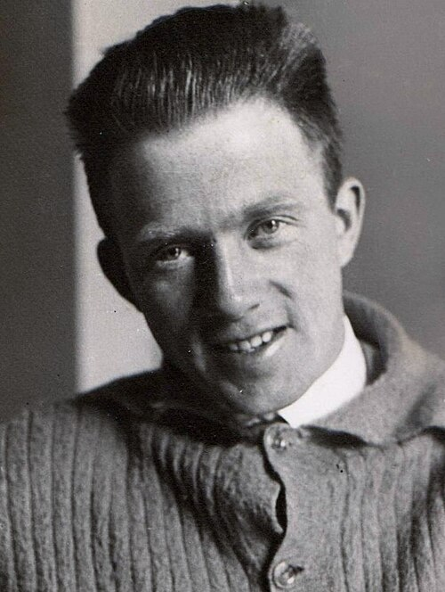

By the spring of 1925 the quantum theory of the atom was a patchwork. Bohr's
orbits gave the lines of hydrogen, and failed for helium; rules for the
brightness of spectral lines worked only for large orbits; each new
spectrum needed a new trick. In Göttingen **[Werner Heisenberg](kloom:e/werner-heisenberg)**, twenty-three
and assistant to **[Max Born](kloom:e/max-born)**, decided that the trouble lay in the orbits
themselves. No one had ever seen an electron go round a nucleus. What
anyone could measure was light: the frequencies of the lines an atom gives
out, and how bright each one is.

## The island, and the story of it

In early June, suffering from hay fever, Heisenberg went for about ten
days to [Heligoland](kloom:e/heligoland), a treeless island in the North Sea with almost no
pollen. In his memoir _Physics and Beyond_, written more than forty years
later, he tells of working late one night until it was clear that energy
was conserved in his new scheme, being too excited to sleep, and climbing
a rock at about three in the morning to watch the sun rise.

It is the founding story of quantum mechanics, and it rests on that one
telling. The historian **Ryan Dahn**, writing for the American Institute
of Physics in 2025, set it beside the letters Heisenberg wrote to **[Wolfgang
Pauli](kloom:e/wolfgang-pauli)** that June and July, which are full of doubt; it is likely that much
of the paper was written before and after the island, not on it. When it
was finished, Heisenberg called it a crazy paper, gave it to Born to judge
whether it was worth sending in, and went away. The _Zeitschrift für
Physik_ received it on 29 July 1925.

## Tables that do not commute

The paper's title promised a "quantum-theoretical reinterpretation" of
mechanics, the [_Umdeutung_](kloom:e/umdeutung-paper). Heisenberg kept Newton's equations but changed
what went into them. Position was no longer a number that changes along an
orbit. It became a table of numbers, one for each jump between two states
of the atom, labeled by both: an entry for the jump from state 3 to state
2, another for 2 to 1. Each entry oscillates at the frequency of the light
that jump gives out, and its square sets the brightness of the line.

To multiply two such tables he had to invent a rule, and the rule has a
strange property: the answer depends on the order. Position times momentum
is not momentum times position. Heisenberg was uneasy about it. The plate
draws what the rule is: a row of one table meets a column of the other,
and the jumps chain together, 3 to 1 then 1 to 2 making 3 to 2.

Born saw it after about a week. "Such quadratic arrays," he recalled in
his Nobel lecture of 1954, "are quite familiar to mathematicians and are called _matrices_."
He had learned matrix algebra as a student at Breslau, and physicists
scarcely used it. Working out Heisenberg's condition as matrices, he
found the equation at the heart of the theory: _pq_ − _qp_ = _h_/2π_i_,
where _p_ and _q_ are the matrices for momentum and position and _h_ is
Planck's constant.

## Four papers in five months

| Paper                                         | Received or published   | What it added                                    |
| --------------------------------------------- | ----------------------- | ------------------------------------------------ |
| Heisenberg, _Zeitschrift für Physik_          | 29 July 1925            | observable quantities, a new product             |
| Born and Jordan, _Zeitschrift für Physik_     | 27 September 1925       | the product as matrices; _pq_ − _qp_ = _h_/2π_i_ |
| Dirac, _Proceedings of the Royal Society_     | published December 1925 | the same laws from classical Poisson brackets    |
| Born, Heisenberg and Jordan, the same journal | 16 November 1925        | systems of many dimensions; the full theory      |

Born worked it out with his former student **[Pascual Jordan](kloom:e/pascual-jordan)**, who had
helped Richard Courant and David Hilbert write a book on the mathematics
of physics; their paper followed Heisenberg's by sixty days. The paper of
all three, the _Dreimännerarbeit_, extended the theory to atoms of more than
one dimension and set out what became [matrix mechanics](kloom:e/matrix-mechanics).

In Cambridge, **[Paul Dirac](kloom:e/paul-dirac)**, a research student, was sent a proof of
Heisenberg's paper by his supervisor, Ralph Fowler, at the end of the
summer. Weeks later he saw that the difference _uv_ − _vu_ had the same
structure as a quantity from nineteenth-century mechanics, the Poisson
bracket, and built the quantum laws from classical ones by that
correspondence alone. His paper appeared in December 1925.

The test that mattered was hydrogen. Early in 1926 Pauli, using matrices
alone, derived its spectrum, the result Bohr's orbits had been built to
give, with no orbit anywhere in the calculation.

## A prize for one

Einstein nominated Heisenberg, Born and Jordan for the Nobel Prize in 1928. In November 1933 it went to Heisenberg alone, "for the creation of
quantum mechanics". He wrote to Born of a "bad conscience" that he had
been honored for work done in Göttingen "in collaboration – you, Jordan
and I". Born received his own in 1954, for his reading of the wave function,
which belongs to the next frame. Jordan, who joined the Nazi party in
1933, never did.

Matrix mechanics was hard to use and harder to picture, and it had hardly
been set out when a rival appeared that anyone trained in waves could
follow: **Schrödinger's** wave mechanics.
