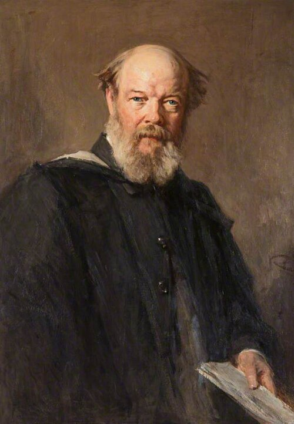

In December 1867 **[Peter Guthrie Tait](kloom:e/peter-guthrie-tait)**, professor of natural philosophy
at Edinburgh, was writing a short history of thermodynamics and asked his
old school friend **[James Clerk Maxwell](kloom:e/james-clerk-maxwell)** for hints. Maxwell's reply of 11
December offered to "pick a hole" in the second law, and the hole he
picked has not been closed to everyone's satisfaction since. He imagined a
creature small and quick enough to sort molecules, and showed that it
could make heat run uphill without doing any work. Thomson, later [Lord
Kelvin](kloom:e/lord-kelvin), called it a demon, and the name stuck.

## A hole in the law

Maxwell had spent the 1860s on the **[kinetic theory of gases](kloom:e/kinetic-theory-of-gases)**: the idea
that a gas is a crowd of molecules flying about and colliding, its
pressure their blows on the walls and its temperature their energy of
motion. His own contribution, worked out in 1859 and printed in 1860, was
that the molecules of a gas at one temperature do not share one speed.
Collisions spread them over every speed, fast and slow, around an average,
in a proportion he calculated: Wikipedia's article on the kinetic theory
calls it the first statistical law in physics.

The letter used that spread. Take two vessels, A and B, joined by a hole in
the wall between them. "Now conceive a finite being who knows the paths
and velocities of all the molecules by simple inspection but who can do no
work except open and close a hole in the diaphragm by means of a slide
without mass." Let it pass the slow molecules one way and the fast ones
the other, and keep the slide shut for the rest. The numbers on each side
stay the same, but the energy moves: "the hot system has got hotter and
the cold colder and yet no work has been done, only the intelligence of a
very observant and neat-fingered being has been employed." Opening and
closing a massless slide costs nothing, so the second law, in Clausius's
form, is broken. Maxwell ended the thought: "Only we can't, not being
clever enough."

The plate draws the vessel and the door, with the fast molecules gathering
on one side.

## In print, and named

The being went public at the end of Maxwell's textbook _Theory of Heat_,
in a section headed "Limitation of the Second Law of Thermodynamics". The
law, he wrote, "is undoubtedly true as long as we can deal with bodies
only in mass, and have no power of perceiving or handling the separate
molecules of which they are made up." The book's title page says London,
1871; Wikipedia's article on the demon dates it 1872. Later editions
followed through the 1870s, so both dates may be met.

The name was Thomson's. In a paper of February 1874 on the kinetic theory
of the dissipation of energy he wrote of an "army of Maxwell's 'intelligent
demons'" that could stop heat spreading along a bar, and defined a demon
in a footnote as "an intelligent being endowed with free-will and fine
enough tactile and perceptive organization" to observe and move single
molecules. Maxwell replied with a catechism for Tait, "Concerning Demons":

| Question in Maxwell's catechism   | His answer                                                                    |
| --------------------------------- | ----------------------------------------------------------------------------- |
| Who gave them this name?          | Thomson                                                                       |
| What were they by nature?         | Very small but lively beings, able to open and shut frictionless valves       |
| What was their chief end?         | To show that the second law has only a statistical certainty                  |
| Is inequality of temperature all? | No: less intelligent demons make a difference of pressure, by one-way traffic |

"This reduces the demon to a valve," he added. "Call him no more a demon
but a valve."

## A statistical law

The chief end is the point. Clausius's second law had been a law of
engines, as firm as the conservation of energy. [Maxwell's demon](kloom:e/maxwells-demon) says it is
a different kind of law: not a rule that each molecule obeys, but a
statement about what crowds of them almost always do. It holds because we
handle molecules only in immense numbers, and in the book Maxwell called the method
that treats them so "the statistical method of calculation", which gives
up following each molecule in its course.

Thomson's pencil note on the 1867 letter points the same way. Newton's
laws run equally well backwards, and he wrote that "another way is to
reverse the motion of every particle of the Universe". If the laws of
molecules do not care which way time runs, why does heat? That question
went to Vienna, where **[Ludwig Boltzmann](kloom:e/ludwig-boltzmann)** tried to prove the law from
the laws of motion, and it is the subject of the next frame on the trail,
Boltzmann's statistical entropy. Whether a demon could really beat the law
waited sixty years, for Szilard's one-molecule engine.
