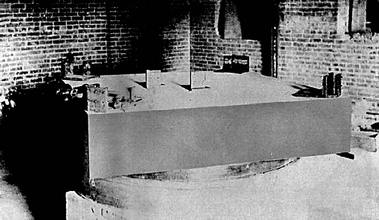

In the summer of 1887, in the basement of a stone dormitory in Cleveland,
Ohio, two American scientists set out to measure how fast the Earth moves
through the medium that was supposed to carry light. **[Albert Michelson](kloom:e/albert-a-michelson)**,
a physicist at the Case School of Applied Science, and **[Edward Morley](kloom:e/edward-w-morley)**, a
chemist at Western Reserve University next door, had built the most
sensitive instrument for comparing lengths that had ever existed. It found
nothing, and the nothing it found became the most famous result in
nineteenth-century physics: the **[Michelson–Morley experiment](kloom:e/michelson-morley-experiment)**.

## A medium for light

By the middle of the century light was known to be a wave, and a wave
seemed to need something to wave in, as sound needs air. That something
was the **[luminiferous ether](kloom:e/luminiferous-aether)**: a medium filling all space, even a vacuum,
stiff enough to carry vibrations at enormous speed and thin enough that the
planets moved through it without drag. When Maxwell showed that light is an
electromagnetic wave, his equations were read as describing strains in the
ether.

If the ether stood still and the Earth moved through it at some 30
kilometers a second on its orbit, a laboratory should feel an ether wind,
and light should take longer to cross it in one direction than another.
The difference was tiny: Earth's speed is about a ten-thousandth of
light's, and in a round trip the effect goes as the square of that ratio.
Maxwell had pointed out in 1878 that only an experiment sensitive to such
second-order effects could hope to see it, and a letter of his that reached
Michelson in 1879 may have set him to work.

## The interferometer

Michelson's answer, first tried in Germany in 1881, was the
**[interferometer](kloom:e/michelson-interferometer)**. A half-silvered plate splits a beam of light in two;
the halves run out along arms at right angles, are reflected back, and
recombine in an eyepiece, where they make a pattern of light and dark
bands, or fringes. If one half is delayed by a fraction of a wavelength
relative to the other, the fringes shift sideways by that fraction. Turning
the instrument should swing an ether wind from one arm to the other.

The 1881 attempt was inconclusive. In 1887 he and Morley rebuilt it. The
optics were mounted on a slab of sandstone about 1.5 meters square and 30
centimeters thick, resting on a wooden float in a trough of mercury, so
that it could be turned slowly and smoothly, once every six minutes,
without being stopped and strained. Mirrors at the corners folded each arm
so that the light traveled about eleven meters, which should have given a
shift of 0.4 of a fringe.

They observed at noon and in the evening on four days in July. In the
paper they published that November, in the _American Journal of Science_,
the shift was "certainly less than the twentieth part" of what was
expected, "and probably less than the fortieth part". Since the effect goes
as the square of the speed, the Earth's motion through the ether was
probably less than a sixth of its orbital speed. Morley tried again
with Dayton Miller from 1902 to 1904, and again found nothing. The plate
draws the instrument in plan, its folded paths simplified, and the curve
they expected against the band the paper allows.

## Explaining nothing

The result was hard to believe, and no one simply concluded that the ether
did not exist. In 1889 the Irish physicist **[George FitzGerald](kloom:e/george-francis-fitzgerald)** proposed
that a body moving through the ether shrinks along its direction of motion,
by just the amount needed to hide the difference; **[Hendrik Lorentz](kloom:e/hendrik-lorentz)**
reached the same idea independently in 1892. The _FitzGerald–Lorentz
contraction_ looked like an ad hoc patch, and Lorentz spent years building
an electrodynamics in which it followed.

In 1905 Einstein's special relativity gave the contraction a reason and
made the ether unnecessary; the frame on special relativity tells how. Whether the experiment
led him there is disputed. His 1905 paper does not mention it, and in later
life he wrote that it had no considerable influence on him and that he
could not remember whether he knew of it. But a typed-up shorthand record of a
short talk he gave at a school in Chicago in 1921, published in his
collected papers in 2009, has him say that as a student he learned that such
experiments had been made, "in particular by your compatriot, Michelson";
the historian Jeroen van Dongen reads it as evidence that he knew of the
result before 1905. Most historians since Gerald Holton give it an indirect part.

Michelson himself took his instrument on to other work. In 1892–93, at the
International Bureau of Weights and Measures, he measured the meter in
wavelengths of the red light of cadmium, the first step towards a meter
defined by light. In 1907 he became the first American to win a Nobel Prize
in a science. His interferometer, grown to arms four kilometers long, is
the instrument of **[LIGO](kloom:e/ligo)**, whose story is the frame on gravitational
waves.

Other instruments were about to show things no classical theory had room
for, starting with a glow on a screen in Würzburg.
