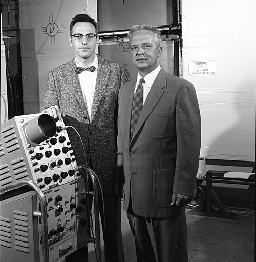
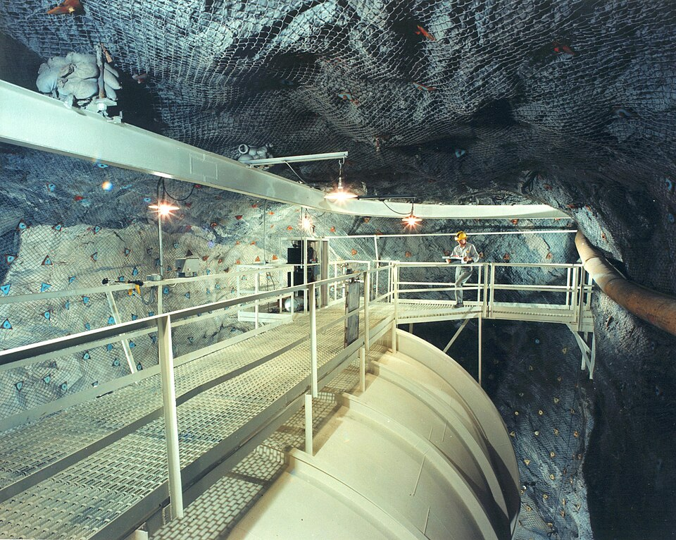

In **[beta decay](kloom:e/beta-decay)** a nucleus throws out an electron and becomes the next
element up. If that were all, every electron from a given kind of nucleus
should leave with the same energy, the difference in mass between the
nucleus before and after. In 1914 James Chadwick, using a magnetic
spectrometer and one of Hans Geiger's new counters, found that it did not:
the electrons came out with every energy from almost nothing up to that
limit. Charles Ellis and his colleagues confirmed it through the 1920s.
Energy seemed to go missing, and Niels Bohr was ready to give up its
conservation in the nucleus.

## A desperate remedy

**[Wolfgang Pauli](kloom:e/wolfgang-pauli)** would not. On 4 December 1930 he wrote from Zurich to a
meeting of physicists in Tübingen, "Dear Radioactive Ladies and
Gentlemen", proposing what he called a desperate remedy: a neutral
particle, light, with spin one-half, emitted with the electron so that
the two together always carry the same energy. Its mass, he guessed, was
no more than a hundredth of the proton's. He called it a "neutron", and
asked to be excused from coming in person because of a ball in Zurich on
the night of 6 December. The plate shows what his particle explained:
the smooth curve of the electrons' energies, and the single line they
would make if the electron flew off alone. With three bodies, the
momenta close a triangle, and the energy can be shared in any proportion.

James Chadwick took the name "neutron" for a heavy neutral particle in
1932, and in Rome **[Enrico Fermi](kloom:e/enrico-fermi)**'s group called Pauli's the
**[neutrino](kloom:e/neutrino)**, the little neutral one. In 1933 Fermi turned it into a
theory: a neutron in the nucleus changes into a proton, creating an
electron and a neutrino on the spot. The story
goes that _Nature_ turned it down as "too remote from reality to be of
interest to the reader"; Fermi's biographer David Schwartz doubts the
later claim that the journal called this its great blunder. It appeared
in Italian and German in 1933 and 1934. In 1934 Hans Bethe and Rudolf
Peierls calculated that a neutrino could pass through the Earth without
touching anything.

## Project Poltergeist

**[Clyde Cowan](kloom:e/clyde-cowan)** and **[Frederick Reines](kloom:e/frederick-reines)** of Los Alamos first planned to
catch neutrinos from a nuclear bomb, with a detector dropped down a shaft
at the moment of the blast. They used a reactor instead. After a first
attempt at Hanford in 1953, they moved in late 1955 to the Savannah River
Plant in South Carolina, 11 m from a reactor and 12 m underground. Tanks
holding about 200 liters of water with cadmium chloride dissolved in it
sat between tanks of liquid scintillator watched by photomultiplier tubes.
An antineutrino striking a proton in the water makes a positron and a
neutron; the positron annihilates at once, and the cadmium swallows the
neutron a few microseconds later, each with a flash of gamma rays. The two
in sequence were the signature. They counted about three an hour, and
fewer with the reactor off.

On 14 June 1956 they telegraphed Pauli that the neutrino had been found,
and their report appeared in _Science_ on 20 July. Reines shared the
Nobel Prize in 1995; Cowan had died in 1974.

## The missing sunlight

The Sun's fusion should pour out neutrinos. From the late 1960s
**[Raymond Davis Jr.](kloom:e/raymond-davis-jr)** counted them in a tank of 100,000 gallons of
dry-cleaning fluid, 1,478 m down the Homestake gold mine in South Dakota:
a neutrino striking chlorine-37 makes argon-37, and every few weeks he
flushed out the few dozen argon atoms and counted them. John Bahcall
calculated what the Sun should give. Davis found about a third of it,
year after year, from 1970 to 1994.

The answer had been suggested by Bruno Pontecorvo: neutrinos come in
kinds, or _flavors_ (a muon neutrino was found in 1962), and if they
have mass they can change from one to another in flight. In 1998
**Super-Kamiokande**, 50,000 tonnes of pure water under a Japanese
mountain, found that muon neutrinos made by cosmic rays arriving from
below, through 13,000 km of Earth, were fewer than those from above,
which had come about 15 km. By our reckoning from the asymmetry the paper
reports for its higher-energy events, it saw about half as many going up. Reines was one of its authors.

| Sudbury, 2002: solar neutrinos, millions per cm² per second | Flux |
| ----------------------------------------------------------- | ---: |
| electron neutrinos only                                     | 1.76 |
| muon and tau neutrinos                                      | 3.41 |
| all flavors together                                        | 5.09 |

The Sudbury Neutrino Observatory in Canada, 1,000 tonnes of heavy water
2,100 m down a nickel mine, could count every flavor at once. In 2001
and 2002 it found the Sun's total right, and only about a third of it
still electron neutrinos, by our arithmetic. The Sun had been making the
neutrinos all along; many arrived as another kind. For those high-energy
neutrinos the change happens mostly inside the Sun, by the _MSW effect_,
so the Nobel committee's word "oscillation" for Sudbury's result has
been called a mistake. Either way, **[neutrino oscillation](kloom:e/neutrino-oscillation)** needs mass, which
the Standard Model had set at zero. The mass is tiny: the KATRIN
experiment in Germany has put the electron antineutrino's below 0.45 eV,
under a millionth of the electron's.

Pauli's particle was the first the model needed; the next were the
pieces of the proton.
