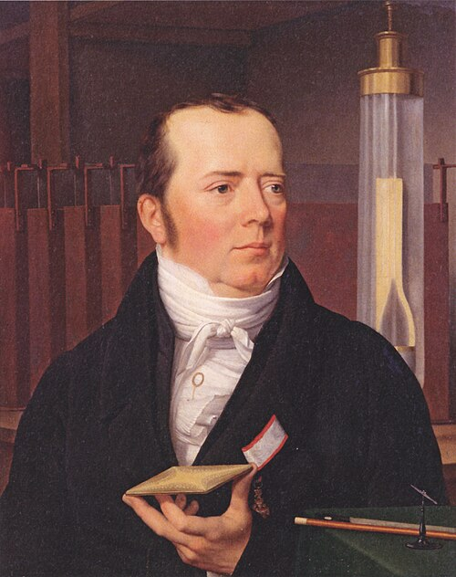

In the spring of 1820, lecturing at the University of Copenhagen,
**[Hans Christian Ørsted](kloom:e/hans-christian-orsted)** passed the current from a small battery through a
thin platinum wire laid over a compass, and the needle moved. The movement
was slight and the audience was not impressed. It was the first evidence
that electricity and magnetism are two faces of one thing, and within six
months it had remade physics across Europe.

## A connection looked for

Ørsted was not lucky, or not only. He was a pharmacist's son from the
island of Langeland who had taken his doctorate on Kant, and he believed,
as he wrote later, "that all phenomena are produced by the same original
power". In Germany in 1801 he had become the friend of [Johann Wilhelm
Ritter](kloom:e/johann-wilhelm-ritter), a physicist who was sure that electricity and magnetism were
linked, and in a book of 1812 Ørsted suggested that magnetism was produced
by electrical forces. He had been looking for the effect since at least
1818, perhaps since 1807, when he announced that he meant to.
Others may have seen a hint before him. Gian Domenico Romagnosi, a
jurist in Trento, reported in 1802 that a voltaic pile deflected a
compass needle; whether he saw Ørsted's effect is disputed, since his
arrangement seems to have acted through static charge, not a current.

The physics of the day said he would not find it. In the 1780s [Charles-Augustin
de Coulomb](kloom:e/charles-augustin-de-coulomb) had measured electric and magnetic forces with his torsion
balance, in a series of memoirs on both, and his work was taken to prove
that the two could not act on each other. [Ampère](kloom:e/andre-marie-ampere), looking back in February 1821, blamed
Coulomb's view for the fact that nobody had tried the experiment in twenty
years of batteries: "we believed that this hypothesis was a fact".

## The lecture

Ørsted told the story himself, in the third person, in an article for the
_Edinburgh Encyclopaedia_ of 1830. He had planned the experiment for a
lecture, "some accident" kept him from trying it beforehand, and he meant
to put it off, "yet during the lecture, the probability of its success
appeared stronger, so that he made the first experiment in the presence of
the audience. The magnetical needle, though included in a box, was
disturbed; but as the effect was very feeble, and must, before its law was
discovered, seem very irregular, the experiment made no strong impression
on the audience."

The tellings differ. The version most often repeated, that he found the
effect by chance while showing something else, is called a myth by modern
accounts; the Wikipedia article on him says so flatly. Edmund Whittaker's
history of 1910 has him set the wire across the needle first, see nothing,
and find the effect after the lecture with the wire along it. Karen Jelved
and Andrew Jackson, his modern translators, suspect the same mistake of
symmetry: across the needle there is no effect at all, and along it the
effect is greatest.

## Four pages in Latin

He let it wait three months. In July he took it up again with a battery of
twenty copper troughs, and six witnesses whose names he printed. On 21 July
1820 he sent out a short paper in Latin, _Experimenta circa effectum
conflictus electrici in acum magneticam_, to learned societies and
scholars across Europe. He named the effect round the wire the "electric
conflict", and the plate draws its two findings. The conflict "is not
confined to the conductor, but dispersed pretty widely in the circumjacent
space"; and it "performs circles", for a wire above a magnetic pole drove
it one way and a wire below drove it the other. A force that went
round, rather than straight between two bodies, was new.

## Europe in weeks

The paper did what it was sent to do. In London **[Humphry Davy](kloom:e/humphry-davy)**, with his
assistant Michael Faraday, repeated the experiments at once, and the Royal
Society gave Ørsted its Copley Medal that year. In Paris **[François Arago](kloom:e/francois-arago)**,
just back from abroad, showed the effect to a sceptical Academy of Sciences; the
sources give the date as 4 September or 11 September. By the end of
September Ampère had found that two currents act on each other, and on 30
October Jean-Baptiste Biot and Félix Savart gave the law of the force round
a long wire. Isobel Falconer compares the effect to that of Röntgen's X-rays
seventy-five years later.

| 1820         | Event                                                |
| ------------ | ---------------------------------------------------- |
| Spring       | The needle stirs in Ørsted's lecture                 |
| 21 July      | The Latin paper is sent out                          |
| 4 or 11 Sept | Arago reports it to the Academy in Paris             |
| 18–25 Sept   | Ampère reports his first results, then two currents  |
| 30 Oct       | Biot and Savart give the force round a straight wire |
| December     | The Prussian Academy elects Ørsted                   |

Ørsted himself did little more with it; he went back to the compression of
gases, isolated aluminium in 1825, and founded Denmark's polytechnic in 1829. C. W. Eckersberg's portrait of him, painted in 1822 or 1823 (the
sources differ), shows the compass needle on the table, small beside the acoustic plate in his hand. The mathematics of the
new effect was made in Paris, by André-Marie Ampère.
