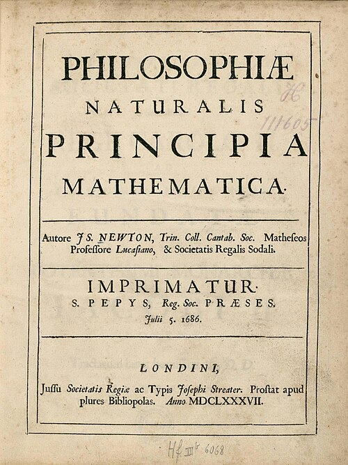

In January 1684, in London, three Fellows of the Royal Society talked about
the planets. **[Robert Hooke](kloom:e/robert-hooke)** claimed he could derive all their motions from
a force that weakens as the square of the distance. Christopher Wren doubted
it, and Hooke never produced the derivation. **[Edmond Halley](kloom:e/edmond-halley)**, who could
manage only the case of a circle, took the question to Cambridge,
probably that August.
[Isaac Newton](kloom:e/isaac-newton) told him the orbit would be an ellipse, that he had worked it
out, and that he could not find the papers.

## Eighteen months

In November Newton sent Halley nine pages, _De motu corporum in gyrum_, "on
the motion of bodies in an orbit", deriving [Kepler](kloom:e/johannes-kepler)'s laws from an
inverse-square force. Halley went straight back to ask for more. For the next
year and a half Newton did little else: his dated notebooks of chemical
experiments, kept for years, have no entry from May 1684 to April 1686. The
nine pages became three books, the [_Principia_](kloom:e/philosophiae-naturalis-principia-mathematica), the _Mathematical Principles
of Natural Philosophy_.

The Royal Society had just spent its money on a book about fishes, so Halley
paid for the printing himself, and talked Newton out of
suppressing the third book when Hooke claimed the inverse square as his. It
appeared in July 1687, in a printing of perhaps 500 copies; estimates run to
750, and bibliographers still argue over the number.

## Three laws and one force

The book opens with definitions and three **[laws of motion](kloom:e/newtons-laws-of-motion)**. In
Andrew Motte's translation the first reads: "Every body perseveres in its
state of rest, or of uniform motion in a right line, unless it is compelled
to change that state by forces impressed thereon." The second makes a change
of motion proportional to the force; the third says every action has an
equal and opposite reaction.

The first book proves what follows. Any force aimed at one centre gives
Kepler's equal areas in equal times; an inverse-square force gives orbits
that are conic sections, ellipses among them. And a sphere attracts as if all
its mass were at its centre, the result Newton had lacked for twenty years
and that let him treat the Earth as a point. The third book, _The System of
the World_, applies it all: **[universal gravitation](kloom:e/newtons-law-of-universal-gravitation)**, every particle
pulling every other with a force proportional to their masses and inversely
to the square of the distance between them.

## The Moon is falling

Proposition 4 of that book is the test the plate draws. The [Moon](kloom:e/moon) is about
60 Earth radii away. From its distance and its month, Newton worked out how
far it falls away from a straight line in one minute: 15 Paris feet and a
twelfth. If the pull falls off as the square of the distance, it is 60 × 60
times stronger at the ground, so a stone should fall the same 15 feet in one
second. Christiaan Huygens's pendulum measurements said a stone does, to
within a fraction of an inch. The force that holds the Moon in its orbit is
the one that drops a stone.

| Book III, Proposition 4       | Newton's figure            |
| ----------------------------- | -------------------------- |
| The Moon's distance           | 60 Earth radii             |
| The Moon's fall in one minute | 15 Paris feet, 1 inch      |
| Gravity at the ground         | 60 × 60 = 3,600 times more |
| A stone's fall in one second  | 15 feet, 1 inch, by theory |
| Huygens's pendulum            | 15 feet, 1 inch, measured  |

The same book explains the tides as the pull of the Moon and the Sun, from
tide heights at Bristol and Plymouth; says the spinning Earth is flattened,
its diameter at the equator to its diameter through the poles as 230 to 229;
and guesses that the Earth is "five or six times" as dense as water.

## The apple, and the quarrels

The apple is Newton's own story, told late. **William Stukeley** recorded
him in 1726, in a Kensington garden, recalling how "the notion of
gravitation came into his mind" at the fall of an apple; John Conduitt, his
niece's husband, set it in 1666 at his mother's farm in Lincolnshire, with
the thought that the same power might reach the Moon. Nobody who heard it
from him says the apple hit his head. His notebooks do show him comparing the
Moon's fall with a stone's in the late 1660s, and publishing nothing.

Hooke's claim was partly fair. Several people had guessed the inverse square
by the late 1660s, and Newton acknowledged Hooke, Wren and Halley in the book. But
Hooke agreed that the demonstration was Newton's, and the mathematician
Alexis Clairaut later put the difference in a sentence: it shows "what a
distance there is between a truth that is glimpsed and a truth that is
demonstrated". A second quarrel, with Leibniz over calculus, was judged in
Newton's favour in 1713 by a Royal Society report that Newton wrote himself.

The deepest objection was to gravity itself. Huygens and Leibniz could not
accept a pull across empty space with nothing to carry it. In the second
edition Newton answered that he had not found the cause of gravity from the
phenomena, "and I frame no hypotheses". Nor could anyone yet say how strong
the pull between two ordinary objects is. Measuring it took a twisted wire,
the instrument with which Coulomb found the same inverse square between
electric charges.
