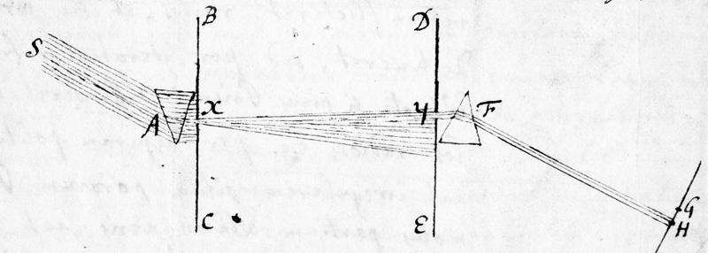
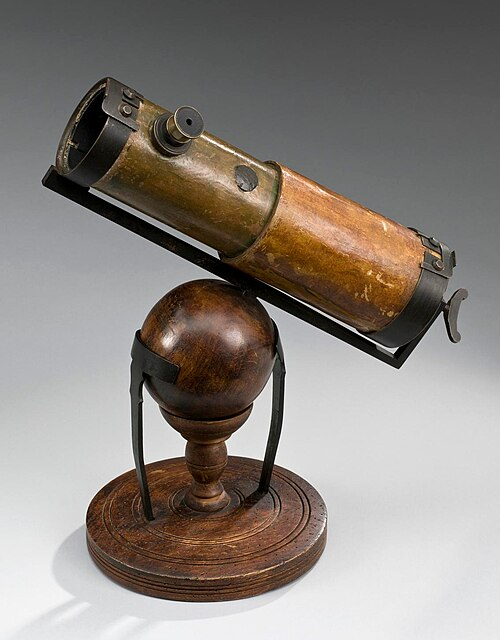

On 6 February 1672 [Isaac Newton](kloom:e/isaac-newton), twenty-nine and the professor of
mathematics at Cambridge, sent a letter to the [Royal Society](kloom:e/royal-society) in London, which
knew him chiefly as the maker of a small telescope. The letter, printed in the _Philosophical Transactions_ that month
as his "New Theory about Light and Colors", claimed that white light, the
purest thing in nature, was a mixture.

## A spectrum five times too long

The story, in Newton's telling, began "in the beginning of the Year 1666".
He darkened his chamber, let the Sun in through a small hole in the
window-shutter, and set a glass prism in the beam. The colours on the far
wall were a pleasure to look at, until he noticed their shape. By the
accepted law of refraction the Sun's image should have come out round. It
came out oblong, "about five times" as long as it was broad.

He measured it. The plate draws his arrangement with his own numbers: a
prism with an angle of 63° 12′, turning the beam through about 45°, and a
wall 22 feet away.

| Newton's measurements, 1666 | Value                             |
| --------------------------- | --------------------------------- |
| Spectrum on the wall        | 13¼ by 2⅝ inches                  |
| Angle its breadth spans     | about 31′, the Sun's own width    |
| Angle its length spans      | 2° 49′, more than five Suns       |
| Sines, in glass and in air  | 44 to 68 for red, 44 to 69 violet |

He tried the obvious causes one by one: the thickness of the glass, the
size of the hole, flaws in the prism (a second prism turned the other way
put the image back into a circle), and even a curve in the rays, like a
tennis ball's struck with a slanting racket. None of them was it.

## The crucial experiment

Then came what he called the **[experimentum crucis](kloom:e/experimentum-crucis)**, the crucial
experiment. He let the spectrum fall on a board with a small hole in it, so
that one colour at a time passed through, and put a second board with a hole
12 feet beyond it and a second prism behind that. Turning the first prism in
his hand, he sent each colour in turn through both holes. The second prism
bent the violet end's light more than the red end's, and changed no colour
into another.

His conclusion was that "Light it self is a Heterogeneous mixture of
differently refrangible Rays": each colour has its own degree of bending, and
no refraction or reflection alters it. White is what all of them make
together, and bringing the colours of a prism back together, he wrote, gave
light "intirely and perfectly white". Colour is not something glass does to
light. It is sorted out of light that already holds it.

## A mirror instead of a lens

The same result condemned the telescope. A lens is a kind of prism, and it
cannot bring every colour to one focus; Newton reckoned it smeared a point
of light over a circle a fiftieth of the lens's width. So in 1668 he built
a telescope with no lens for its objective: a concave mirror of speculum
metal, 1.3 inches across, with a small flat mirror set at 45° to send the
image out of the side of the tube to the eyepiece. Through it he saw the four
moons of Jupiter and the crescent of Venus. Isaac Barrow showed a second one
to the Royal Society late in 1671, and Newton was elected a Fellow in 1672. The **[Newtonian telescope](kloom:e/newtonian-telescope)** is still a favourite of amateur
telescope makers.

He was wrong about lenses, which he had decided could never be freed of
colour. John Dollond later proved otherwise, and the physicist John Tyndall
called it the one hole that Goethe, Newton's fiercest critic on colour, found
in his armour.

## Hooke, and a book held back

The Society's curator of experiments, **[Robert Hooke](kloom:e/robert-hooke)**, read the letter
within days. He agreed with every observation, "by many hundreds of trials",
and rejected the theory: to him light was a pulse in a medium, and a prism
disturbed it into colour. He would be glad, he wrote, of "one experimentum
crucis from Mr. Newton, that should divorce me from it. But it is not that,
which he so calls, will do the turn."

Newton was stung, and withdrew from public argument. His line to Hooke in
1675, "If I have seen further it is by standing on the shoulders of Giants",
is sometimes read as modesty and sometimes as a jab at Hooke's stature;
historians disagree. He held back his book on light until after Hooke died in 1703. [_Opticks_](kloom:e/opticks) came out in English in 1704: the prism experiments, the
coloured rings between a lens and a flat glass that Hooke had described first
and Newton measured, now **[Newton's rings](kloom:e/newtons-rings)**, and at the end a set of
Queries. In later editions they grew bolder: "Are not the Rays of Light very
small Bodies emitted from shining Substances?"

That corpuscular view held most of the eighteenth century, largely on
Newton's authority. It was not overturned by an argument about colour but by
an experiment with two slits, in the frame on Thomas Young. First came
Newton's other book, begun when **Edmond Halley** asked him a question
about the planets.
