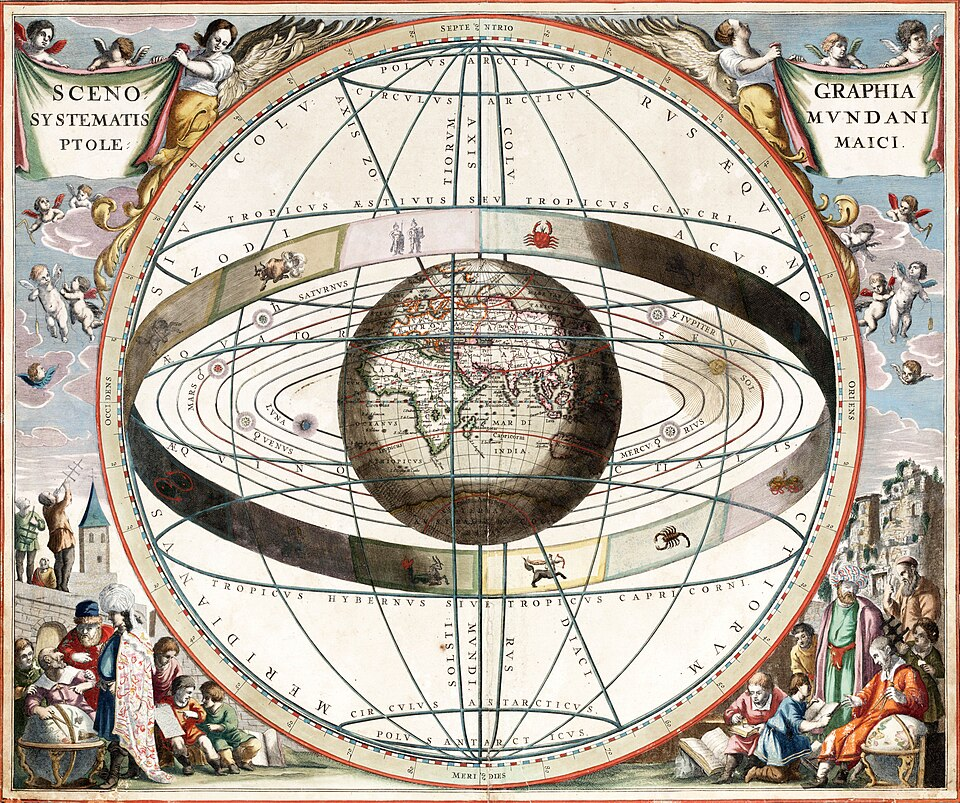

Around AD 150, in [Alexandria](kloom:e/alexandria), **[Claudius Ptolemy](kloom:e/ptolemy)** wrote a book in thirteen
parts that told an astronomer how to compute where the Sun, the Moon and
each of the five planets would be on any date, past or future. He called it
the _Mathematical Treatise_. Its readers called it the greatest, and the
name came down through Arabic as the **[Almagest](kloom:e/almagest)**. It is the only
comprehensive treatise on astronomy to survive from antiquity, and for some
fourteen hundred years, in Greek, Arabic and Latin, it was astronomy.

## Circles on circles

The problem was old. Seen from the Earth, the planets drift eastward
against the stars, but not steadily: each in turn slows, stops, runs
backwards for weeks, stops again and goes on. Greek philosophy since Plato
and Aristotle required that the heavens move in circles at even speeds.
The solution, from Apollonius of Perga in the third century BC, was to put
a circle on a circle. The planet rides a small circle, the **epicycle**,
whose center rides a large one, the **deferent**. Where the epicycle's turn
carries the planet backwards faster than the deferent carries it forwards,
the planet seems to reverse.

**[Hipparchus](kloom:e/hipparchus)**, in the second century BC, was the first to turn such models
into numbers, fitting them to Babylonian and Greek observations of the Sun
and the Moon, including the Moon's uneven speed. He could not do the same
for the planets. Ptolemy did, drawing on observations that spanned more
than eight hundred years. The Almagest takes a reader from the geometry of
chords, through the Sun and the Moon, eclipses and a catalog of 1,022
stars in 48 constellations, to the five planets in its last books.

## The equant

The plate draws Ptolemy's model for Mars, and the trace the planet makes as
seen from the Earth over two of its years, with a backward loop each time
the Earth overtakes it. The Earth is not at the center of the deferent but
off to one side. On the far side, at an equal distance, is the point that
made the model work, later called the **[equant](kloom:e/equant)**: the epicycle's center
moves round the deferent at an even rate _as seen from the equant_, and so
at an uneven rate as seen from anywhere else.

Ptolemy never explained how he arrived at it. It kept the letter of the
circular rule and broke its spirit, and it was attacked for as long as it
was used: by Nasir al-Din al-Tusi in thirteenth-century Persia, who built
an alternative from a pair of circles, and by **[Copernicus](kloom:e/nicolaus-copernicus)**, who called it
a monstrous construction and whose dislike of it was one of his reasons for
moving the Sun to the center. But it fitted the sky. Applied to a circle
with no epicycle, it gets the angular speed right at the nearest and
farthest points, and errs only a little between them. Ptolemy's models were
corrected for fourteen centuries, and were only wholly replaced when
**[Kepler](kloom:e/johannes-kepler)**, working from Tycho Brahe's observations, put the planets on
ellipses in his _Astronomia nova_ of 1609.

## Fishy numbers

Some of the Almagest's observations fit its theory too well. In 1977 the
physicist Robert R. Newton, in _The Crime of Claudius Ptolemy_, accused him
of inventing data to match his models; an equinox Ptolemy says he observed
agrees with what Hipparchus's tables predicted, and not with the sky.
Historians such as Owen Gingerich agreed that there are "some remarkably
fishy numbers" but rejected the charge of fraud, and the argument went on.

Multispectral imaging of a palimpsest, the **[Codex Climaci Rescriptus](kloom:e/codex-climaci-rescriptus)**,
found the first surviving fragments of Hipparchus's own star catalog
under its Syriac text in 2021, published in 2022. Its coordinates are not Ptolemy's shifted
for precession, as the charge had long held: Ptolemy combined his sources.

| Distance, in Earth radii | Ptolemy, _Planetary Hypotheses_ |   Today |
| ------------------------ | ------------------------------: | ------: |
| The Sun, on average      |                           1,210 | ~23,450 |
| The sphere of the stars  |                          20,000 |       — |

In a later book, the _Planetary Hypotheses_, Ptolemy nested the models
inside one another like shells and so gave the universe a size, about
twenty thousand Earth radii to the stars. The first serious written attack
on his physics came from a reader in Cairo in the eleventh century,
**Ibn al-Haytham**, who admired the Almagest and doubted it.
