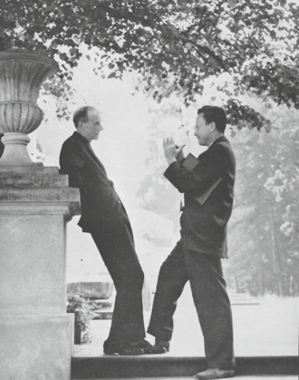

Quantum mechanics, as the last frames left it, described electrons in atoms
but not the light they give off. Light was still Maxwell's field, and an
atom that dropped to a lower level and emitted a photon had no quantum
account. **[Paul Dirac](kloom:e/paul-dirac)** supplied one in _The Quantum Theory of the Emission
and Absorption of Radiation_, published by the Royal Society in 1927. He
treated the field as an infinite set of oscillators whose quanta are
photons, so that a photon could be created or destroyed like any other
change of state, and he derived Einstein's coefficients for emission and
absorption from it. With his equation for the electron the next year, the
theory later called **[quantum electrodynamics](kloom:e/quantum-electrodynamics)**, or QED, had all its
parts. It took twenty years to make them give sensible answers.

## Infinity at the second step

The first approximation to anything worked. The next step, which lets the
electron act on its own field, gave infinity. **J. Robert Oppenheimer**
found in 1930 that the shift in an atomic level was infinite; **Victor
Weisskopf** showed by 1939 that the worst of it grew only with the
logarithm of the highest energy counted. A second infinity came from the
empty space around a charge, where the theory filled the vacuum with
short-lived electron–positron pairs that turned their ends toward the
charge and partly canceled it: **[vacuum polarization](kloom:e/vacuum-polarization)**. Many physicists
came to distrust the whole theory, and some concluded that quantum
mechanics and relativity could not be joined without something new.

In 1939 **[Sidney Dancoff](kloom:e/sidney-dancoff)**, a student of Oppenheimer's at Berkeley, came
close. He calculated how an electron scatters off a field, tried to fold
the infinities into the electron's mass, and found one left over that would
not fold. He had missed a term. Nobody noticed for nine years.

## Tomonaga's route

In Tokyo, **[Sin-Itiro Tomonaga](kloom:e/shin-ichir-tomonaga)** went a different way. He had been
enchanted, as he put it in his Nobel lecture, by a theory of Dirac's from
1932 that gave every particle its own time, and from about 1942 he
extended it to fields, giving every point of space its own time so that
the theory treated space and time alike. He finished it in 1946, having
worked through the war.

With his students he then redid Dancoff's calculation by the new method,
which took weeks rather than months, and found the missing term. With it,
every infinity in the scattering reduced to one of two: a change in the
electron's mass, or a change in its charge. Tomonaga's lecture draws the
conclusion plainly. The theory cannot calculate those two changes, but it
never needs to, because the mass and charge anyone measures already
include them: put the measured values in, and everything else comes out
finite. "When a theory is incompetent in part, it is a common procedure to
rely on experiment for that part." The procedure is **[renormalization](kloom:e/renormalization)**.

News reached Japan slowly after the war. Tomonaga learned of the Lamb
shift, the measurement that proved the infinities hid something real, from
the popular science column of an American weekly magazine, and his group
began its own relativistic calculation of it.

| The infinity                    | Where it comes from                          | Absorbed into       |
| ------------------------------- | -------------------------------------------- | ------------------- |
| Self-energy                     | the electron acting on its own field         | the measured mass   |
| Vacuum polarization             | virtual pairs screening the charge           | the measured charge |
| Anything else in the scattering | nothing: once those two are absorbed, finite | —                   |

## Three routes, one theory

In America **[Julian Schwinger](kloom:e/julian-schwinger)** at Harvard had built a covariant theory of
the same kind, using the Green's functions he had learned on wartime radar,
and calculated the electron's extra magnetism, α/2π, early in 1948.
Feynman reached the same results with diagrams, and Freeman Dyson proved
that the three were one theory; the Feynman subject tells those parts. The
Nobel Prize of 1965 went to Tomonaga, Schwinger and Feynman.

The makers were not all at ease with what they had made. Dirac never
accepted it: neglecting a quantity because it is infinitely great and you
do not want it, he said in 1975, is not sensible mathematics. The answer
that satisfied most physicists came from **Kenneth Wilson** in the 1970s:
a field theory describes nature down to some scale, what happens below it
is folded into a few measured numbers, and renormalization is the
bookkeeping of how those numbers change with the scale you look at.

## The charge runs

That change can be measured. Close to an electron there is less of the
screening cloud between you and the charge, so the charge looks larger,
and the **[fine-structure constant](kloom:e/fine-structure-constant)** α, the strength of electromagnetism,
grows with the energy of the collision. The plate draws the cloud and the
climb. The Particle Data Group gives 1/α as about 137.036 at low energy
and 127.93 at 91 GeV, the mass of the Z boson, and experiments at CERN's
LEP collider saw the running directly. By our arithmetic, the force is
about 7 percent stronger there.

| Energy                         | 1/α     |
| ------------------------------ | ------- |
| Low (atoms, the Thomson limit) | 137.036 |
| 91 GeV (the Z boson's mass)    | 127.93  |

QED became the pattern for the rest of particle physics: a field whose
symmetry fixes how it couples to charge, renormalized. Its precision is
still unmatched. The electron's magnetic moment is measured and calculated
to about a part in a trillion, and theory and experiment agree; the
Feynman subject's frame on the magnetic moment gives both. Put the same
electrons into the lattice of a crystal, and the next frame begins.
