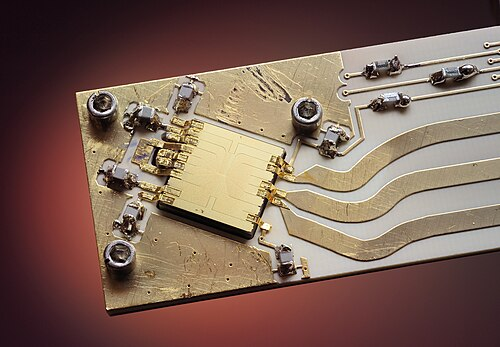

A **[quantum computer](kloom:e/quantum-computing)** is not a faster ordinary computer. It is a
physical system kept so well isolated that its quantum state can be
steered, step by step, through a calculation, and read only at the end.
Feynman proposed it in 1981 to simulate nature, and the Feynman subject
follows his part and the machines of today. This frame is the physics
underneath: what a [qubit](kloom:e/qubit) is, what a gate does to it, what destroys it, and
the four kinds of hardware in which people are trying to build one.

## A qubit and its gates

A bit is 0 or 1. A **qubit** is a two-level quantum system, the two
lowest energy levels of an atom or a circuit, whose state is a
superposition _a_|0⟩ + _b_|1⟩, where _a_ and _b_ are complex amplitudes
and |_a_|² and |_b_|² are the chances of reading 0 or 1. Every such state
is a point on a sphere, the **Bloch sphere** of the plate: |0⟩ at the top,
|1⟩ at the bottom, and a continuum of superpositions in between. Reading
the qubit gives one bit and throws the rest away.

A gate turns the sphere. In the mathematics a **[quantum gate](kloom:e/quantum-logic-gate)** is a
unitary matrix, which conserves total probability, and a unitary matrix
can always be undone, so every quantum gate is reversible. That is why the
reversible logic of the frame on Bennett and reversible computing, and of
Feynman's 1985 machine, carried straight over. In hardware a gate is a
pulse, of microwaves or laser light, timed to rotate the state by just
the right angle.

Two qubits have four amplitudes, _n_ qubits 2ⁿ, and a gate on one qubit
can depend on another. The plate's circuit puts the first qubit into an
equal superposition and then flips the second only where the first is 1.
The result, (|00⟩ + |11⟩)/√2, is **entangled**: neither qubit has a state
of its own, and the two readings always agree. The frame on entanglement
tells how Bell showed that no hidden instructions could do this. For a
computer it is a resource. An algorithm works by arranging for the
amplitudes of wrong answers to cancel and of right ones to reinforce, as
waves do, across a state far too large to write down.

Only a few problems are known to reward this. **[Shor's algorithm](kloom:e/shors-algorithm)**
(1994) finds the period of a function by interference and so factors large
numbers exponentially faster than any known classical method. **[Grover's
algorithm](kloom:e/grovers-algorithm)** (1996) searches _N_ unsorted items in about √*N* steps, a
square-root gain that is provably the best possible for that problem.

## The enemy

Any interaction with the surroundings, a stray photon, a vibrating atom,
a fluctuating charge, entangles the qubit with its environment, and the
information leaks out of the computer. This **[decoherence](kloom:e/quantum-decoherence)** turns a
superposition into an ordinary uncertainty within a characteristic time.
Every gate must be much faster than that.

Errors cannot be fixed as in ordinary memory by keeping copies: an
unknown quantum state cannot be copied at all (the no-cloning theorem of
1982). **[Quantum error correction](kloom:e/quantum-error-correction)** spreads one logical qubit over many
physical ones and measures only whether neighbouring qubits agree, which
reveals where an error happened without revealing, and so destroying, the
data. If each physical operation fails rarely enough, below a threshold,
adding qubits makes the logical qubit better rather than worse. The code
most machines aim at, the _surface code_, lays the qubits out as a square
patch on a chip, each checking its neighbours.

In the NIST trap above, two ions hovered over the middle of the gold
square and were entangled by microwaves carried in its wiring, rather than
by lasers.

## Four ways to build one

| Platform                 | The qubit                                           | Two qubits interact through                     | Kept at                                 |
| ------------------------ | --------------------------------------------------- | ----------------------------------------------- | --------------------------------------- |
| Superconducting circuits | a transmon: a Josephson junction and a capacitor    | capacitors and microwave resonators on the chip | below 15 mK, in a dilution refrigerator |
| Trapped ions             | two levels of an ion held by radio-frequency fields | the shared vibration of the ion string          | ions laser-cooled; trap in vacuum       |
| Neutral atoms            | two levels of an atom in a laser tweezer            | the Rydberg blockade of highly excited atoms    | microkelvin atoms, in vacuum            |
| Photons                  | a photon's polarisation or path                     | measurement and teleportation (the KLM scheme)  | light in optical circuits               |

The **[transmon](kloom:e/transmon)**, designed at Yale in 2007, is the qubit of most large
processors, Google's and IBM's among them. It rests on work honoured by
the Nobel Prize in Physics of 2025: in 1985 John Clarke, Michel Devoret
and John Martinis showed that a current in a superconducting circuit big
enough to hold in the hand tunnels and takes quantised energies like a
single atom. Trapped ions came first: Ignacio Cirac and Peter Zoller
proposed a controlled-NOT gate for them in 1995, and a group at NIST made
the key step that year. Ions give the most accurate operations; neutral
atoms can be packed into large arrays; photons are hard to make interact but travel
well, which suits linking machines together.

## Where it stands

As of 29 September 2026, no quantum computer has done a useful
calculation that ordinary computers demonstrably cannot. Google's
105-qubit Willow chip showed in 2024 that a logical qubit stored in a
surface code gets better as the patch grows, the first clear sign of
running below threshold, but only for storing a qubit, not yet for the
gates a computation needs. Wikipedia's article sums up the demonstrations
so far as scientific milestones rather than practical machines, and
fault-tolerant computing as still out of reach. By Craig Gidney's
estimate of 2025, factoring the 2048-bit keys the internet uses would take
just under a million noisy physical qubits for about a week.
Feynman's own application, simulating quantum matter, is where claims of
an advantage cluster, and the frame on quantum computing today in the
Feynman subject follows them. The physics that would settle it is the
physics of the last three frames: materials, junctions and very cold
electrons.
