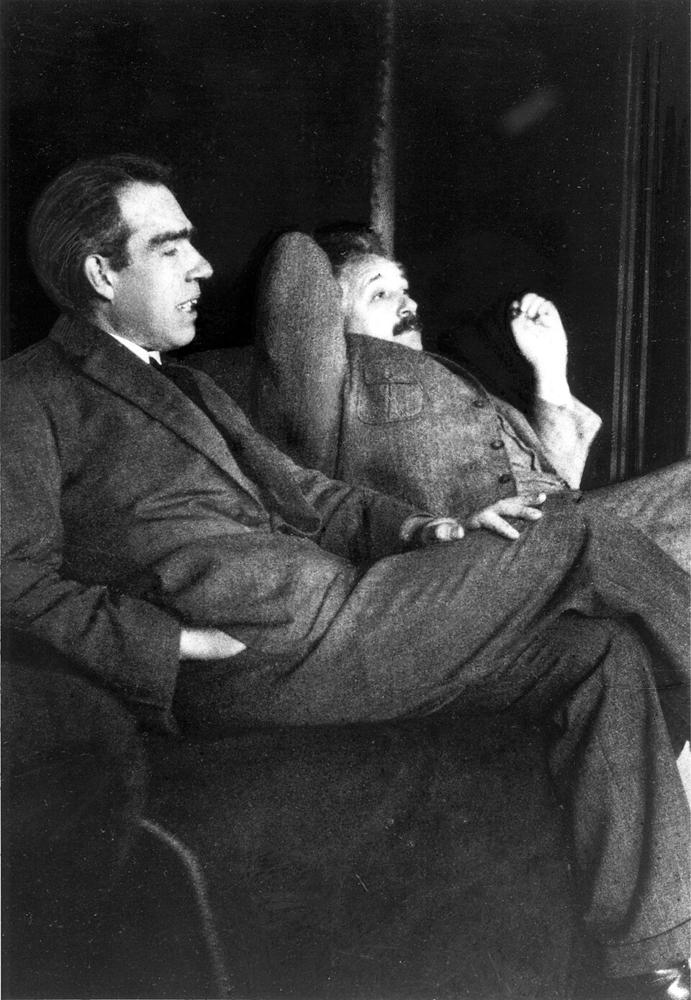

Between the summer of 1925 and the spring of 1927 a handful of physicists in
Göttingen, Copenhagen, Cambridge and Zurich built a new mechanics for
atoms, and it is still the one we use. Quantum mechanics predicts the
colors of atoms, the chemistry of the elements and the working of
transistors and lasers, and no experiment has contradicted it.
What its equations say about the world is another matter. On that, the
physicists who use it every day still disagree.

## What the theory says

A system is described by a _state_,
usually written as a **[wave function](kloom:e/wave-function)**. The state does not say where a
particle is. It gives an _amplitude_, a complex
number, for each result a measurement could find. Between measurements the
state changes smoothly and predictably, as Schrödinger's equation says. A
state can be a sum of other states, a **superposition**: a particle is
neither here nor there, but a combination of the two, each with its
amplitude.

Measurement is where chance enters. In July 1926 **Max Born** proposed
that the wave function gives only the probability of a result, and a
footnote added in proof said how: the probability is the square of the
amplitude's size. That is the **[Born rule](kloom:e/born-rule)**. Born said in his Nobel lecture
of 1954 that "again an idea of Einstein's gave me the lead": Einstein had
already read the square of a light wave's amplitude as the probability of
finding a light quantum there.

The plate shows the rule at work in an interferometer. A half-silvered mirror splits one photon's amplitude into two
paths of equal length, 1/√2 each, and a second one brings them together.
In the arrangement drawn, the two contributions add at one detector,
½ + ½ = 1, and cancel at the other, ½ − ½ = 0. Every photon arrives at the
first detector. Block either path and the photons that get through divide
evenly between the two detectors, one by one, at random. Nothing in the
theory says which.

## Copenhagen

The account most physicists learned is called the **[Copenhagen
interpretation](kloom:e/copenhagen-interpretation)**, after the institute of Niels Bohr, where Heisenberg worked in
the mid-1920s. It holds that the theory is complete; that the probabilities
are irreducible, not a cover for ignorance; that a measuring instrument must
be described in the plain language of classical physics; and, in Bohr's
word, that the wave and particle pictures are _complementary_, each true of
a different experimental arrangement and never needed at once.

There is no single text of it. The name seems to have been coined by
Heisenberg in the 1950s, and Bohr and Heisenberg disagreed on points as
basic as where the quantum system ends and the instrument begins. Its working form is often summed
up as "shut up and calculate", a phrase coined by **N. David Mermin** and
often misattributed to Feynman.

## Bohr and Einstein

Einstein would not accept that the theory was the end of the matter. "He
is not playing at dice", he wrote to Born in 1926. The famous
exchanges came at the fifth **[Solvay Conference](kloom:e/solvay-conference)** in Brussels in October
1927, where Heisenberg's uncertainty principle had just been stated, and at
the sixth in 1930. Einstein proposed thought experiments, a screen that
recoils to show which slit a particle used, a box of light weighed as one
photon leaves it, and Bohr answered each: the screen and the scale are
themselves subject to quantum uncertainty.
These **[Bohr–Einstein debates](kloom:e/bohr-einstein-debates)** are usually told as Bohr's victory.

That telling is mostly Bohr's own, written from memory for a volume on
Einstein in 1949. When **Guido Bacciagaluppi** and **Antony Valentini**
translated the whole of the 1927 proceedings in 2009, they found not a
word of the famous clash in them: the arguments happened over breakfast
and dinner, and Bohr and Einstein were nearly silent in the formal
sessions. Following the historian Don Howard, they argue that Einstein's
real target was not uncertainty but something else, that the theory seemed
to let what happens at one place depend on what is done at another. That
worry became the paper of 1935 at the start of the frame on entanglement.

## Still argued

What a measurement is, and why it gives one result when the equations give
a superposition, is the **[measurement problem](kloom:e/measurement-problem)**. Textbooks say the
state collapses to the result, without saying how. **David Bohm** revived de Broglie's pilot waves in 1952: the
particles have positions all along, guided by the wave. Hugh Everett, in
1957, dropped the collapse altogether, which is the **[many-worlds
interpretation](kloom:e/many-worlds-interpretation)**: every result happens, each in its own branch. Collapse
theories change the equation; information-based views read the wave
function as knowledge.

| Favored interpretation, Nature survey, 2025 | Respondents | Share |
| ------------------------------------------- | ----------: | ----: |
| Copenhagen                                  |         397 |   36% |
| Information-based                           |         183 |   17% |
| Many worlds (with consistent histories)     |         165 |   15% |
| Pilot wave (de Broglie–Bohm)                |          73 |    7% |
| Spontaneous collapse                        |          41 |    4% |
| Relational                                  |          39 |    4% |
| Everything else                             |         203 |   18% |

For the theory's centenary in 2025 _Nature_ asked researchers in quantum
physics which they favor; 1,101 gave usable answers. The
counts are ours, from the survey's published data. Copenhagen led with
only just over a third, and only 267, about 24 percent, said they were
confident their choice was correct. As of September 2026, there is still no
agreement on what one of the most accurate theories in physics is a theory of.

How the theory was found, from Einstein's light quanta in 1905 to
Heisenberg's uncertainty in 1927, is the trail **The quantum revolution**,
starting with the photon. Einstein's objection has its own frame next:
entanglement.
