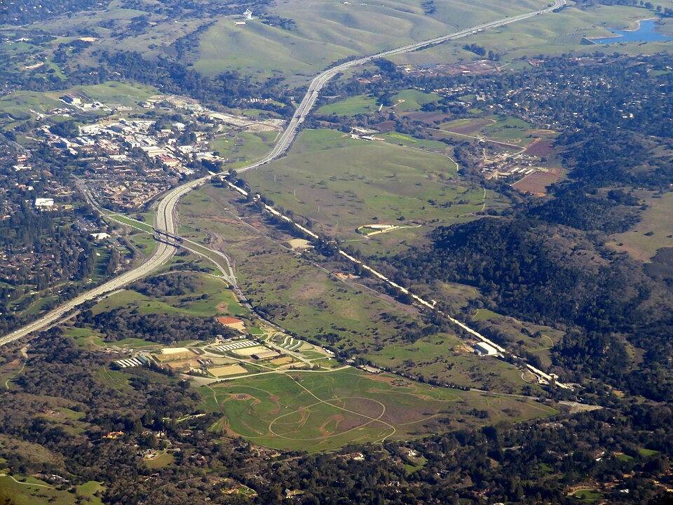

By the early 1960s the accelerators had turned up so many strongly
interacting particles, _hadrons_, that physicists called them the
particle zoo. There were protons and neutrons, pions and kaons, and dozens
of short-lived resonances, with no sign of which were fundamental. The
way out began with a sorting.

## The Eightfold Way

In 1961 **[Murray Gell-Mann](kloom:e/murray-gell-mann)** at Caltech, and independently Yuval Ne'eman,
arranged the hadrons into families by a mathematical symmetry,
SU(3). Gell-Mann called the scheme the **[Eightfold Way](kloom:e/eightfold-way-physics)**, a joke on the
Buddhist Noble Eightfold Path, for its families of eight. One family, the
heavier baryons of spin 3/2, had ten places, set out in a triangle. In 1962 Gell-Mann pointed at the empty place at the apex and
predicted a particle to fill it: the _omega minus_, with charge −1,
strangeness −3 and a mass near 1,680 MeV. A bubble chamber at Brookhaven
photographed it in 1964.

The plate draws that triangle. Each node carries three letters, which is
the next part of the story: the ten are every way of choosing three from
u, d and s.

## Three quarks for Muster Mark

In February 1964 Gell-Mann published a two-page paper in _Physics
Letters_ proposing that the families were built from three objects with
charges of +2/3 and −1/3 of the proton's. He named them **[quarks](kloom:e/quark)**. He had
the sound first, he later wrote, and found the spelling in James Joyce's
**[_Finnegans Wake_](kloom:e/finnegans-wake)**: "Three quarks for Muster Mark". He was careful about
what they were. The paper treated them as mathematical, and ended by
suggesting that a search for free quarks "would help to reassure us of the
non-existence of real quarks."

**[George Zweig](kloom:e/george-zweig)**, who had just finished a Caltech thesis under Feynman and
was working at CERN, reached the same scheme in January 1964 by another
road: he was puzzled by a decay that ought to have happened and did not.
He called his constituents _aces_, because he expected four of them, and
unlike Gell-Mann he took them as real particles bound together. His two
CERN reports were not published in a journal at the time, and he
remembered the resistance they met. Gell-Mann's name for them won.

## Seen from inside

For four years nobody could say whether quarks existed. Then, in 1968 and
1969, a collaboration from MIT and **[SLAC](kloom:e/slac-national-accelerator-laboratory)** fired the new two-mile linear
accelerator's electrons at protons and found far too many bounced back
hard, as if from small, hard things inside. Feynman read the results as
scattering from what he called _partons_, and his story belongs to his
frame; by the mid-1970s the partons were understood to be quarks and the
gluons that bind them. Jerome Friedman, Henry Kendall and Richard Taylor
shared the Nobel Prize for the experiments in 1990.

## Six

In the year of Gell-Mann's paper Sheldon Glashow and James Bjorken proposed
a fourth quark, _charm_, and in 1970 Glashow, John Iliopoulos and Luciano
Maiani showed that the weak force needed it. On 11 November 1974 two
groups announced the same new particle: **[Burton Richter](kloom:e/burton-richter)**'s at SLAC called
it ψ and **Samuel Ting**'s at Brookhaven called it J. The J/ψ was a charm
quark bound to its antiquark, and its discovery, the _November
Revolution_, convinced most physicists that quarks were real.

In 1973 Makoto Kobayashi and Toshihide Maskawa showed that the tiny
difference between matter and antimatter seen in kaon decays could be
built into the theory if there were six quarks, not four. The fifth,
_bottom_, appeared in 1977 at **[Fermilab](kloom:e/fermi-national-accelerator-laboratory)**, in Leon Lederman's experiment,
as a new particle decaying to two muons. The sixth, _top_, took eighteen
years more, because it is so heavy: the CDF and DØ experiments at
Fermilab's Tevatron reported it on 2 March 1995 at 176 ± 18 GeV, close to
the mass of an atom of gold.

| Quark   | Charge | Proposed | Found | Where                   |
| ------- | -----: | -------: | ----: | ----------------------- |
| up      |   +2/3 |     1964 |  1968 | SLAC, inside the proton |
| down    |   −1/3 |     1964 |  1968 | SLAC, inside the proton |
| strange |   −1/3 |     1964 |  1968 | SLAC, indirectly        |
| charm   |   +2/3 |     1964 |  1974 | SLAC and Brookhaven     |
| bottom  |   −1/3 |     1973 |  1977 | Fermilab                |
| top     |   +2/3 |     1973 |  1995 | Fermilab                |

No one has ever seen a quark on its own, and the theory now says no one
will. Why quarks stay bound, and why they move almost freely when struck
hard, is the business of the strong force, after the electroweak theory
that comes next.
