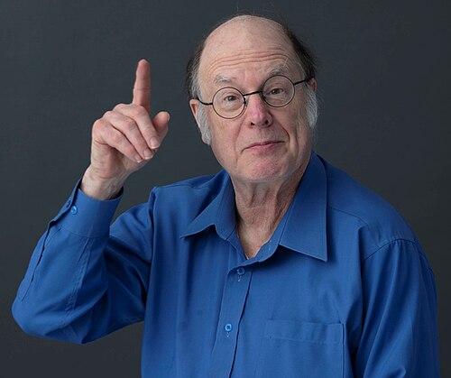

Landauer had shown in 1961 that forgetting a bit costs heat, and had
concluded that a useful computer cannot help forgetting. Twelve years
later a young physicist in the same company showed that it can. In
November 1973 **[Charles Bennett](kloom:e/charles-h-bennett-physicist)** of IBM published "Logical Reversibility
of Computation": any computation, he proved, can be done in steps that
can each be undone, and a machine built that way need throw nothing away.
The idea, **[reversible computing](kloom:e/reversible-computing)**, turned a question about chips into an
answer to one of physics' oldest puzzles, and it is built into every
quantum computer.

## Compute, copy, retrace

Bennett worked with the most general computer there is, the **[Turing
machine](kloom:e/turing-machine)**. An ordinary one is logically irreversible: when it overwrites a
square, or reaches an instruction by two different routes, its present
state no longer fixes its past. The obvious remedy is to keep a record of
every step on an extra tape. But, as Landauer had pointed out, that only
postpones the bill: the record must be erased before the tape is used
again.

Bennett's machine pays no bill. The plate draws it: three tapes at four
moments. First it computes, as the ordinary machine would, but writes on a
_history_ tape which rule it used at each step. Then it copies the answer
onto a blank output tape, which can be done reversibly because the blank
is known. Then it runs its first stage backwards, step by step, using the
history to undo each one, until the working and the history are blank
again. What is left is the input, which it was allowed to keep, and the
answer. It costs about twice as many steps as the
ordinary machine, and much temporary storage.

Bennett was not quite first. Yves Lecerf had
described reversible Turing machines in 1963, without Landauer's physics. Bennett also pointed to a machine that already
worked this way: the enzyme that copies DNA into RNA, which can run
forwards or backwards and spends, by his estimate, 20 to 100 _kT_ a step.

## Gates and billiard balls

At MIT, **[Edward Fredkin](kloom:e/edward-fredkin)** and **[Tommaso Toffoli](kloom:e/tommaso-toffoli)** did the same for logic
gates. An AND gate is irreversible, since an output of 0 hides which of
three inputs made it. Toffoli's gate of 1980, now called the [Toffoli gate](kloom:e/toffoli-gate),
passes two bits through unchanged and flips a third only when both are 1; with the
third set to 0, it computes AND and keeps its inputs. Fredkin's gate
swaps two bits when a third is 1. Given constant inputs, copies of either
gate alone can build any circuit.

In "Conservative Logic", in 1982, Fredkin and Toffoli went further and
built a computer out of mechanics: hard balls rolling on a table and
bouncing off fixed mirrors, a ball's presence on a path being a 1. Two
balls that meet collide and leave by new paths, and a collision is a gate.
The **[billiard-ball computer](kloom:e/billiard-ball-computer)** is a model, frictionless and perfectly
timed, but its point was physics. "Quite literally," they wrote, the
working of a general-purpose computer "can be reproduced by a perfect gas
placed in a suitably shaped container": the gas of the kinetic theory,
set up to compute.

## Exorcising the demon

That same year Bennett turned the idea on **[Maxwell's demon](kloom:e/maxwells-demon)**. The trail's
earlier frames give the demon's history and Leo Szilard's engine of
one molecule, from which a demon who knows the molecule's side can draw
_kT_ ln 2 of work. Szilard, and Brillouin after him, had put the cost that
saves the second law in the demon's measuring.

Bennett's review, "The Thermodynamics of Computation", in 1982, put it
elsewhere. Measuring, he argued, can be done reversibly, like the copying
onto a blank tape in his machine. What cannot is getting ready for the
next cycle. The demon's memory now holds "left" or "right", and to use it
again it must be reset to a standard state: an erasure, which by
Landauer's principle costs _kT_ ln 2. So all the work gained from the
molecule, he wrote, "must be converted into heat again in order to
compress the demon's mind back into its standard state." The demon is
beaten by its own forgetting.

Not everyone was persuaded. The philosophers John Earman and John Norton
argued in 1998 and 1999 that such an exorcism, because it leans on the
second law, is either unnecessary or not enough. Bennett answered in 2003 that even a demon that never erases a
record merges two paths of its program into one, and that merging is
the erasure.

## Reversible by nature

Quantum mechanics is reversible by construction: a quantum state evolves
by unitary steps, each of which can be undone, until it is measured. So
every quantum logic gate is reversible, and the Toffoli gate is one of
them. When Feynman designed a quantum mechanical computer in 1985, he
built it from reversible gates. The frame on quantum computing takes that
thread on.

As of September 2026, ordinary chips are still irreversible. A London
start-up, Vaire Computing, reported in 2025 a test chip that recovered
energy from its circuits, but not yet computation in reversible gates.
The trail ends where it began, at the second law and the entropy frame it
branches from: the law held, and the demon's loophole turned out to be
its memory.
