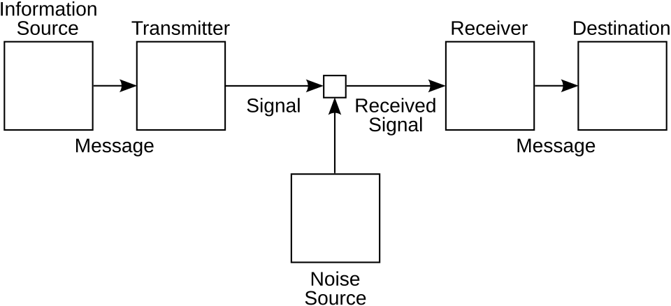

In July and October 1948 the _Bell System Technical Journal_ printed, in two
parts, a paper by a thirty-two-year-old mathematician at [Bell Telephone
Laboratories](kloom:e/bell-labs). **[Claude Shannon](kloom:e/claude-shannon)**'s [_A Mathematical Theory of
Communication_](kloom:e/a-mathematical-theory-of-communication) asked an engineer's question: how fast can a message be
sent down a wire that adds noise to it? To answer it he had to say what a
message is, and how much of it there is. His measure came out as a formula
physicists already knew, and he gave it their name, **[entropy](kloom:e/entropy-information-theory)**.

## Choice, measured

Shannon set meaning aside at once: its "semantic aspects", he wrote, "are
irrelevant to the engineering problem." What matters is that a message is
one chosen from a set of possible messages. The more there were to choose
from, and the more evenly likely they were, the more the one chosen tells
you. If the choices have probabilities _p_₁, _p_₂, … _p_ₙ, the measure he
proved to be the only one with three reasonable properties is

_H_ = −*K* Σ _pᵢ_ log _pᵢ_

where _K_ only picks the unit. With logarithms to base 2 the unit is the
binary digit, "or more briefly [bits](kloom:e/bit), a word suggested by J. W. Tukey," who
had shortened it in a Bell Labs memo of January 1947. A relay or a
flip-flop, which has two stable positions, holds one bit; _N_ of them hold
_N_ bits. Eleven years before, Shannon's master's thesis had shown that
relays do Boole's algebra of 0 and 1. Now the two-way switch was also the
unit of what a wire carries.

The plate draws the paper's figure 7: _H_ for a choice between two things,
with probabilities _p_ and 1 − _p_. A fair coin carries one bit. A coin
that lands heads 99 times in 100 carries only 0.081 bits, because its
outcome is rarely news. And a coin that lands heads 89 times in 100 still
carries half a bit.

## What a wire can carry

The measure was a means to an end. Shannon's own example: send 1,000
binary digits a second, each 0 or 1 equally often, down a channel that
gets one in a hundred wrong. It is tempting to say 990 bits a second get
through. Shannon showed the right answer subtracts the uncertainty that
remains about what was sent once you have seen what arrived, 0.081 bits a
symbol, and so 919 bits a second. His central theorem then said something
nobody had expected: every channel has a _capacity_, and below it a
message can be coded so that it arrives with as few errors as you like;
above it, not. For a line of bandwidth _W_ with signal power _P_ and white
noise _N_, the capacity is _W_ log₂ (1 + _P_/_N_) bits a second.

The same paper applied the measure to English. Letters do not come
equally often and do not follow one another freely, so English carries
fewer bits a letter than its alphabet could: its redundancy, Shannon
estimated, was roughly 50 percent. In 1951 he measured it another way,
by asking people to guess a text one letter at a time. With a hundred
letters of context, English came to something like one bit a letter.
The same guessing game, scored by the same logarithm, is how language
models are trained today.

## Why "entropy"?

A good story explains the name. Myron Tribus, a thermodynamicist, told it
in _Scientific American_ in 1971, and said Shannon had told it to him:
Shannon had thought of calling his measure "information" or
"uncertainty", and **[John von Neumann](kloom:e/john-von-neumann)** advised him to call it entropy,
because the same function already had that name in statistical mechanics,
and because nobody knows what entropy really is, "so in a debate you will
always have the advantage."

Shannon remembered it otherwise. Asked about it by Robert Price in 1982,
he laughed, and said he was "quite sure that it didn't happen between von
Neumann and me." Price noted that Shannon had already tied _p_ log _p_ to
entropy in a wartime report on cryptography, in 1945. The 1948 paper
itself makes the link without any story: the form of _H_, it says, "will
be recognized as that of entropy as defined in certain formulations of
statistical mechanics," the _H_ of Boltzmann's _H_ theorem. So the name
was Shannon's choice, made knowingly; whether von Neumann nudged him
rests on one secondhand account, and Shannon doubted it.

## The same, or not?

The formula is the same as Gibbs's entropy of a gas, _S_ = −*k* Σ _p_ ln
_p_, apart from its constant: one bit is _k_ ln 2, about 9.6 × 10⁻²⁴
joules per kelvin, by our arithmetic. But the two measure different
things. Shannon's _p_ are the chances of messages, and his _H_ has no
temperature and no energy. Boltzmann's entropy counts the arrangements of atoms that look
alike from outside.

In 1957 **[Edwin T. Jaynes](kloom:e/edwin-thompson-jaynes)** argued that the difference is only in what the
probabilities are about. Statistical mechanics, in his reading, is
inference: the Boltzmann distribution is simply the one with the greatest
Shannon entropy that fits what is known, such as the average energy. What turned the likeness into physics was a question
about machines: does forgetting a bit cost energy? That is the next
frame's, Landauer's.
