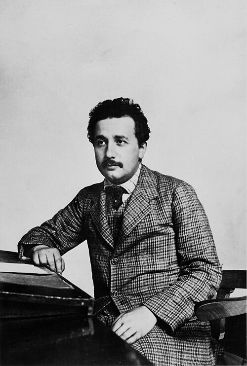
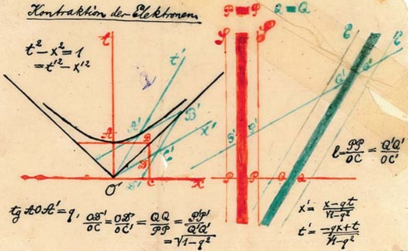

On 30 June 1905 the _Annalen der Physik_ received a paper of thirty-one pages
from an examiner at the patent office in Bern. **[Albert Einstein](kloom:e/albert-einstein)**'s [_On
the Electrodynamics of Moving Bodies_](kloom:e/on-the-electrodynamics-of-moving-bodies), published on 26 September, cites no
other paper and names only five other scientists. It set out to tidy an
awkwardness in the theory of electricity, and did it by changing what we
mean by time. We call it **[special relativity](kloom:e/special-relativity)**.

## A magnet and a coil

The paper opens with Faraday's induction. Move a magnet past a loop of
wire, or the wire past the magnet, and the same current flows: only the
relative motion matters. Yet Maxwell's theory, as then understood,
explained the two cases differently, with an electric field in one and
none in the other. That, and "the unsuccessful attempts to discover any
motion of the earth relatively to the 'light medium'", suggested to
Einstein that nothing in physics marks out absolute rest. The paper names
no experiment; the frame on Michelson and Morley tells theirs, the
contraction **[Hendrik Lorentz](kloom:e/hendrik-lorentz)** and FitzGerald invented to explain it, and the
argument over whether it moved Einstein.

He made two postulates. The first, the principle of relativity: the laws
of physics are the same for every observer in uniform motion. The second:
light in empty space always travels at one speed, _c_, whatever the motion
of what emitted it. They look incompatible, since chasing a light beam
ought to slow it. The ether, he wrote, would prove "superfluous".

## What "at the same time" means

The reconciliation starts with a train. "That train arrives here at 7
o'clock", he wrote, means that the small hand of my watch pointing to 7
and the arrival of the train are simultaneous events. For events far
apart, the only way to say that two clocks agree is to send light between
them, and **[Henri Poincaré](kloom:e/henri-poincare)** had pointed out in 1898 that this rests on an
assumption about light's speed. With the second postulate, two events that
are simultaneous for one observer are not simultaneous for another moving
past. There is no universal now.

From there the rest follows. A moving clock runs slow, by the factor
√(1 − _v_²/_c_²), and a moving rod is shortened by the same factor along
its motion. The plate derives the first from Pythagoras with a clock of
two mirrors moving at 0.6 _c_: light that travels 5 units while the clock
moves 3 has crossed the clock only 4, so it ticks at four-fifths of the
rate of one at rest. Einstein drew the consequence himself: a clock
carried away and brought back comes home behind one that stayed.

Lorentz had the transformations that carry his name, and in 1905 Poincaré
had most of the mathematics too. Some have credited the
theory to them. Most historians of
science credit Einstein, because Lorentz's "local time" stayed an
auxiliary quantity and Poincaré kept an undetectable ether in his physics.

## E = mc²

On 27 September the _Annalen_ received three more pages. If a body gives
off energy _L_ as light, Einstein showed, its mass goes down by _L_/_c_²:
the **[equivalence of mass and energy](kloom:e/mass-energy-equivalence)**. He suggested radium salts might test
it. He wrote it in words and letters, not as _E_ = _mc_², a form he used
from 1907. In 1933 the energy released when protons split lithium-7 nuclei
confirmed it to within half a percent.

## Spacetime

On 21 September 1908, in Cologne, Einstein's former mathematics teacher
**[Hermann Minkowski](kloom:e/hermann-minkowski)** recast the theory as geometry, with time as a fourth
dimension: "Henceforth space by itself, and time by itself, are doomed to
fade away into mere shadows, and only a kind of union of the two will
preserve an independent reality." Einstein at first dismissed the
four-dimensional version as "learned superfluousness"; by 1912 he was
building on it. Minkowski died of appendicitis the following January.

## Tested

Muons made by cosmic rays high in the air live about two millionths of a
second at rest, far too short to reach the ground. In 1962 David Frisch
and Smith counted about 563 an hour on Mount Washington and about
412 at sea level in Cambridge, Massachusetts; without time dilation about
27 would have survived the fall. In October 1971 Joseph Hafele and Richard
Keating flew cesium clocks round the world on airliners, east and then
west, and compared them with clocks at the US Naval Observatory: the
**[Hafele–Keating experiment](kloom:e/hafele-keating-experiment)**. Their predictions include the effect of height,
from general relativity.

| Flown clocks, nanoseconds gained | Predicted | Measured |
| -------------------------------- | --------: | -------: |
| Eastward                         |  −40 ± 23 | −59 ± 10 |
| Westward                         | +275 ± 21 | +273 ± 7 |

Satellite navigation takes both effects into account routinely, and since 1983
the meter has been the distance light travels in 1/299,792,458 of a
second, a definition that only works because every observer measures the
same _c_. Special relativity left one thing out, gravity. Einstein's ten
years' work on it is the next frame.
