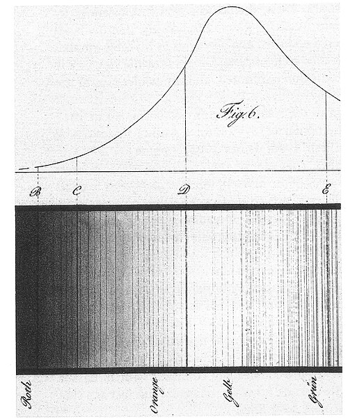
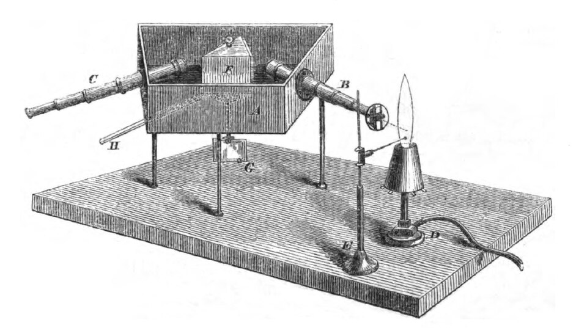

In his _Positive Philosophy_ the French philosopher **Auguste Comte** gave,
as an example of what we could never know, the chemical composition of the stars. We could measure
their positions and motions; what they were made of was beyond reach.
Within thirty years two professors in Heidelberg had shown how to read it
from their light, found two new elements on Earth the same way, and
started a science, spectroscopy, that would in the end lead into the
atom.

## Lines in the Sun

Newton had spread sunlight into a band of colours with a prism, and it
looked continuous. In 1802 William Hyde Wollaston saw a few dark lines
across it. In 1814 a Munich glassmaker and optician, **[Joseph von
Fraunhofer](kloom:e/joseph-von-fraunhofer)**, looked with a far better prism and a small telescope, and
found hundreds. Accounts of how many differ: Wikipedia's articles give 574,
or "over 570"; Arthur Berry's history of 1898 says he saw about 600 and
mapped 324. He labelled the strongest with letters, A to K, and used them
as fixed marks to measure the refraction of his glass. The **[Fraunhofer
lines](kloom:e/fraunhofer-lines)** appeared in a different pattern in the spectra of bright stars, so
they belonged to the light's source, not to our air. Nobody
knew what they were.

Among them was a dark pair in the yellow, which he called D. A flame with
salt in it was well known to show a bright yellow pair in the same place.

## Two professors and a burner

At Heidelberg in 1859 the chemist **[Robert Bunsen](kloom:e/robert-bunsen)** was studying the
colours salts give to a flame, using the hot, nearly colourless gas burner
he and his assistant Peter Desaga had perfected. The physicist **[Gustav
Kirchhoff](kloom:e/gustav-kirchhoff)** suggested looking at the colours through a prism. By October
they had a spectroscope: a slit, a lens to make its light parallel, a
prism in a blackened box, and a small telescope to view the result. The
plate draws the light's path through such a prism. Each metal, purified
over and over, gave its own set of bright lines, whatever salt it came in
and however it was heated. The test was absurdly sensitive: burning three
milligrams of sodium salt in a far corner of a room of 60 cubic metres
lit the sodium line in their flame for ten minutes, and they reckoned
the eye could see "with the greatest ease" less than a three-millionth of
a milligram.

Then Kirchhoff sent sunlight through a sodium flame. The dark D lines did
not fill in; they grew darker. A cool vapour, he concluded, absorbs the
very colours it emits when hot. Sunlight comes from a hot body wrapped in
cooler gas, and each dark line is an element in that gas taking its own
colour out of the light. From the D lines, "the presence of sodium in the
sun's atmosphere may be concluded." He argued the point against the
obvious objection that the lines came from our own air: they did not
darken as the Sun set, and some stars lacked them. **Kirchhoff's law of
thermal radiation**, that a body absorbs best the light it emits best,
came out of the same work. Kirchhoff went on to match some sixty lines of
iron with dark lines in the Sun, and found half a dozen other elements
there.

## New elements, on Earth and in the Sun

The method worked the other way round too. In 1860, in the spectrum of
mineral water from Dürkheim, Bunsen saw two blue lines that belonged to no
known element. Some forty tons of the water, about 44,000 litres, were boiled
down to 240 kilograms of brine to get at it. They named the element
**[caesium](kloom:e/caesium)**, from the Latin for bluish grey. Since 1967 a line in its
spectrum, far out in the microwaves, has defined the second. In 1861 came rubidium, named
for the deep red of its lines.

In August 1868, during a total eclipse seen from India, several observers
turned spectroscopes on the Sun's red prominences and saw bright lines,
among them a yellow one close to D. Jules Janssen, who observed from
Guntur, is often credited with it. In October **[Norman Lockyer](kloom:e/norman-lockyer)** observed
it in England without an eclipse, found that it matched no known element,
and named the element after the Sun: **[helium](kloom:e/helium)**. Who named it is
disputed: William Thomson told the British Association in 1871 that
Frankland and Lockyer proposed the name, but Wikipedia's article judges
the chemist Edward Frankland unlikely to have joined in, since he doubted
the element existed. In 1895 William Ramsay found the same line in gas from a
uranium mineral: helium had been found in the Sun twenty-seven years
before anyone held it.

## A formula without a reason

The spectra were a code no one could read. Hydrogen, the simplest gas,
showed four lines in the visible, measured with great care by Anders
Ångström. In 1885 **[Johann Jakob Balmer](kloom:e/johann-jakob-balmer)**, a sixty-year-old mathematics
teacher at a girls' school in Basel, found that all four fitted one rule:
multiply 364.56 nanometres by _n_²/(_n_² − 4), for _n_ = 3, 4, 5 and 6.
He predicted a fifth line from _n_ = 7, and his colleague Eduard Hagenbach
told him Ångström had already measured one there.

| Line | _n_ | Balmer's rule, nm (our arithmetic) | Measured today, nm |
| ---- | --: | ---------------------------------: | -----------------: |
| Hα   |   3 |                             656.21 |             656.28 |
| Hβ   |   4 |                             486.08 |             486.14 |
| Hγ   |   5 |                             434.00 |             434.05 |
| Hδ   |   6 |                             410.13 |             410.17 |
| Hε   |   7 |                             396.97 |             397.01 |

The rule worked to about one part in ten thousand, and nobody knew why a
gas should obey a formula with whole numbers in it. The answer waited for
1913, and an atom whose electron could sit only on certain orbits.
