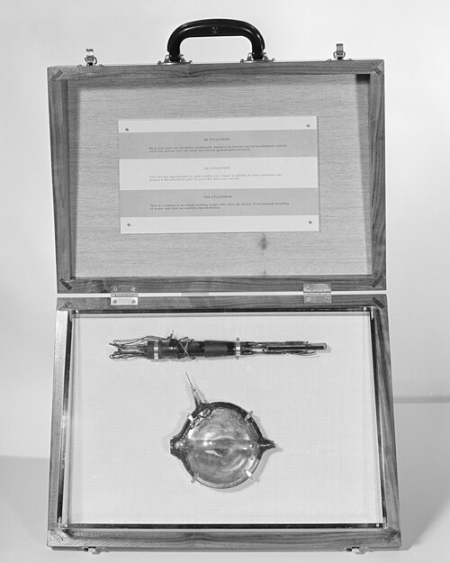
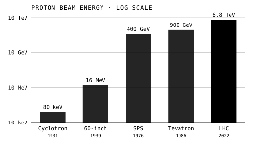
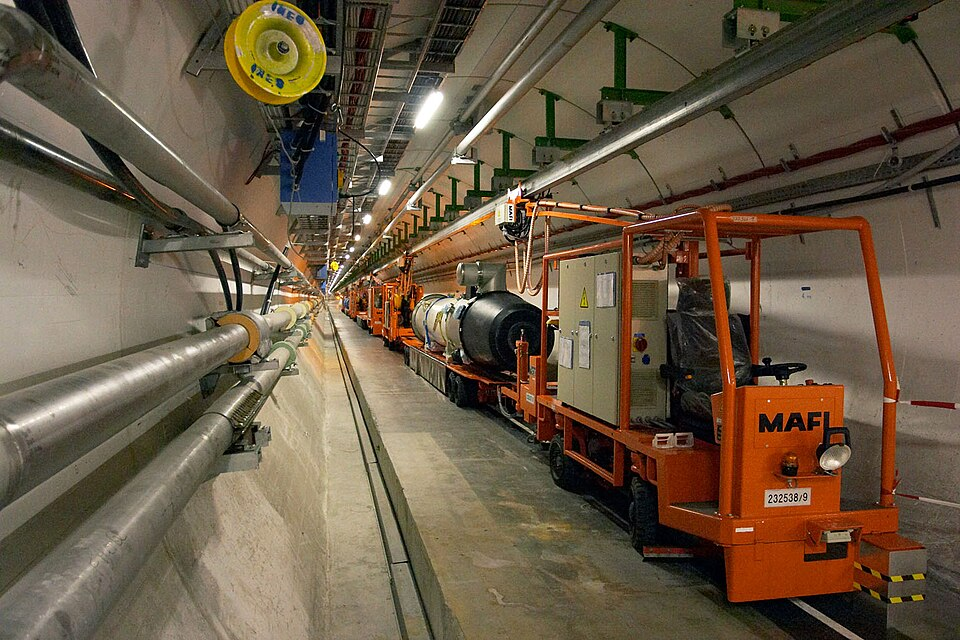

By the middle of the 1970s physicists had one theory for everything they
could make in a laboratory: every particle then known, and every force but
gravity. It was called the **[Standard Model](kloom:e/standard-model)**, and who named it is disputed. Abraham Pais
and Sam Treiman used the term in 1975; Steven Weinberg later said he had
used it first, in a talk at Aix-en-Provence in 1973, and chose it out of
modesty. Half a century on, it is still the standard.

## Seventeen particles

The model's matter is twelve particles of spin one-half, in two families
of six. **[Quarks](kloom:e/quark)** feel the strong force and are always bound, three to a
proton or neutron, or a quark with an antiquark. _Leptons_ do not: the
electron, its heavier copies the muon and the tau, and a neutrino for each.
Both families come in three _generations_, each a heavier copy of the one
before; only the first makes ordinary matter, and the heavier ones decay
in moments. Every one of the twelve has its antiparticle. Then there are
the carriers of the forces, and one particle unlike any other.

| Particle              | Kind            | Charge | Mass               |
| --------------------- | --------------- | -----: | ------------------ |
| up, charm, top        | quarks          |   +2/3 | 1.9 MeV–173.5 GeV  |
| down, strange, bottom | quarks          |   −1/3 | 4.4 MeV–4.24 GeV   |
| electron, muon, tau   | charged leptons |     −1 | 0.511 MeV–1.78 GeV |
| three neutrinos       | neutral leptons |      0 | under 1 eV         |
| photon                | electromagnetic |      0 | none               |
| eight gluons          | strong          |      0 | none               |
| W⁺, W⁻ and Z          | weak            |  ±1, 0 | 80.4 and 91.2 GeV  |
| Higgs boson           | scalar field    |      0 | 125 GeV            |

The plate lays them out in their usual grid, a circle for each, and
sizes the circles by the logarithm of the mass on a scale of our own. The
spread is the thing to see: the top quark is some 340,000 times as heavy
as the electron, by our arithmetic, and nothing in the model says why.

## Three forces, three symmetries

The forces come from symmetry. In a **[gauge theory](kloom:e/gauge-theory)** the equations stay the
same when a particle's quantum phase is shifted by a different amount at
every point in space and time, and they can do so only if a field is there
to carry the difference from point to point. The field's quanta are the
force's carriers. The symmetry of electromagnetism, U(1), gives the photon;
the weak force's SU(2) gives the W and Z; the strong force's SU(3), acting
on the three _colours_ a quark can carry, gives eight gluons. The whole is
written SU(3) × SU(2) × U(1). A field that fills space, the Higgs field,
breaks the weak symmetry and gives the W, the Z and the matter particles
their masses; the **[Higgs boson](kloom:e/higgs-boson)** is its quantum. Written out as
generally as those symmetries allow, the theory has 19 numbers that only
measurement can fix. Its predictions for a collision are calculated as sums
of Feynman diagrams, often thousands of them.

## Machines to test it

Seeing inside a proton takes energy, and energy takes machines. On 2
January 1931 **[Ernest Lawrence](kloom:e/ernest-lawrence)** and his student M. Stanley Livingston, at
Berkeley, ran the first **[cyclotron](kloom:e/cyclotron)**: a chamber 4.5 inches across between the
poles of a magnet, in which protons circled in a spiral, kicked by an
alternating voltage at each half turn, to 80,000 electron-volts. Lawrence's
60-inch machine reached 16 million in 1939. Synchrotrons, whose magnets
strengthen as the beam gains energy, took over after the war, and then
colliders, which smash two beams head on.

| Machine                        | Year | Energy per proton |
| ------------------------------ | ---: | ----------------: |
| First cyclotron, Berkeley      | 1931 |            80 keV |
| 60-inch cyclotron, Berkeley    | 1939 |            16 MeV |
| Super Proton Synchrotron, CERN | 1976 |           400 GeV |
| Tevatron, Fermilab             | 1986 |           900 GeV |
| Large Hadron Collider, CERN    | 2022 |           6.8 TeV |

The last is the largest machine ever built for science. The
**[Large Hadron Collider](kloom:e/large-hadron-collider)**, at **[CERN](kloom:e/cern)** outside Geneva, runs in a
tunnel 27 km round, as much as 175 m under the French–Swiss border, with
about 10,000 superconducting magnets held at 1.9 kelvin. It was built
between 1998 and 2008 by more than 10,000 scientists from over a hundred
countries, and first collided protons in 2010.

## What it leaves out

As of September 2026 the LHC is dark. Its third run ended in June 2026,
when Long Shutdown 3 began; the machine is to restart from 2028 and run as
the High-Luminosity LHC, with ten times the collision rate, in the 2030s.
In sixteen years of collisions it has found the Higgs boson and, by
February 2026, 79 new hadrons, particles made of quarks; it has found no
new fundamental particle beyond the model's own.

That is its success and its problem, because the model is known to be
incomplete. It has no place for gravity. It contains no particle that
could be the dark matter the cosmos seems to need. It was written with
massless neutrinos, and neutrinos have mass. And it cannot explain why the
universe is made of matter and not of antimatter.

The trail follows how the model was built: the neutrino, the quarks, the
electroweak theory, asymptotic freedom, the W and Z, and the Higgs boson.
