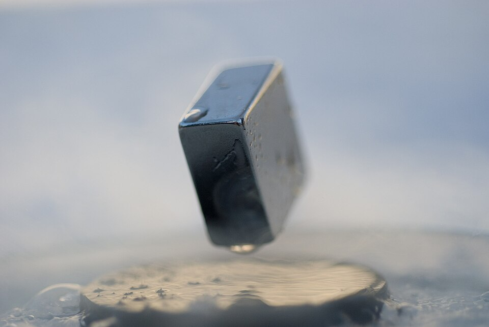

At Leiden in 1908 **[Heike Kamerlingh Onnes](kloom:e/heike-kamerlingh-onnes)** liquefied helium, at 4.2
degrees above absolute zero, and so owned the coldest place on Earth. He
used it to settle an argument about metals near absolute zero: would
their resistance fall steadily to nothing, or would the electrons freeze
in place and the resistance soar? He expected the first. What he found in
1911 was neither.

## Mercury, 8 April 1911

The laboratory knew how to purify mercury by distillation, so the team
froze a thread of it in a glass capillary and lowered it into liquid helium. The
notebook for 8 April 1911, read closely a century later by the historians
Dirk van Delft and Peter Kes, records at about 3 K, in Kamerlingh Onnes's Dutch,
"Kwik nagenoeg nul": mercury's resistance practically zero. Later that
day, as the bath was pumped colder, the boiling helium suddenly went
still. Without knowing it, the team had seen helium become a superfluid
at 2.2 K: two quantum transitions in one laboratory on one day.

In May, measuring more finely, they found the resistance at 3 K below one
ten-millionth of its normal value. Warming again, they saw it begin to
return at 4.12 K; just above 4.2 K it rose almost four hundred times
within a tenth of a degree. The
October run gave the famous plot of a resistance that drops to nothing at
4.20 K, which the plate redraws. A well-told story has a sleepy apprentice
letting the helium warm and the galvanometer swing; the notebook, van
Delft and Kes found, does not bear it out. Kamerlingh Onnes called the new
state **[superconductivity](kloom:e/superconductivity)**. Accounts of the first day disagree on the
temperature: the notebook's 3 K, 3.6 K in some biographies, and the 4.2 K
of the transition itself.

| Material                    | Found | Critical temperature |
| --------------------------- | ----: | -------------------: |
| Mercury                     |  1911 |                4.2 K |
| Lead                        |  1913 |                  7 K |
| Niobium nitride             |  1941 |                 16 K |
| La–Ba–Cu–O (cuprate)        |  1986 |                 35 K |
| Y–Ba–Cu–O                   |  1987 |                 93 K |
| Hg–Ba–Ca–Cu–O               |  1993 |                133 K |
| Lanthanum hydride, squeezed |  2019 |                250 K |

## Not just a perfect conductor

In 1933 Walther Meissner and Robert Ochsenfeld cooled tin
and lead in a magnetic field and found the field pushed out as they became
superconducting. A merely perfect conductor would trap whatever field it
held; a superconductor expels it, whatever its history, so it is a new
state of matter. The **[Meissner effect](kloom:e/meissner-effect)** is the right half of the plate.
Two years later **[Fritz London](kloom:e/fritz-london)** and his brother Heinz wrote equations for
it, and London came to see a superconductor as one quantum state spread
through the whole metal, the same kind of explanation he gave for
superfluid helium.

A magnet floating over a superconductor, the familiar demonstration, is
not quite the Meissner effect. This one is a copper oxide ceramic at
−196 °C, and in such materials the field threads through in fine
quantized tubes, which defects in the ceramic pin in place, holding the
magnet where it is.

## Pairs

The explanation took forty-six years. The hint was that heavier isotopes
of a metal superconduct at lower temperatures, so the vibrating lattice
was involved. In 1956 Leon Cooper showed that any attraction, however
weak, binds two electrons near the top of the filled levels into a pair;
the attraction comes from the lattice, which one electron distorts as it
passes and another feels. In 1957 **[John Bardeen](kloom:e/john-bardeen)**, Cooper and J. Robert
Schrieffer at Illinois built the whole theory from such pairs. In **[BCS
theory](kloom:e/bcs-theory)** the pairs, overlapping one another, share one quantum state,
and breaking any of them costs a finite energy, a gap that ordinary
scattering cannot pay. Feynman, who had explained superfluid helium's
excitations, had tried superconductivity too; the solution eluded him.

In 1962 Brian Josephson, a graduate student at Cambridge, predicted that pairs would tunnel through a thin insulating
barrier between two superconductors, and that a steady voltage _V_ across
it would make the current oscillate at 2_eV_/_h_, about 484 gigahertz
per millivolt. The **[Josephson effect](kloom:e/josephson-effect)** ties voltage to frequency through
nothing but constants of nature. Since 1990 voltage standards everywhere
have been arrays of such junctions; NIST's volt uses 20,208 of them in
series. The Kibble balance, which has weighed the kilogram against the
Planck constant since 2019, measures its voltages with one.

## Hotter, and useful

In 1986 J. Georg Bednorz and K. Alex Müller at IBM Zürich found
superconductivity at 35 K in a copper oxide ceramic, and within a year a
related compound passed 77 K, where liquid nitrogen boils. **[High-temperature
superconductivity](kloom:e/high-temperature-superconductivity)** won them the Nobel Prize in 1987, and forty years on
no theory of it is agreed. Hydrides squeezed to millions of
atmospheres superconduct higher still; a claim of room temperature, in
_Nature_ in 2020, was retracted in 2022.

Most superconductors at work are older, cheaper niobium–titanium wire.
Magnetic resonance imagers are the largest market, about four fifths of it
by one estimate for 2014. The Large Hadron Collider's magnets hold 1,200
tonnes of niobium–titanium cable at 1.9 K for fields of 8.3 tesla. SQUIDs,
loops of Josephson junctions, can measure fields as weak as 5 × 10⁻¹⁸
tesla; a fridge magnet's is about 10⁻². And a Josephson junction, cooled until its whole
circuit behaves as one quantum object, is a qubit, the next frame.
