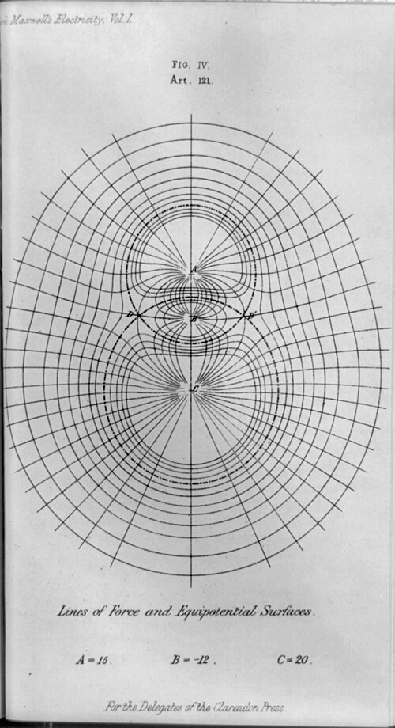

For two centuries the forces of physics reached across empty space. A
planet pulled on a planet, a charge on a charge, by a rule that named only
the two bodies and the distance between them. By 1900 physics said
something else: that the space between is full. A **[field](kloom:e/field-physics)** has a value at
every point, carries energy from place to place, takes time to pass a
disturbance on, and goes on existing after the bodies that made it have
gone. Every later frame of this subject is built on that idea, and it was
made in the nineteenth century out of electricity and magnetism.

## Across empty space

Newton's law of gravitation says how hard two bodies pull on each other,
and nothing about how they do it. Newton did not think it could be the whole
story. In a letter to the scholar Richard Bentley in February 1693 he wrote
that one body acting on another "at a distance through a vacuum without the
mediation of any thing else" was "so great an absurdity" that no one with a
competent faculty of thinking could believe it. Aristotle had held,
two thousand years before, that there is no void and that a mover must
touch what it moves. But the law worked. It predicted the return of
Halley's comet and in 1846 found Neptune, and physicists learned to live
with **[action at a distance](kloom:e/action-at-a-distance)**.

Electricity followed. In 1785 Charles-Augustin de Coulomb showed with a
torsion balance that two charges repel with a force that falls as the
square of the distance, the same form as gravity, and Laplace, Lagrange and
Poisson built mathematical physics on such forces between pairs of
particles. They did define a quantity at every point of space, the
potential, but as bookkeeping: the sum of every body's pull, ready for a
test particle to feel. Nobody supposed it was there.

## Lines in the space between

In 1820 Hans Christian Ørsted found that a current turns a compass needle,
and the force did something no force had done: it did not point along the
line from the wire to the needle, but round the wire. Within weeks André-Marie
Ampère had built a mathematical _electrodynamics_ of forces between
elements of current, still acting at a distance, so complete that he
would be called "the Newton of electricity".

The man who would not accept action at a distance was **[Michael Faraday](kloom:e/michael-faraday)**.
He pictured the space round
magnets and currents as filled with **[lines of force](kloom:e/line-of-force)**, first as a way to
think, later as something real. He asked three questions of any force:
whether matter placed in the way changes it, whether it takes time to
cross, and whether it depends on the body that receives it. In 1845 he
began to speak of the _magnetic field_; in 1851 William Thomson, later Lord
Kelvin, gave the word a formal definition. Later a fourth
question was added: does the action carry energy?

| The question                          | Electric and magnetic force | Newton's gravity | Einstein's gravity |
| ------------------------------------- | --------------------------- | ---------------- | ------------------ |
| Is it changed by matter in the way?   | Yes                         | No               | No                 |
| Does it take time to cross?           | Yes                         | No               | Yes                |
| Does it depend on the receiving body? | Yes                         | Yes              | Yes                |
| Does it carry energy?                 | Yes                         | No               | Yes                |

## Where the energy is

**[James Clerk Maxwell](kloom:e/james-clerk-maxwell)** gave Faraday's picture its equations, and his paper of 1865,
"A Dynamical Theory of the Electromagnetic Field", named the thing: the
field "is that part of space which contains and surrounds bodies in
electric or magnetic conditions". The same paper made a claim that is the
heart of the idea. "In speaking of the Energy of the field," he wrote, "I
wish to be understood literally." The only question, he said, was where it
resides. On the old theories it sat in the charged bodies as a power of
acting at a distance; on his, "it resides in the electromagnetic field, in
the space surrounding the electrified and magnetic bodies".

He drew such fields by hand for his _Treatise on Electricity and
Magnetism_ of 1873: the lines of force and the surfaces of equal potential
round three charges of 15, −12 and 20 units.

In 1884 John Henry Poynting, and Oliver Heaviside independently, showed
how that energy moves. It flows through the field, at a rate and in a
direction given at each point by the **[Poynting vector](kloom:e/poynting-vector)**, _S_ = _E_ × _H_.
In a torch the energy that lights the bulb does not run along inside the
wire: it flows through the space round the wires, from the battery to the
bulb, and the wires guide it. Sunlight
left the Sun about 499 seconds before it reaches us (this frame's arithmetic, from
the length of the astronomical unit and the speed of light), and for those
eight minutes its energy belongs to neither body. It is in the field.

## A field with nothing under it

Maxwell took his field to be the strain and motion of a medium, the
**[luminiferous aether](kloom:e/luminiferous-aether)**, "matter in motion" filling space. No experiment
ever found it, and Einstein's relativity of 1905 did without it: the field
was left standing on its own. In 1915 gravity became a field too, and from
1927 quantum theory made particles into the quanta of fields, the
**[quantum field theory](kloom:e/quantum-field-theory)** in which the Standard Model is written.

The idea was tested by trying to do without it. In the 1940s John Wheeler
and Richard Feynman wrote an electrodynamics in which charges act directly
on one another, with no field at all, to escape the infinite energy that a
charge's own field gives it. It was set aside: the field was too useful. The trail from here follows the field's
making: Ørsted's compass needle, Ampère's currents, Faraday's lines of
force, Maxwell's displacement current, and Hertz's waves.
