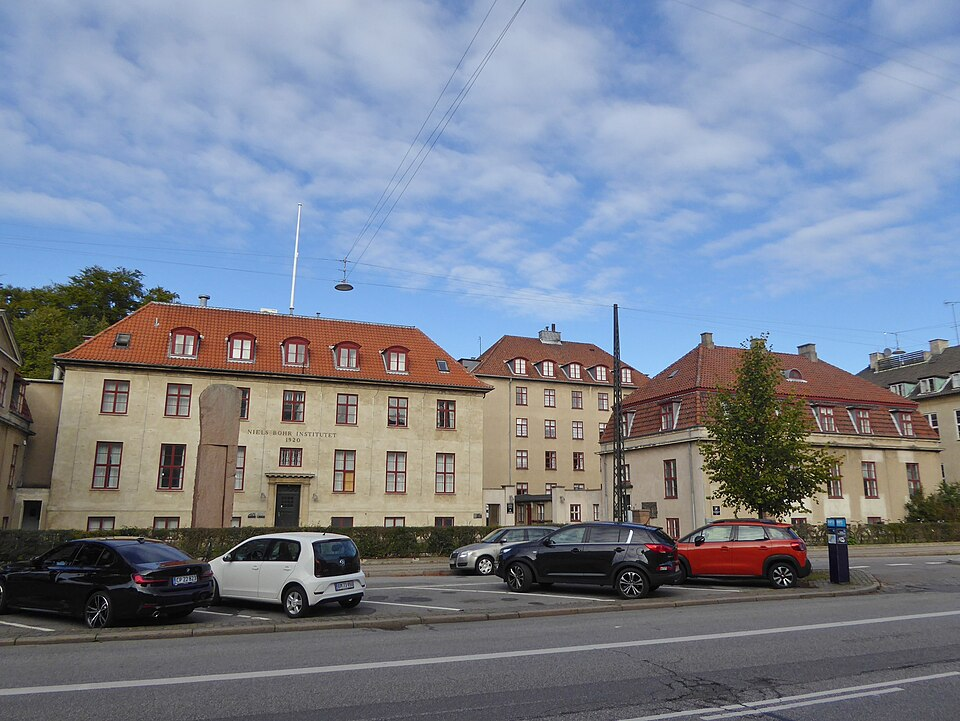

By the end of 1926 quantum mechanics worked, in two forms that were one
theory, and no one could say what it described. In Copenhagen, where
**[Werner Heisenberg](kloom:e/werner-heisenberg)** was now lecturing at **[Niels Bohr](kloom:e/niels-bohr)**'s institute, the
two men argued about it through the winter, often, Heisenberg recalled,
until long after midnight, until "both of us became utterly exhausted and
rather tense". In late February 1927 Bohr went skiing in Norway. Heisenberg,
alone, wrote out his answer in a fourteen-page letter to Pauli, and then as
a paper, which the _Zeitschrift für Physik_ received on 23 March.

## The microscope

Its title asked for the _anschaulich_ content of the theory: what could be
pictured. Heisenberg's method was to ask what it would take to measure a
thing. To see where an electron is, look at it through a microscope. A
microscope cannot resolve detail much finer than the wavelength of the
light it uses, so to pin the electron down closely, use light of very short
wavelength: gamma rays.

But light comes in quanta, and a gamma-ray photon is a hard blow. To be
seen, at least one must bounce off the electron into the lens, and it
kicks the electron as it goes, as Compton had shown X-rays kick electrons.
How hard, and which way, depends on where in the lens the photon entered,
and that cannot be known without losing the image. The shorter the
wavelength, the sharper the position and the harder and less certain the
kick. The plate draws the arrangement: the cone of rays the lens accepts,
the photon coming in and the one scattered into the lens, and the electron's
recoil somewhere within the matching cone. Multiply the two uncertainties
together and the wavelength cancels, leaving about Planck's constant, _h_.
Heisenberg wrote it δ_p_ δ_q_ ~ _h_: position and momentum cannot both be
known more closely than that. It is what came to be called the [uncertainty
principle](kloom:e/uncertainty-principle).

## Bohr's objection

Bohr came back from Norway and did not like it. Heisenberg had explained
the uncertainty as a disturbance, a particle knocked by a particle. Bohr
thought that too narrow, and [Heisenberg's microscope](kloom:e/heisenbergs-microscope) wrong in its details:
the limit on what a lens can resolve comes from light being a wave, so
both pictures, particle and wave, were needed at once. Heisenberg would
not withdraw the paper, but he added a postscript in proof: Bohr had
shown him things he had overlooked, and would soon publish a deeper
account of his own.

What Heisenberg wrote was an estimate. The exact statement came the same
year from an American, **[Earle Kennard](kloom:e/earle-hesse-kennard)**, on sabbatical in Göttingen. If
Δ_x_ and Δ_p_ are the standard deviations of the position and momentum a
state would give over many measurements, then

Δ_x_ Δ_p_ ≥ _ħ_/2,

with _ħ_ = _h_/2π. It is a property of the wave function, true before any
microscope is brought near, and it is the form in textbooks today. Whether
Heisenberg's own reading, a limit on how gently one can measure, also
holds became an argument of its own, reopened in the 2000s and 2010s
with experiments and proofs that define error and disturbance more
carefully, and not all of them agree.

## Como and Brussels

Bohr's own answer was **[complementarity](kloom:e/complementarity-physics)**, first given in a lecture at Como
on 16 September 1927: wave and particle are two descriptions of one thing,
each needed, and no experiment can show both at once; the uncertainty
relations say how far each can be pushed. Einstein and Schrödinger were not
at Como. A month later they were in Brussels.

The fifth [Solvay Conference](kloom:e/solvay-conference), on "Electrons and Photons", met from 24 to 29
October 1927. Born and Heisenberg told it that they regarded quantum
mechanics as "a complete theory for which the fundamental physical and
mathematical hypotheses are no longer susceptible of modification". The
group photograph taken there, twenty-nine people in three rows, Marie
Curie the only woman among them, is one of the most reproduced pictures
in science.

| At the fifth Solvay Conference, 1927 | Count |
| ------------------------------------ | ----: |
| Participants in the photograph       |    29 |
| Nobel laureates then or later        |    17 |

Einstein did not agree. Between the sessions he put thought experiments
to Bohr meant to beat the uncertainty relations, such as a screen whose
recoil would show which slit a particle had passed, and Bohr answered that
the screen, too, obeys the uncertainty relations: measure its recoil that
finely and the bands blur away. How that debate went, and how much of the
usual telling is Bohr's own, belongs to the trail's anchor.

With the uncertainty principle the revolution this trail has followed from
1900 was complete: a theory, two forms of it shown to be one, a rule for
its probabilities and a limit on what it lets be known. What the theory
says about the world is the subject of the anchor, **quantum mechanics**.
