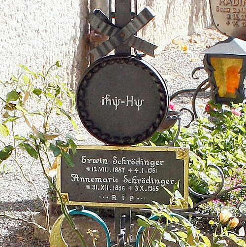

**[Erwin Schrödinger](kloom:e/erwin-schrodinger)** was thirty-eight, a professor at Zurich, and known
for careful work on colours, gases and spectra rather than for any
revolution. In late 1925 he had been reading de Broglie's thesis, which
gave every particle a wave. At a colloquium in Zurich **Peter Debye**
remarked, offhand, that if particles behaved as waves there ought to be a
wave equation for them. Schrödinger went looking for it.

## Christmas at Arosa

His first attempt took account of relativity, and its fine detail
disagreed with the measured spectrum of hydrogen. He put it aside. Over
Christmas he went to **[Arosa](kloom:e/arosa)**, the Alpine resort where he had stayed at a
sanatorium for his lungs before. The accounts differ on the details: Sergei
Suslov, in a paper for the centenary, puts him in the
Villa Frisia of Dr Herwig's sanatorium; Wikipedia's history of the
equation has him secluded in a mountain cabin with a mistress, not his
wife. On 27 December he wrote to Wilhelm Wien, editor
of the _Annalen der Physik_, that he hoped to get the energy levels of
hydrogen as the natural frequencies of a vibration.

He did. His paper "Quantisation as an eigenvalue problem" reached the
_Annalen_ in January 1926, and three more with the same title followed by
the summer. The first dropped relativity and wrote a wave equation for an
electron held by the pull of a proton. Only certain energies let the wave
fit, dying away far from the atom instead of blowing up, as only certain
notes fit a string fixed at both ends. Those energies were exactly Bohr's:
_E_ = −13.6 electronvolts divided by _n_², for _n_ = 1, 2, 3 and on. For the
radial part of the calculation he thanked **[Hermann Weyl](kloom:e/hermann-weyl)**. The whole
numbers of the quantum theory, which Bohr had simply postulated, now came
out of the mathematics as the number of nodes in a standing wave. The plate
draws the first three.

## The equation

In the fourth paper, on systems that change with time, he wrote it in the
form that is still taught:

_iħ_ ∂Ψ/∂*t* = −(_ħ_²/2_m_) ∇²Ψ + _V_Ψ

Ψ, the _wave function_, is spread through space; _V_ is the potential the
particle moves in; _m_ is its mass; _ħ_ is Planck's constant divided by 2π;
and _i_ is the square root of −1, which enters only in this fourth paper. It is
a wave equation of a kind physicists had solved since the eighteenth
century, and that was its power. Where matrix mechanics needed an algebra
few of them knew, this needed only the differential equations everyone had
been taught. Einstein, sent a copy, hailed it as the work of true genius.

That spring, in a separate paper, Schrödinger showed that his theory and
Heisenberg's gave the same answers: a wave function could be turned into
matrices and back. Two formulations, from two schools, were one theory.

| Paper, 1926                                    | In the _Annalen der Physik_ | What it did                            |
| ---------------------------------------------- | --------------------------- | -------------------------------------- |
| Quantisation as an eigenvalue problem I        | volume 79 (384), issue 4    | hydrogen's levels as standing waves    |
| … II                                           | issue 6                     | oscillator, rotator, diatomic molecule |
| On the relation to Heisenberg, Born and Jordan | issue 8                     | the two mechanics shown to agree       |
| … III                                          | volume 80 (385)             | perturbations; the Stark effect        |
| … IV                                           | volume 81 (386)             | the equation in time, with _i_         |

## What the wave is

Schrödinger thought Ψ was real: that the electron was a wave, its charge
smeared through the atom. It would not work. A wave packet spreads, and an
electron always arrives whole, at one point.

In a short paper of July 1926 **[Max Born](kloom:e/max-born)**, in Göttingen, used the equation to describe an
electron scattering off an atom. The wave that comes out spreads in every
direction, but a counter records the electron in only one. In the text of
his paper Born said the wave "determines the probability" of each
direction; in a footnote added in proof he corrected it: the probability
is proportional to the square. That is the **[Born rule](kloom:e/born-rule)**: the wave function
gives not where the electron is but the odds of finding it there. It was
the chief reason for Born's Nobel Prize in 1954.

Schrödinger never accepted it. In 1935, to show where it led, he imagined
a cat shut in a steel chamber with a radioactive atom, a counter and a
flask of poison, so that after an hour the wave function of the whole
system held, in his words, "the living and dead cat (pardon the
expression) mixed or spread out in equal parts". He meant it as an
absurdity. [Schrödinger's cat](kloom:e/schrodingers-cat) became the most famous animal in physics.

If the wave was only odds, something about the electron had to stay
unknown. Heisenberg, in Copenhagen, set out to say exactly what: the
uncertainty principle.
