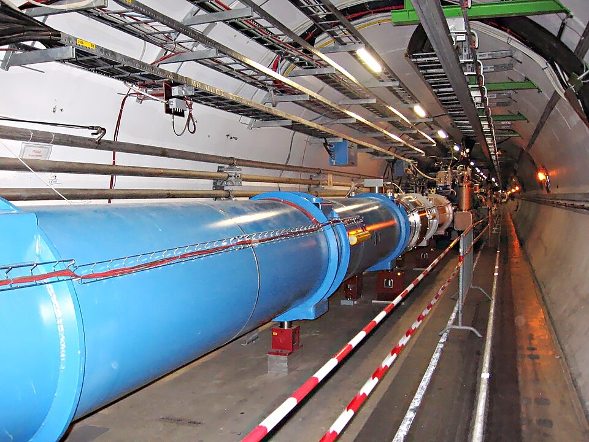
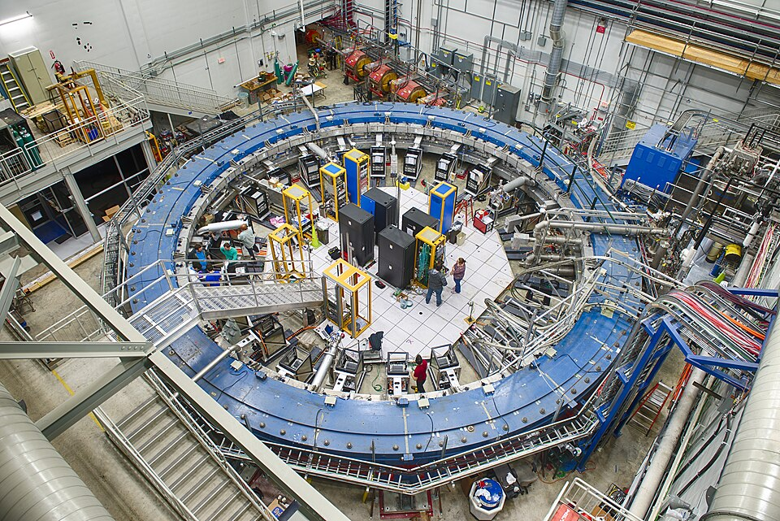

This spine began with Aristotle asking why a stone falls. It ends on 29
September 2026 with two theories that have passed every test put to
them, the Standard Model of particles and general relativity, which do
not fit together, and a list of things neither explains. This frame is a
snapshot of that list as it stood on this date, and of one way physics
has lately reached outside itself.

## Gravity and the quantum

The plate draws a way of seeing the problem that goes back to Matvei
Bronstein and George Gamow in the 1930s, the _cGh cube_. Take classical
mechanics as a corner. Switch on the speed of light, _c_, and we have
special relativity; Newton's constant _G_, gravity; Planck's constant
_ħ_, quantum mechanics. Two at a time give general relativity (c and G)
and quantum field theory (c and ħ). The corner with all three, a quantum
theory of gravity, is empty.

**Quantum gravity** matters where both are strong at once: inside black
holes and in the first instant after the Big Bang. Its effects are
expected at the Planck length, about 10⁻³⁵ meters, far beyond any
experiment. The most studied candidate, **[string theory](kloom:e/string-theory)**, makes every
particle a vibration of a tiny string and includes gravity from the
start, but it admits an enormous number of possible universes, commonly
estimated at around 10⁵⁰⁰, which critics say leaves it predicting almost
nothing. **[Loop quantum gravity](kloom:e/loop-quantum-gravity)** quantizes space itself into discrete
loops without trying to unify the forces. Neither has made a prediction
that an experiment has confirmed.

## Nothing new at the collider

The **[Large Hadron Collider](kloom:e/large-hadron-collider)** at CERN found the Higgs boson in 2012, the
last particle the Standard Model predicted, and since then no new
fundamental particle. That absence is itself a result. The **[hierarchy
problem](kloom:e/hierarchy-problem)** asks why the Higgs boson's mass is so small, when quantum
corrections should drag it up towards the Planck scale unless something
cancels them. Supersymmetry, which gives every particle a partner, would
cancel them; the LHC has found no evidence of it.

The LHC's third run ended in mid-2026, and the machine is shut down
until about 2030 for its high-luminosity upgrade, which will give it
about ten times the collisions. On 22 May 2026 the CERN Council, meeting
in Budapest, recommended a 91-kilometer Future Circular Collider,
colliding electrons with positrons first, as CERN's next flagship; the
decision to build it is not expected before 2028.

## Small numbers

Neutrinos oscillate between their three kinds as they travel, which
they could not do without mass, and the Standard Model gives them none;
the 2015 Nobel Prize in Physics went to that discovery. How much mass
they have is unknown. The KATRIN experiment in Karlsruhe, weighing the
electrons from tritium's decay, put the upper limit at 0.45 electronvolts
in April 2025. Cosmology is sharper and more awkward: DESI and the
microwave background together allow the three masses to sum to no more
than 0.064 eV, while oscillations require at least 0.059.

A result that had been the best hope of new physics has gone the other
way. The **[Muon g − 2](kloom:e/muon-g-2)** experiment at Fermilab published its final
measurement of the muon's magnetism in June 2025, to 127 parts per
billion. For years the prediction had disagreed with it. The prediction
changed, not the measurement: the Standard Model's hardest term, from
quarks and gluons, was recomputed on supercomputers, and in April 2026 a
calculation combining those lattice results with experimental data,
published in _Nature_, agreed with the measurement to within half a
standard deviation. The electron's version of the same quantity has been
measured and calculated more precisely than any other in physics.

Dark matter, a quarter of the universe's energy, and dark energy, more
than two-thirds, have frames of their own; neither is explained. And the
oldest open question in quantum mechanics is still open. The **[measurement
problem](kloom:e/measurement-problem)** asks how the many possibilities in a quantum state become the
single result an instrument records; the Copenhagen, many-worlds and
collapse interpretations answer it differently, and no experiment has
chosen between them. "Shut up and calculate", the phrase often
attributed to Richard Feynman as the working physicist's answer, was
coined by N. David Mermin.

| Question                    | State on 29 September 2026                             |
| --------------------------- | ------------------------------------------------------ |
| A quantum theory of gravity | Candidates, no confirmed prediction                    |
| Why the Higgs is light      | No new particles at the LHC; upgrade under way to 2030 |
| Neutrino masses             | Non-zero; sum below 0.064 eV from cosmology            |
| Muon g − 2                  | Theory and measurement agree, 0.5 standard deviations  |
| Dark matter and dark energy | Measured, unexplained; dark energy may be changing     |
| The measurement problem     | Interpretations, no deciding experiment                |

## Physics outside physics

On 8 October 2024 the Nobel Prize in Physics went to **[John Hopfield](kloom:e/john-hopfield)**
and **[Geoffrey Hinton](kloom:e/geoffrey-hinton)** "for foundational discoveries and inventions that
enable machine learning with artificial neural networks". The committee's
case was that they had "used tools from physics": Hopfield's network
stores memories as low points of an energy written like that of a
material of atomic spins, each a tiny magnet, and Hinton's Boltzmann
machine learns with the statistical physics of systems of many similar
parts. The prize said something about the field as it now is: that the
methods physics built for magnets and gases have become the working
tools of other sciences, and of the neural networks behind today's
artificial intelligence.

Aristotle's question has been answered, and the answer raised these. The
spine ends here; go back to its start, or follow a connection out into
the other subjects.
