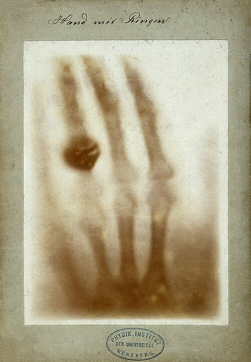
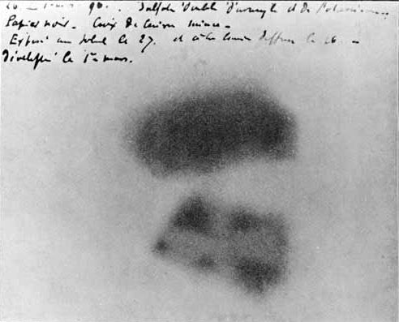

Late on the afternoon of 8 November 1895, at the University of Würzburg,
**[Wilhelm Röntgen](kloom:e/wilhelm-rontgen)** was passing a discharge through a glass tube wrapped in
black cardboard, in a darkened room. A screen painted with barium
platinocyanide, lying on a bench some way off, began to glow. Nothing that
was known could get out of the tube and through the card, and yet
something did. Within three years two more kinds of invisible ray had been
found, coming not from any tube but from matter itself, and the atom, which
was supposed to be the one thing that never changed, was seen to be giving
off energy on its own.

## A new kind of ray

Physicists had been studying the glow of such tubes for decades: current
driven through a nearly empty tube makes _cathode rays_, which light up the
glass where they strike it. Röntgen's rays came from that spot on the
glass and went much further. In the weeks that followed he ate and
slept in his laboratory. His paper, "On a New Kind of Rays",
went to the Würzburg Physical-Medical Society on 28 December. It begins
with the experiment the plate draws: the tube in a close-fitting shield of
black paper, the screen lighting up "with brilliant fluorescence", still
visible two meters away. The rays passed through paper, wood and books,
and were stopped by lead. Because he did not know what they were,
he called them **[X-rays](kloom:e/x-ray)**.

On 22 December he photographed the left hand of his wife, Anna Bertha
Röntgen, with the rays. The print shows her bones and her ring. She is
said to have exclaimed, on seeing it, "I have seen my death." On 1 January
1896 Röntgen posted copies of his paper and prints to physicists around
Europe, and the news was in the newspapers within days. His biographer Otto
Glasser counted 49 essays and 1,044 articles on the rays in 1896 alone.
Within weeks doctors were using them to find needles and bullets in hands
and limbs. In 1901 Röntgen received the first Nobel Prize in Physics. He
took out no patent.

## Rays from uranium

In Paris, **[Henri Becquerel](kloom:e/henri-becquerel)** heard Röntgen's work read to the Academy of
Sciences in January 1896 and wondered whether phosphorescent substances,
which glow after being lit, might give off such rays too. He wrapped
photographic plates in thick black paper, laid crystals of a uranium salt
on top and put them in the sun, and the plates came out marked. Then the
sun failed. He left a prepared plate with its uranium in a drawer on 26 and
27 February, developed it on 1 March expecting a faint image, and found
the silhouettes "with great intensity". The uranium needed no light. By May
he had shown that the rays came from the uranium itself.

## Polonium and radium

**[Marie Curie](kloom:e/marie-curie)**, a Polish physicist in Paris looking for a subject for her
doctorate, took up the uranium rays late in 1897. Measuring the tiny electric
currents they make in air, with an electrometer her husband **[Pierre
Curie](kloom:e/pierre-curie)** and his brother had devised, she showed that the strength of the
rays depends only on the amount of uranium present, and found that thorium
gives them too. It was a property of atoms. She proposed a name for it:
**[radioactivity](kloom:e/radioactive-decay)**.

Some uranium ores were more active than their uranium could explain, and
she guessed at an unknown element. Pierre dropped his own research to join
her. Working through pitchblende ore by chemistry, and following the
activity with the electrometer, they announced **polonium**, named for her
country, in July 1898, and **[radium](kloom:e/radium)** in December. Proving them took
years: from several tons of mine residue from Joachimsthal in Bohemia,
worked in a leaking shed, Marie had separated a tenth of a gram of radium
chloride by 1902. The Curies and Becquerel shared the Nobel Prize in
Physics in 1903.

## What it cost

Ernest Rutherford named two kinds of uranium's rays alpha and beta in 1899,
and a third, more penetrating, gamma in 1903; what they revealed about the
atom's core is the nucleus frame's story. The rays themselves did harm long
before anyone understood it. Early X-ray workers reported burns and hair
loss in 1896. **Clarence Dally**, a glassblower who tested tubes on his own
hands for Thomas Edison, died in 1904 after both arms were amputated, the
first death known to be caused by X-rays. Becquerel was burned by radium he
carried in a waistcoat pocket, and both Curies had radium burns. Marie
Curie died in 1934 of aplastic anemia, probably from her exposure; her
notebooks are still radioactive and are kept in lead-lined boxes.

In 1912 Max von Laue showed that crystals diffract X-rays, proving them
waves far shorter than light's, and the Braggs turned the pattern into a
way to read the arrangement of atoms in a crystal. **[X-ray crystallography](kloom:e/x-ray-crystallography)**
would one day read the structure of DNA. Meanwhile the cathode rays that
had made Röntgen's glow were still unexplained, and in Cambridge J. J.
Thomson was about to say what they were.
