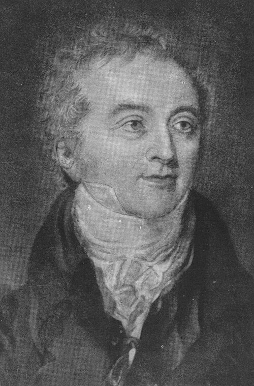
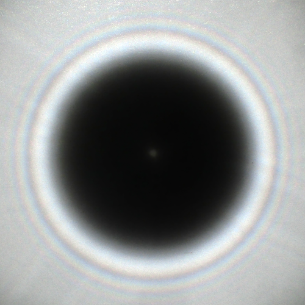

In 1801 a physician in his late twenties, **[Thomas Young](kloom:e/thomas-young-scientist)**, became professor of
natural philosophy at the **[Royal Institution](kloom:e/royal-institution)** in London. In two years he
gave ninety-one lectures there, and between 1800 and 1803 he read the Royal
Society three Bakerian lectures arguing that light is a wave. Most of his audience held
the other view, Newton's: that light is a stream of particles, the
**[corpuscular theory of light](kloom:e/corpuscular-theory-of-light)**, which Newton's authority had kept in front
for a century. Young's case rested on one idea, which he called the general
law of the interference of light, and on an experiment simple enough to do
with a sunbeam and a card.

## Two portions of one light

Young came to light from sound. He had studied the human voice, and knew
that two notes a little out of tune beat: they reinforce, cancel and
reinforce again. He argued that light does the same. In his Bakerian
lecture of 1801, published in 1802, he put it with water: two equal trains
of waves entering one channel make higher waves where crest meets crest,
and smooth water where crest meets trough. Whenever two portions of the
same light reach the eye by routes of different length, he wrote, the light
is brightest when the difference is a whole number of some small length,
and weakest in between, and the length differs from colour to colour.

He used it to explain the coloured rings Newton had seen where a lens
presses on glass. Light reflected from the top and the bottom of the thin
film of air between them interferes. From Newton's own measurements of the
film's thickness at each ring, Young worked out the length of a wave of
each colour. The table converts some of his figures; the conversion to
nanometres is ours.

| Young's colour, 1802 | Wave, parts of an inch | In nanometres, by our conversion |
| -------------------- | ---------------------: | -------------------------------: |
| Extreme red          |              0.0000266 |                              676 |
| Yellow               |              0.0000227 |                              577 |
| Green                |              0.0000211 |                              536 |
| Blue                 |              0.0000196 |                              498 |
| Extreme violet       |              0.0000167 |                              424 |

On 24 November 1803 he gave the Royal Society what he called a proof "so
simple and so demonstrative" that it would convince "the most prejudiced".
He let sunlight through a pinhole in a window shutter and held in the beam
a slip of card about a thirtieth of an inch wide. Its shadow was crossed by
fringes, and the middle of the shadow was always white. Then he put a
second card beside the first, to stop the light passing one edge only. The
fringes inside the shadow vanished. They were made by the light from both
edges together: light added to light had made the dark bands.

## Did he use two slits?

The experiment that carries his name is described in his _Course of
Lectures_ of 1807: light from one source falls on a screen with two small
holes or slits, and the light beyond is "divided by dark stripes". The bright
stripes lie where the routes from the two slits differ by one, two or three
waves, the dark ones where they differ by a half, one and a half, and so on.
The plate draws that geometry. Historians are not sure which of the
versions Young described he actually performed; the split sunbeam of 1803
is documented, and the **[double-slit experiment](kloom:e/double-slit-experiment)** in the form taught today may
have been partly a thought experiment.

London was not persuaded. In 1803 and 1804 the _Edinburgh Review_ ran
unsigned attacks on Young's papers, later known to be by **Henry
Brougham**. Young answered in a pamphlet of which, it was said, a single
copy was sold, and a publisher dropped his lectures.

## Fresnel and the bright spot

The case was carried in Paris. **[Augustin Fresnel](kloom:e/augustin-jean-fresnel)**, a government road
engineer, took up diffraction in 1815 while out of work for having opposed
Napoleon's return from Elba. He combined Young's interference with
Huygens's idea that every point of a wave sends out wavelets of its own,
and added up the wavelets with their phases. In 1817 the Academy of
Sciences, whose leading physicists favoured particles, set diffraction as
the subject of its prize for 1818. Fresnel's memoir, deposited on 29 July
1818, won it the next March.

On the committee, **[Siméon Denis Poisson](kloom:e/simeon-denis-poisson)** worked out a consequence of
Fresnel's mathematics: at the very centre of the shadow of a small disc
there should be a bright spot. The usual story is that he meant it as a
reductio, and that **François Arago** tested it with a disc of about 2 mm
waxed to glass and found the spot. The historian E. T. Whittaker, writing
in 1910, says instead that Poisson suggested the test and the results
confirmed the theory. Either way the **[Arago spot](kloom:e/arago-spot)** is real, and had been
seen a century earlier and forgotten.

One puzzle remained. Light can be polarized, and a wave like sound, which
vibrates along its direction of travel, cannot. In January 1817 Young
suggested to Arago that light's vibration might be transverse, across its
path. Fresnel made light's waves wholly transverse, and with that explained
polarization. Within seven years of the prize, in Whittaker's account, the
particle theory had been overthrown. What was waving was a question left to
the field.

A century later the same apparatus, fed with electrons one at a time,
became the central puzzle of quantum mechanics.
