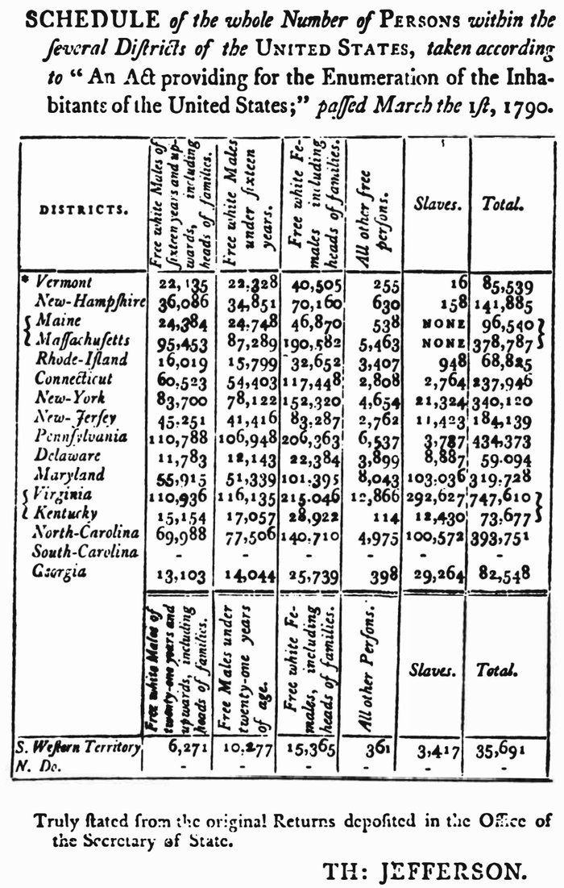

When Britain won the Seven Years' War in 1763, its thirteen colonies on the Atlantic coast of North America were among the richest parts of the **[British Empire](kloom:e/british-empire)**, and Parliament decided they should help pay for the war. The **[Stamp Act](kloom:e/stamp-act-1765)** of 1765 taxed every legal document, newspaper and pack of cards in the colonies. Their assemblies answered that only they could tax the colonists, who sent no members to Parliament: "No taxation without representation". The act was repealed the next year, but Parliament declared its right to legislate for the colonies "in all cases whatsoever", and taxes on tea, glass and paper followed. Troops in Boston fired on a crowd in 1770; the Boston Tea Party in 1773 brought laws closing the port. On 19 April 1775 British soldiers marching to seize militia stores met armed colonists at Lexington and Concord, and the **[American Revolution](kloom:e/american-revolution)** became a war.

## Self-evident

In June 1776 the **Second Continental Congress** appointed five members to draft a declaration of independence, and they gave the writing to **[Thomas Jefferson](kloom:e/thomas-jefferson)** of Virginia. His draft held these truths to be "sacred & undeniable"; Benjamin Franklin may be the one who made them "self-evident". On 2 July Congress voted for independence, and for two days it cut Jefferson's text by about a quarter. On 4 July it adopted the **[United States Declaration of Independence](kloom:e/united-states-declaration-of-independence)**, whose second sentence reads, in the National Archives' transcription: "We hold these truths to be self-evident, that all men are created equal, that they are endowed by their Creator with certain unalienable Rights, that among these are Life, Liberty and the pursuit of Happiness."

One cut was a paragraph blaming King George III for the slave trade: he "has waged cruel war against human nature itself, violating it's most sacred rights of life and liberty in the persons of a distant people who never offended him". Jefferson, who owned more than 620 people in the course of his life, explained in his autobiography that it was struck out "in complaisance to South Carolina and Georgia, who had never attempted to restrain the importation of slaves". A grievance that stayed in called Native Americans "merciless Indian Savages". In March, **[Abigail Adams](kloom:e/abigail-adams)** had asked her husband John to "Remember the Ladies" in the new laws: "all Men would be tyrants if they could."

## Making a constitution

The war ended in 1783, and the Articles of Confederation gave the new nation a Congress that could not tax or enforce its laws. In May 1787, 55 delegates met in Philadelphia for the **[Constitutional Convention](kloom:e/constitutional-convention-united-states)**, and agreed to keep their debates secret. **[James Madison](kloom:e/james-madison)** came with a plan, which is why the Convention began from it:

| Question        | The Virginia Plan, 29 May       | The New Jersey Plan, 15 June     | The Constitution, 17 September              |
| --------------- | ------------------------------- | -------------------------------- | ------------------------------------------- |
| Congress        | two houses, seats by population | one house, one vote a state      | a House by population, two senators a state |
| Executive       | chosen by the legislature       | several, chosen by Congress      | one President, chosen by electors           |
| Who checks whom | Congress may veto state laws    | the executive may coerce a state | veto, override, impeachment, appointments   |

Large states and small ones deadlocked until 16 July, when the **[Connecticut Compromise](kloom:e/connecticut-compromise)** carried by five states to four: the House by population, the Senate by state. Seats raised a second fight. The South asked that the enslaved be counted for seats though they could not vote, and the North that they not be counted. The **[Three-fifths Compromise](kloom:e/three-fifths-compromise)** split the difference in Article I: seats went by the number of free persons, "excluding Indians not taxed, three fifths of all other Persons". Other clauses barred Congress from stopping the slave trade before 1808 and required free states to return people who escaped.

Dividing power among the House, the Senate, the President and the courts, as the plate draws it, owed most to **[Montesquieu](kloom:e/montesquieu)**, whose _The Spirit of Law_ (1748) had held up England's constitution as a model of liberty. Defending the result early in 1788, Madison called him "the oracle who is always consulted and cited on this subject", and agreed that "the accumulation of all powers, legislative, executive, and judiciary, in the same hands … may justly be pronounced the very definition of tyranny." That essay was one of the 85 that he, Alexander Hamilton and John Jay wrote as **[_The Federalist_](kloom:e/the-federalist-papers)**. On 21 June 1788 a ninth state ratified the **[Constitution of the United States](kloom:e/constitution-of-the-united-states)**, enough to make it law, and in April 1789 **[George Washington](kloom:e/george-washington)** took office as the first President. A bill of rights, promised to win ratification, followed in 1791.

## Who "We the People" were

The first census, taken in 1790 under the Constitution's own clause and signed off by Jefferson as Secretary of State, counted 697,697 people as slaves out of 3,929,326, or 17.8 percent: more than one American in six was owned by another. South Carolina's line is blank on the printed schedule; its count came later. By our arithmetic from the counts:

| State                | SC   | VA   | GA   | MD   | NC   | KY   | DE   | NY  | NJ  | US   |
| -------------------- | ---- | ---- | ---- | ---- | ---- | ---- | ---- | --- | --- | ---- |
| Counted as slaves, % | 43.0 | 39.1 | 35.5 | 32.2 | 25.5 | 16.9 | 15.0 | 6.3 | 6.2 | 17.8 |

Women could not vote, except in New Jersey, whose constitution let property owners of either sex vote until a law of 1807 shut women out. Native nations were outside the count altogether. The trail _The idea of rights_ takes up the Bill of Rights, and the next frame the campaign to end the trade that the delegates in Philadelphia had protected.
