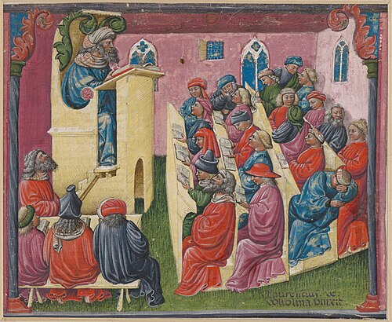

In 1265 the Dominican friars of Rome gave one of their brothers a school to run at their convent of Santa Sabina. **[Thomas Aquinas](kloom:e/thomas-aquinas)**, about forty, had already taught theology at the **[University of Paris](kloom:e/university-of-paris)**. At Santa Sabina he began a textbook for beginners. He worked on it until December 1273, when he stopped, telling his secretary that all he had written "seems like straw to me", and he died the following March, the book unfinished. The **[_Summa theologiae_](kloom:e/summa-theologica)** runs, in the parts he wrote, to 512 questions and, by our arithmetic from them, 2,669 articles, each an argument with the same five parts. It was the work of a new institution, the university, and of a new library, the works of **[Aristotle](kloom:e/aristotle)** in Latin.

## A guild of students

The oldest was at **[Bologna](kloom:e/university-of-bologna)**, where teaching of law began around 1088, though the historian Paul Grendler doubts there was enough of an institution to call a university before the 1150s or even the 1180s. Its students came from all over Europe to study the **[Digest](kloom:e/digest-roman-law)**, Justinian's great anthology of Roman law, rediscovered in Italy about 1070. Foreigners in an Italian city could be punished for their countrymen's debts, so the students formed sworn societies by nation, and in 1155 the emperor **[Frederick Barbarossa](kloom:e/frederick-barbarossa)** granted them a privilege, confirmed at Roncaglia in 1158 and now called the **[Authentica habita](kloom:e/authentica-habita)**: safe travel for study, freedom from that reprisal, and trial before their own masters or the bishop rather than the city's courts. The student guilds then hired the professors, and made the rules. The historian Hastings Rashdall summarized their surviving statutes in 1895:

| The rule                                   | The penalty                                                 |
| ------------------------------------------ | ----------------------------------------------------------- |
| Begin when the bell of San Pietro rings    | 20 solidi for each late start                               |
| Stop when the bell rings for tierce        | Students who stay to listen are fined 10 solidi each        |
| Cover each section of the text by its date | A deduction from the 10 pounds deposited with a banker      |
| Skip no chapter, defer no difficulty       | A fine                                                      |
| Leave of absence, even for a day           | First from your own students, then from the student rectors |
| An audience of at least five               | Under five, you are counted absent and fined                |

A committee of students, the "denouncers of doctors", reported on the professors to the rector.

## Masters and their license

Paris grew the other way, as a guild of masters. A statute of 1215 set the course: no one was to lecture in arts before twenty, after six years of study, or in theology before thirty-five, after eight; and no one was to buy the license to teach "through a gift of money". The faculty of arts came first, and above it the higher faculties of law, medicine and theology. A master taught by the lecture, reading an authoritative text with his commentary, and by the disputation, where a question was argued for and against and the master then summed up the arguments and gave his own answer. The schools' method of argument is called **[scholasticism](kloom:e/scholasticism)**. The degree was that license: a master was one licensed to teach.

The same statute forbade the arts masters to read "the books of Aristotle on Metaphysics or Natural Philosophy". They had arrived in a flood. **[James of Venice](kloom:e/james-of-venice)** put the _Posterior Analytics_ and the _Physics_ into Latin from Greek, in Constantinople, between about 1125 and 1150. In **[Toledo](kloom:e/toledo-spain)**, retaken from its Muslim rulers in 1085, **[Gerard of Cremona](kloom:e/gerard-of-cremona)** translated 87 books from Arabic before he died in 1187, the _Physics_ and Ptolemy's _Almagest_ among them. Much of that Arabic had itself been translated from Greek, in **[Baghdad](kloom:e/baghdad)**, between the eighth century and the tenth. **[Michael Scot](kloom:e/michael-scot)** translated the commentaries on Aristotle of **[Averroes](kloom:e/averroes)**, the philosopher and jurist of Córdoba, whom Aquinas called simply "the Commentator". By 1270 the ban was a dead letter; **[William of Moerbeke](kloom:e/william-of-moerbeke)**, a Dominican, retranslated nearly all of Aristotle from the Greek in the 1260s, at Aquinas's request, it is often said, though the evidence for that is unclear.

## The parts of an article

The _Summa_ took the disputation's form. Its first part, question 2, article 3, asks whether God exists, and answers with the five ways, in the 1920 translation of the English Dominicans:

| Part                 | What it says                                                                                                                                                                 |
| -------------------- | ---------------------------------------------------------------------------------------------------------------------------------------------------------------------------- |
| The question         | "Whether God exists?"                                                                                                                                                        |
| Objection 1          | If God were infinite goodness, "there would be no evil discoverable; but there is evil in the world"                                                                         |
| Objection 2          | Everything can be accounted for by nature and by human reason, so "there is no need to suppose God's existence"                                                              |
| On the contrary      | An authority: "I am Who am" (Exodus 3:14)                                                                                                                                    |
| I answer that        | "The existence of God can be proved in five ways": from motion, from cause, from possibility and necessity, from degrees of perfection, and from the governance of the world |
| Reply to objection 1 | With Augustine, God allows evil to bring good out of it                                                                                                                      |
| Reply to objection 2 | Nature and will both "must be traced back to an immovable and self-necessary first principle"                                                                                |

Every objection gets its reply, so that nothing on the other side is left unanswered. The plate draws the article's structure. The first way is Aristotle's argument for an unmoved mover, from the _Physics_; the authorities are the Bible and Augustine.

## Faith, reason and 1277

Aquinas held that reason and revelation are both roads to truth about God, and that reason alone can reach some of it, God's existence among it. He wrote against those arts masters, followers of Averroes, who taught that the intellect is one for all humankind. In 1270 the bishop of Paris, Étienne Tempier, condemned thirteen of their propositions. On 7 March 1277, three years to the day after Aquinas died, Tempier condemned 219, among them the eternity of the world and the claim that God could not move the heavens in a straight line. Whether any came from Aquinas is argued: John Wippel, against Roland Hissette, finds some taken from his writings, and Robert Wielockx argued for a separate inquiry into Aquinas that was begun and then stopped, a reading others have since questioned. In 1323 the pope made him a saint, and the condemnation was later annulled so far as it touched his teaching. The masters who came after him in the arts faculties, at Oxford and at Paris, went on arguing with Aristotle's physics. The next frame comes to the plague that reached Europe in 1347.
