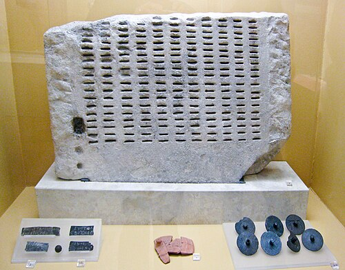
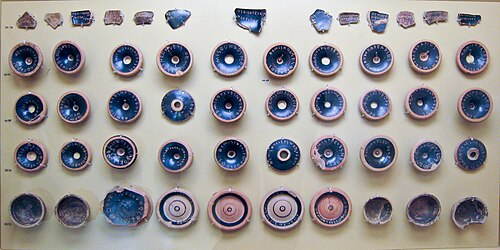

In 508 BC the Spartan king Cleomenes marched into [Athens](kloom:e/athens) to back an aristocrat, Isagoras, against his rival. He expelled seven hundred families and tried to dissolve the city's council. The council refused, and, in the words of [Aristotle](kloom:e/aristotle)'s _Constitution of the Athenians_ (Frederic Kenyon's translation), "the populace flocked together", shut Cleomenes and Isagoras up on the Acropolis and "besieged them for two days". On the third they let the Spartans go and called the exiled rival back. He was **[Cleisthenes](kloom:e/cleisthenes)**, and the reforms he made in 508 and 507 BC began **[Athenian democracy](kloom:e/athenian-democracy)**. Most cities of **[ancient Greece](kloom:e/ancient-greece)** were ruled by tyrants or by a few rich families. Athens would now be ruled by its citizens, in person.

Cleisthenes broke the old clans' hold by redrawing the map. He divided Attica into about 139 local districts, the demes, and grouped them into thirty "thirds", ten in the city, ten on the coast and ten inland. Each of ten new tribes took one third from each region, chosen by lot, so that no tribe was a single neighborhood. A Council of 500, fifty from each tribe, prepared the business. "From this arose the saying 'Do not look at the tribes'," Aristotle writes, "addressed to those who wished to scrutinize the lists of the old families."

## How it worked

By the time Aristotle's school described it, in the 320s BC, the system had grown, but its parts were Cleisthenes':

| Body                | Who sat                                          | How chosen                 | Pay a day           |
| ------------------- | ------------------------------------------------ | -------------------------- | ------------------- |
| The Assembly        | any adult male citizen who came                  | nobody chosen              | 1 drachma (6 obols) |
| The Council         | 500, fifty from each tribe                       | lot                        | 5 obols             |
| Its presiding fifty | one tribe's councillors, for a tenth of the year | order of the tribes by lot | 1 obol more         |
| Its chairman        | one of them, for "a night and a day"             | lot, never twice           | nothing more        |
| The courts          | citizens over thirty, 500 or more a case         | lot, by machine            | 3 obols             |
| The ten generals    | one from each tribe                              | vote of the Assembly       | nothing more        |

The **[Assembly](kloom:e/ecclesia-ancient-greece)** met on the hillside of the **[Pnyx](kloom:e/pnyx)**, four times in each tenth of the year, and its herald opened debate by asking, "Who wishes to speak?" Offices that needed skill, the generals and some treasurers, were elected. The rest went by lot, which gave every citizen the same chance and owed nobody a favor. The chairman of the Council, for one night and day, held the keys of the treasuries and the city's seal.

## A machine for juries

The courts show it best. There was no professional judge: a citizen brought the case, and hundreds of citizens decided it by majority. The danger was a jury picked by a friend, so the Athenians chose jurors by a machine, the **[kleroterion](kloom:e/kleroterion)**. Aristotle sets out the steps:

| Step | What happened                                                                                                |
| ---- | ------------------------------------------------------------------------------------------------------------ |
| 1    | Each juror owned a ticket with his name, his father's and his deme, and one of ten letters, alpha to kappa   |
| 2    | At his tribe's entrance he dropped it in the chest of his letter; the archon drew one ticket from each chest |
| 3    | That man, the "ticket-hanger", slotted the tickets into the stone, one letter to each column                 |
| 4    | The archon poured bronze dice into a tube beside the slots, black and white, "one for each five tickets"     |
| 5    | Each white die that fell chose the next row of tickets; each black one sent a row home                       |
| 6    | The chosen drew a lettered counter that sent each to a court, decided by a second lot                        |

By our arithmetic, to send fifty jurors from a tribe's two allotment rooms, the archon put five white dice in each tube: five rows of five. Nobody could know in advance who would sit, or where.

A fragment of one stands in the Agora Museum in Athens, cataloged I 3967: Pentelic marble, 73 centimeters wide, eleven columns of slots, with holes at the left where the tube was fixed. The Agora's kleroteria are later than Aristotle, of the second century BC, and this one was found reused as the floor of a medieval storage jar. Pay made the courts possible for the poor: **[Pericles](kloom:e/pericles)** introduced it, Aristotle says, "as a bid for popular favour".

## Ostracism

Once a year the Assembly was asked whether to hold an **[ostracism](kloom:e/ostracism)**. If it said yes, two months later each citizen scratched a name on a potsherd, an _ostrakon_. If at least six thousand voted, Plutarch says, the man with the most was exiled for ten years, his property untouched. Plutarch tells of an illiterate voter who handed his sherd to **[Aristides](kloom:e/aristides)** and asked him to write "Aristides" on it, because "I am tired of hearing him everywhere called 'The Just'." Aristides wrote it.

About twelve thousand ostraka have been dug up in the Agora and the Kerameikos. In a well beside the Acropolis lay 190 made out for **[Themistocles](kloom:e/themistocles)**, written by only fourteen hands, ready to be handed to voters.

## Who was not there

The citizens were free men of Athenian birth, after Pericles' law of 451 BC with an Athenian mother as well as father. Women, foreign residents (the **[metics](kloom:e/metic)**) and slaves had no vote. Attica in the fourth century held perhaps 250,000 to 300,000 people, and some 30,000 adult male citizens; by our arithmetic, about one person in nine. Slaves are counted from 20,000 to 80,000 and more; a census under Demetrius of Phalerum, about 317 BC, gave 21,000 citizens, 10,000 metics and 400,000 slaves, a last figure many historians doubt. Slaves worked the silver mines that, with the tribute of an empire, paid for the fleet and the pay.

**[Thucydides](kloom:e/thucydides)** gives Pericles a funeral speech of 431 BC, written in his own words, that states the ideal: "Its administration favours the many instead of the few; this is why it is called a democracy" (Richard Crawley's translation). Critics answered from the start. An anonymous pamphlet, the "Old Oligarch", says of the constitution, "I praise it not, in so far as the very choice involves the welfare of the baser folk as opposed to that of the better class" (H. G. Dakyns). **[Plato](kloom:e/plato)**, whose teacher a jury of citizens sentenced to death, has Socrates call democracy "a charming form of government, full of variety and disorder, and dispensing a sort of equality to equals and unequals alike" (Benjamin Jowett). The next frame takes the same citizens to the theater.
