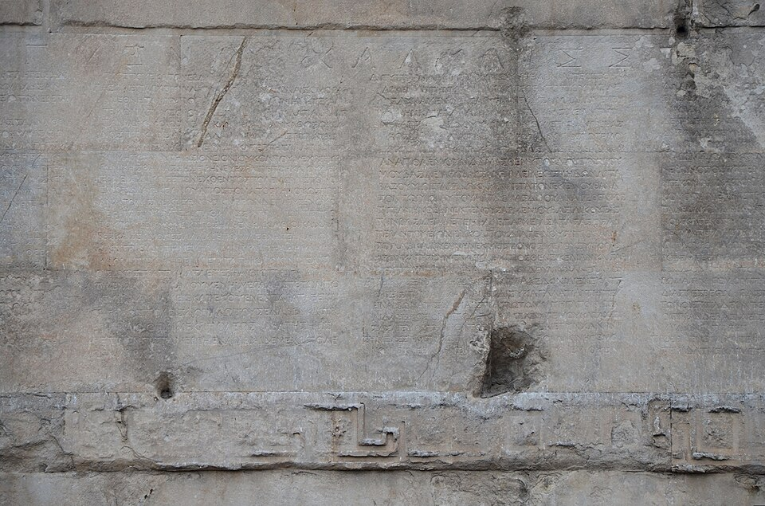

On 2 September 31 BC, off the headland of **[Actium](kloom:e/battle-of-actium)** in western Greece, the fleet of **Octavian**, commanded by his friend **[Marcus Agrippa](kloom:e/marcus-vipsanius-agrippa)**, broke the fleets of **[Mark Antony](kloom:e/mark-antony)** and **[Cleopatra](kloom:e/cleopatra)**, queen of Egypt. Within a year both were dead by their own hands, and Octavian, the great-nephew and adopted son of **[Julius Caesar](kloom:e/julius-caesar)**, was the only man in the Roman world with an army that mattered. Caesar had ruled as dictator and been murdered for it. His heir did something subtler. In January 27 BC he handed his powers back to the Senate, and the Senate gave most of them back to him, with a new name: **[Augustus](kloom:e/augustus)**, "the revered". Historians date the **[Roman Empire](kloom:e/roman-empire)** from that month; Augustus said he had restored the **[Roman Republic](kloom:e/roman-republic)**.

## In his own words

He wrote an account of his life to be set up on two bronze pillars outside his tomb in **[Rome](kloom:e/rome)**. The bronze is lost. The text survives because copies were carved in the provinces, the fullest on the **[Temple of Augustus and Rome](kloom:e/temple-of-augustus-and-rome)** at Ankara, in Latin inside the porch and in Greek outside, the side shown here. It is the **[_Res Gestae Divi Augusti_](kloom:e/res-gestae-divi-augusti)**, "the deeds of the deified Augustus". Of 27 BC it says, in Frederick Shipley's translation of 1924:

> In my sixth and seventh consulships, when I had extinguished the flames of civil war, after receiving by universal consent the absolute control of affairs, I transferred the republic from my own control to the will of the senate and the Roman people. … After that time I took precedence of all in rank, but of power I possessed no more than those who were my colleagues in any magistracy.

He refused, he says, any office "contrary to the traditions of our ancestors". What was new was holding the old powers together, for life, with no colleague able to check him:

| Power                   | Held from                    | What it gave him                                               |
| ----------------------- | ---------------------------- | -------------------------------------------------------------- |
| Consul                  | every year, 31–23 BC         | the chief magistracy, the chair of the Senate                  |
| Command of provinces    | 27 BC, ten years and renewed | Spain, Gaul, Syria and Egypt, and about twenty legions in them |
| Greater command         | 23 BC                        | authority over every other governor                            |
| Power of a tribune      | 23 BC, for life              | to call the Senate and people, propose laws and veto them      |
| First man of the Senate | by 27 BC                     | to speak first                                                 |
| _Pontifex maximus_      | 12 BC                        | the headship of the state's religion                           |
| Father of his Country   | 2 BC                         | a title, voted by Senate, knights and people                   |

The historian **[Tacitus](kloom:e/tacitus)**, a century later, put it in one sentence (Church and Brodribb's translation): he "won over the soldiers with gifts, the populace with cheap corn, and all men with the sweets of repose, and so grew greater by degrees, while he concentrated in himself the functions of the Senate, the magistrates, and the laws."

What the inscription leaves out says as much. It names no enemy. Caesar's murderers are "those who slew my father", punished "by due process of law"; there is no word of the proscriptions of 43 BC, in which Octavian, Antony and Lepidus outlawed some 300 senators and knights and **[Cicero](kloom:e/cicero)** was killed. Antony and Cleopatra appear only as "the war in which I was victorious at Actium". The three legions lost under Varus in the **[Battle of the Teutoburg Forest](kloom:e/battle-of-the-teutoburg-forest)** in AD 9 are missing, and Germany is "reduced to a state of peace" as far as the Elbe. It counts among his deeds that about 30,000 runaway slaves who had fought for Sextus Pompey were "delivered to their masters for punishment".

## Soldiers, roads and a count of citizens

Augustus says that about 500,000 citizens had sworn their military oath to him, and that he settled more than 300,000 of them on land or with money. What remained became a standing army on fixed pay and terms. In AD 6 he founded a military treasury with 170 million sesterces of his own, to pay soldiers who had served twenty years. By AD 23, Tacitus counts, 25 legions held the frontiers, eight of them on the Rhine. Along the military roads, Suetonius says, he posted couriers and then carriages, so that news from the provinces came fast.

He also counted the citizens, three times:

| Census   |  Citizens |
| -------- | --------: |
| 70/69 BC |   910,000 |
| 28 BC    | 4,063,000 |
| 8 BC     | 4,233,000 |
| AD 14    | 4,937,000 |

The jump from the Republic's last count is a puzzle. If Augustus's census counted women and children, as the standard reading holds, Italy held about 4 million people in 28 BC; if it counted adult men, as the Republic's had, it held about 10 million. The historian Elio Lo Cascio argues for the second. The best-known census of the reign may not be his. Luke's Gospel says "there went out a decree from Caesar Augustus that all the world should be taxed" (Luke 2:1, King James Version), when Quirinius governed Syria. But Quirinius counted Judaea in AD 6, when it became a province, and no other source knows an empire-wide census; most critical scholars think Luke mistaken, though some religious scholars defend him.

## The price of peace

Augustus died at Nola on 19 August AD 14, in the month that had been renamed for him in 8 BC. He left, in his own hand, a summary of the empire's resources and a counsel to keep it within its present limits. It ran from Spain to Syria, and from the Rhine to the Sahara. Bruce Frier estimates its people at 45.5 million; Karl Julius Beloch, in 1886, at 54 million; Kyle Harper at 60 million. Inside the frontiers came about two centuries of the **[Pax Romana](kloom:e/pax-romana)**, the Roman peace. Tacitus knew what it cost. He gave a Caledonian chief, about to fight his father-in-law Agricola in AD 83 or 84, a speech that ends: "To robbery, slaughter, plunder, they give the lying name of empire; they make a solitude and call it peace."

The trail _Rome, from Republic to Byzantium_ goes back to the Republic he ended, its law and its last defender, and on to the eastern empire that kept his title until 1453. The main spine goes on to the Pantheon, rebuilt on the site of Agrippa's.
