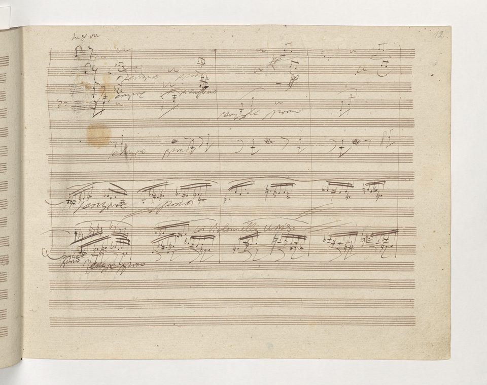

On the evening of 7 May 1824 the **[Theater am Kärntnertor](kloom:e/theater-am-karntnertor)** in **[Vienna](kloom:e/vienna)** was full for a concert of new works by **[Ludwig van Beethoven](kloom:e/ludwig-van-beethoven)**, his first appearance on a stage in ten years. The last piece was a symphony in D minor that ended, as no symphony had before, with soloists and a chorus. Beethoven stood among the players and gave the tempo at the start of each movement, but the theater's conductor, Michael Umlauf, had told the musicians to watch him and not the composer, who was almost completely deaf. Beethoven had used ear trumpets made by the showman **[Johann Nepomuk Mälzel](kloom:e/johann-nepomuk-maelzel)** since 1814, and since 1818 his visitors had written what they wanted to say in _conversation books_. At the end, or perhaps after the second movement, the young contralto **[Caroline Unger](kloom:e/caroline-unger)** "plucked him by the sleeve and directed his attention to the clapping hands and waving hats and handkerchiefs. Then he turned to the audience and bowed." That is Alexander Thayer's telling. Unger herself, and Beethoven's secretary **[Anton Schindler](kloom:e/anton-schindler)**, put the moment at the end of the concert; the pianist Sigismond Thalberg, who was there, told Thayer it came after the scherzo.

## How a symphony is built

The **[Symphony No. 9](kloom:e/symphony-no-9-beethoven)** is scored for the largest orchestra Beethoven ever asked for, and at the premiere every wind part was played by two players, a band nearly twice the usual size:

| Section    | In the score                                                                 | At the premiere                                                                                                                           |
| ---------- | ---------------------------------------------------------------------------- | ----------------------------------------------------------------------------------------------------------------------------------------- |
| Woodwinds  | 2 flutes and a piccolo, 2 oboes, 2 clarinets, 2 bassoons and a contrabassoon | each part doubled                                                                                                                         |
| Brass      | 4 horns, 2 trumpets, 3 trombones                                             | each part doubled                                                                                                                         |
| Percussion | timpani; bass drum, triangle and cymbals in the finale                       | as scored                                                                                                                                 |
| Strings    | first and second violins, violas, cellos, double basses                      | parts copied for at least 6 desks of first violins, 6 of seconds, 5 of violas and 6 of cellos and basses, two players to a desk           |
| Voices     | soprano, alto, tenor and bass soloists; a four-part chorus                   | Henriette Sontag, Caroline Unger, Anton Haizinger and Joseph Seipelt; the theater's chorus, enlarged by the Gesellschaft der Musikfreunde |

A symphony of the time had four movements: a fast one in **[sonata form](kloom:e/sonata-form)**, a slow one, a dance (by Beethoven's day a quick _scherzo_), and a fast finale. Beethoven put the scherzo second and the slow movement third. Sonata form is an argument in three parts. An _exposition_ states two groups of themes in two keys, a _development_ breaks them into fragments and drives them through other keys, and a _recapitulation_ brings both back in the home key, often followed by a _coda_. The first movement, by the bar numbers its analysts use, runs:

| Bars   | Section        | What happens                                                                   |
| ------ | -------------- | ------------------------------------------------------------------------------ |
| 1–16   | Introduction   | Bare open fifths, A and E, played pianissimo, like an orchestra tuning up      |
| 17     | First theme    | The fifths crash down into D minor, fortissimo                                 |
| 80     | Second group   | B-flat major                                                                   |
| 150    | Closing        | The exposition ends in B-flat, and is not repeated                             |
| 160    | Development    | The introduction returns; the themes are taken apart                           |
| 301    | Recapitulation | The opening returns fortissimo, in D major, not the hushed fifths of the start |
| last ¼ | Coda           | Nearly a quarter of the movement                                               |

## Not these tones

The finale breaks the form. It opens with what George Grove called "a horrible clamour or fanfare" from the wind and drums, and the cellos and basses answer in a recitative, like a singer without words. Fragments of the first three movements come back one by one, and each is waved away. Then, at bar 92, the low strings play a plain tune in D major, the "Joy" theme, and the orchestra builds variations on it. When the fanfare returns, a human voice answers it for the first time, in words of Beethoven's own: "O Freunde, nicht diese Töne!" ("Oh friends, not these tones!"). From there the bass, the chorus and the soloists sing stanzas of **[Friedrich Schiller](kloom:e/friedrich-schiller)**'s poem **"[Ode to Joy](kloom:e/ode-to-joy)"**, _An die Freude_, through a march with triangle and cymbals, a fugue, a solemn hymn and a headlong coda, 940 bars in all. The musicologist Nicholas Cook calls it "a cantata constructed round a series of variations on the 'Joy' theme", and notes that critics have argued for a century over whether it is also a sonata form, a concerto or four movements in one.

Schiller wrote the ode in 1785 and printed it in his journal _Thalia_ in 1786. He later revised it for his collected poems (Wikipedia's articles date the revision 1803 and 1808; the copy quoted here is the edition of 1808), and Beethoven set the revision, which changed one couplet. In our translation:

| _Thalia_, 1786                                                                                                            | Revised, as Beethoven set it                                                                                     |
| ------------------------------------------------------------------------------------------------------------------------- | ---------------------------------------------------------------------------------------------------------------- |
| Deine Zauber binden wieder, / was der Mode Schwerd getheilt;                                                              | Deine Zauber binden wieder, / Was die Mode streng getheilt,                                                      |
| Bettler werden Fürstenbrüder, / wo dein sanfter Flügel weilt.                                                             | Alle Menschen werden Brüder, / Wo dein sanfter Flügel weilt.                                                     |
| Your spells bind again / what fashion's sword divided; / beggars become princes' brothers / where your gentle wing rests. | Your spells bind again / what fashion sternly divided; / all men become brothers / where your gentle wing rests. |

## Rehearsed, or not

Thayer wrote that the theater's manager, Louis Duport, allowed only two full rehearsals, a third being lost to a ballet, and that "the performance was far from perfect". The historian Theodore Albrecht, working from the conversation books, lists the "inadequate performance after only two rehearsals" among the myths of the night, and reconstructs the sectional, choral and full rehearsals of the fortnight before it. The conversation books are also where Schindler recorded the applause: "Never in my life did I hear such frenetic and yet cordial applause." But Schindler is known to have added entries to them after Beethoven's death, so his words carry less weight than Thalberg's.

## The artist as hero

The Ninth helped make Beethoven the model of the Romantic artist: the solitary genius, deaf and defiant, who speaks to all mankind. E. T. A. Hoffmann had already written in 1810 that his music awakened "the infinite yearning that is the essence of romanticism", and an estimated ten thousand people attended his funeral in Vienna in 1827. The ode became public property too. In 1972 the **[Council of Europe](kloom:e/council-of-europe)** adopted the theme, without words, as its anthem, and in 1985 the European Community, now the **[European Union](kloom:e/european-union)**, did the same. At Christmas 1989, weeks after the **[Berlin Wall](kloom:e/berlin-wall)** was opened, **[Leonard Bernstein](kloom:e/leonard-bernstein)** conducted the symphony in Berlin with an orchestra from both Germanys and the four occupying powers, and the chorus sang _Freiheit_, freedom, in place of _Freude_. The story that the **[compact disc](kloom:e/compact-disc)** was sized at 74 minutes to hold the Ninth is Philips's own; the engineer Kees Schouhamer Immink, who sat in the meetings, says the size was settled by a commercial standoff between Philips and Sony, with Furtwängler's slow 1951 Bayreuth Ninth as the excuse.

The plate draws the four movements to scale, the finale's 940 bars as Cook divides them, and the first bars of the theme. The next frame leaves the concert hall for a basement laboratory in London, where Michael Faraday made magnetism give a current.
