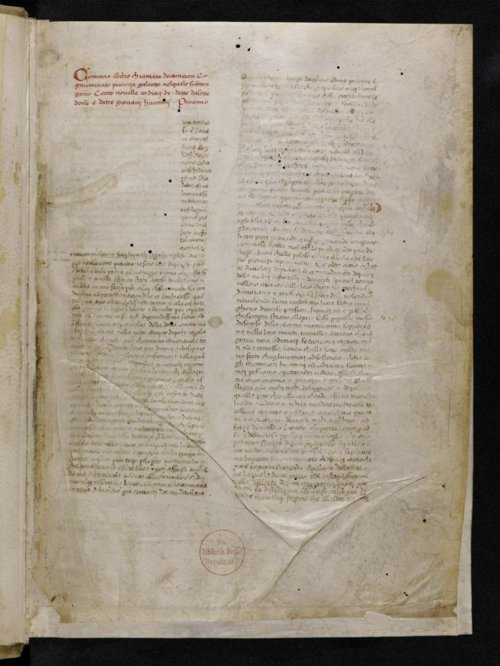

In October 1347 twelve Genoese galleys put into **[Messina](kloom:e/messina)**, in Sicily, and brought the plague with them. Within six years it had crossed Europe to Norway and Moscow, killing somewhere between a quarter and well over half of everyone it reached. Nobody at the time called it the **[Black Death](kloom:e/black-death)**: that name came from Scandinavian chroniclers more than a century later. They called it the pestilence, the great death, or in Latin _mortalitas_, the mortality.

## Where it came from

The best-known story of its arrival is a lawyer's. **[Gabriel de Mussis](kloom:e/gabriel-de-mussis)**, a notary of Piacenza, wrote around 1348 that when the army of the **[Golden Horde](kloom:e/golden-horde)** besieging the Genoese trading port of **[Caffa](kloom:e/feodosia)**, in the Crimea, was struck by the disease in 1346, its commanders had the corpses hurled over the walls: "What seemed like mountains of dead were thrown into the city," in Rosemary Horrox's translation. Survivors, he said, carried the plague home by sea. Mark Wheelis, of the University of California, Davis, found the attack plausible in 2002, but noted that de Mussis was probably not there, and that the plague moved west in steps, on many ships over more than a year, so Caffa's refugees were not the cause. The plate maps the first records place by place.

Its source lay farther east. Graves near Lake Issyk-Kul, in what is now Kyrgyzstan, carry tombstones dated 1338 and 1339 that give "pestilence" as the cause of death. In 2022 Maria Spyrou and her colleagues recovered the plague bacterium's DNA from seven of the people buried there, a strain ancestral to those that spread across Eurasia.

## What it was, and how we know

For decades some historians doubted that it was plague at all. The bones settled it. In 2010 Stephanie Haensch's team found the DNA and proteins of **[_Yersinia pestis_](kloom:e/yersinia-pestis)** in skeletons from mass graves in northern, central and southern Europe, and in 2011 Kirsten Bos's team reconstructed its genome from victims buried in London in 1348–50. How it passed between people is still argued. The classic chain runs from black rats to their fleas to people, and the Oriental rat flea carries plague today. In 2018 Katharine Dean and her colleagues found that the death curves of nine European outbreaks fit a model in which human fleas and body lice carried it from person to person better than one driven by rats. No single explanation has won general acceptance, and the historian Monica Green has urged more attention to the wild animals that carry plague.

The Florentine **[Giovanni Boccaccio](kloom:e/giovanni-boccaccio)** described the signs in the introduction to **[_The Decameron_](kloom:e/the-decameron)**, in John Payne's translation of 1886: "certain swellings, either on the groin or under the armpits, whereof some waxed of the bigness of a common apple, others like unto an egg", followed by "black or livid blotches". De Mussis put the swellings down to "coagulating humours", the medicine of his day. Boccaccio's own copy of the book, from his last years, is in Berlin.

## How many died

| Who                                | Their estimate for Europe                                           |
| ---------------------------------- | ------------------------------------------------------------------- |
| Agents of Pope Clement VI, in 1351 | 23,840,000 dead: 31% of 75 million, by Robert Gottfried's reckoning |
| Mark Wheelis, 2002                 | A quarter to a third                                                |
| Philip Daileader                   | 45 to 50% over four years                                           |
| Ole Benedictow                     | 60%                                                                 |

Cities suffered most. Florence had perhaps 110,000 to 120,000 people in 1338 and about 50,000 in 1351; Boccaccio's belief that "upward of an hundred thousand" died there between March and July 1348 cannot be right, as he half admits, wondering whether the city had held so many. In Siena the chronicler **[Agnolo di Tura](kloom:e/agnolo-di-tura)** wrote that he "buried my five children with my own hands".

## Wages, and blame

With so many dead, those left could ask for more. On 18 June 1349 **[Edward III](kloom:e/edward-iii)** ordered that every able man and woman under sixty serve whoever required them, at the wages of 1346 or the years before, because servants "will not serve unless they may receive excessive wages". The **[Statute of Labourers](kloom:e/statute-of-labourers-1351)** of 1351 set the rates:

| Worker, 1351                 | The most allowed                |
| ---------------------------- | ------------------------------- |
| Master freestone mason       | 4d. a day; other masons 3d.     |
| Master carpenter             | 3d. a day; other carpenters 2d. |
| Mower of meadows             | 5d. an acre or a day            |
| Reaper, first week of August | 2d. a day; the second week 3d.  |
| Thresher                     | 2½d. a quarter of wheat or rye  |

Historians have long said the law failed: farm wages in England roughly doubled between 1350 and 1450. Bertha Putnam, reading the justices' records in 1908, found it "impossible to doubt that during this first decade the wages and price clauses were thoroughly enforced", and thought they held wages lower than they would have gone. Resentment of the labor laws and of a poll tax fed the **[Peasants' Revolt](kloom:e/peasants-revolt)** of 1381.

Others looked for someone to blame. From the spring of 1348 Jews were accused of poisoning wells, and confessions extracted under torture were copied from town to town. **[Pope Clement VI](kloom:e/pope-clement-vi)**, in two bulls of July and September 1348, answered that "it cannot be true", since the plague killed Jews too and struck places where none lived. In Strasbourg, where it had not yet arrived, a new council took power, and on 14 February 1349 about two thousand Jews were burned in their cemetery. Debts owed to them were canceled. "The money was indeed the thing that killed the Jews," wrote the city's chronicler Jacob von Königshofen, in Jacob Marcus's translation. By 1351 some 60 large and 150 smaller Jewish communities had been destroyed, and many survivors fled east to Poland. Bands of flagellants marched from town to town whipping themselves in penance, until the pope condemned them in October 1349.

The plague came back again and again, in Europe until the eighteenth century. In 1377 the Adriatic city of **[Ragusa](kloom:e/republic-of-ragusa)**, now Dubrovnik, ordered arrivals from plague-stricken places to wait thirty days before entering; Venice's forty days, _quarantena_, gave **[quarantine](kloom:e/quarantine)** its name. The next frame steps back a few years, to Petrarch and the humanists.
