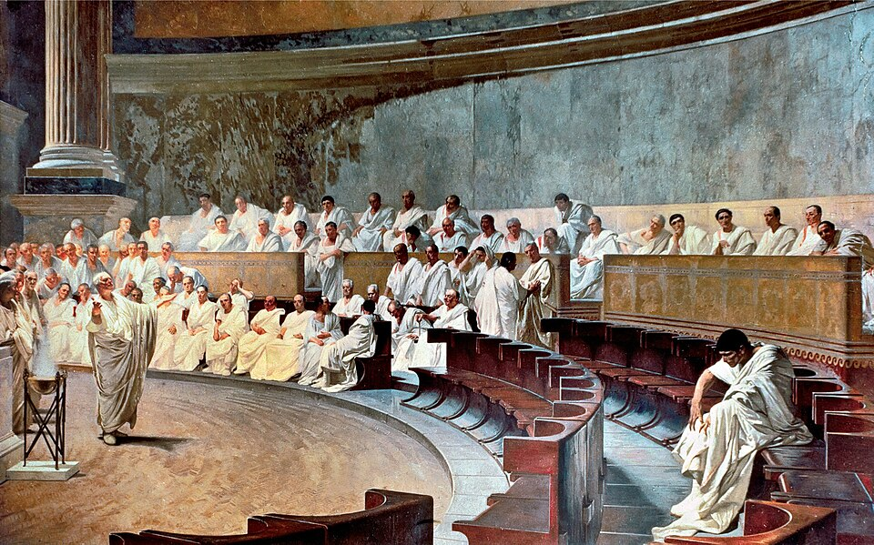

In 63 BC the consul of Rome was **[Cicero](kloom:e/cicero)**, a lawyer from the hill town of Arpinum and a "new man", the first of his family to reach the consulship. That autumn he learned of a plot. **[Catiline](kloom:e/catiline)**, a patrician who had lost the consular election, was gathering indebted veterans and ruined nobles to take by force what the voters had refused him. In October the Senate passed its emergency decree, telling the consuls to do whatever the crisis required. On 7 or 8 November Cicero denounced Catiline to his face, in the temple of Jupiter Stator: "When, O Catiline, do you mean to cease abusing our patience?", in C. D. Yonge's translation. Catiline left Rome for an army in Etruria. In December letters handed to envoys of a Gallic tribe, the Allobroges, exposed five conspirators still in the city, and they were arrested.

On 5 December the Senate debated what to do with them, and the historian **[Sallust](kloom:e/sallust)** gives the order of business. Cicero, as consul, put the question. Decimus Silanus, consul-elect, "the first to be called upon for his opinion", proposed death. When his turn came **[Julius Caesar](kloom:e/julius-caesar)**, praetor-elect, proposed life imprisonment in Italian towns, warning, in J. C. Rolfe's translation, that "all bad precedents have originated in cases which were good." Cato the Younger answered him, and the Senate voted for death. That evening Cicero himself led the chief of them down into the underground cell of the Tullianum, and all five were strangled. A citizen had the right of appeal to the people, and the Senate was not a court.

## How the Republic decided

Cicero climbed the ladder of offices, the **[cursus honorum](kloom:e/cursus-honorum)**, each rung at the youngest age the law allowed, as the table shows. As quaestor in Sicily he found the neglected tomb of Archimedes outside Syracuse.

| Office or body        | Who and how many                 | How it decided                                                              | Cicero                                                                  |
| --------------------- | -------------------------------- | --------------------------------------------------------------------------- | ----------------------------------------------------------------------- |
| Quaestor              | about 20 a year, aged 30 or more | elected by the tribes                                                       | 75 BC, aged 30                                                          |
| Aedile                | 4 a year, aged 36 or more        | elected by the tribes                                                       | 69 BC, aged 36                                                          |
| Praetor               | 6 to 8 a year, aged 39 or more   | elected by the centuries                                                    | 66 BC, aged 39                                                          |
| Consul                | 2 a year, aged 42 or more        | elected by the centuries                                                    | 63 BC, aged 42                                                          |
| Senate                | about 600 former magistrates     | opinions asked in order of rank; a vote by walking to one side of the house | presided in 63 BC                                                       |
| Assembly of centuries | 193 voting units, by wealth      | the richest first; voting stopped at a majority of 97                       | elected him consul, every century voting for him; recalled him in 57 BC |
| Assembly of tribes    | 35 voting units, by district     | one vote a tribe; 18 carried a law                                          | elected him quaestor                                                    |

The Senate's decrees were advice, given force by the magistrates who asked for them. The assemblies were where the people voted, but unequally. **[Livy](kloom:e/livy)**, describing the centuries as they were first set up, says the knights voted first, "then the eighty centuries of the infantry of the First Class; if their votes were divided, which seldom happened, it was arranged for the Second Class to be summoned; very seldom did the voting extend to the lowest Class." Reforms in the third century BC changed the arithmetic, but the plate draws it as Livy did.

## The fall

In 58 BC the tribune **[Publius Clodius Pulcher](kloom:e/publius-clodius-pulcher)** carried a law against anyone who had put a citizen to death without trial. Cicero fled to Thessalonica, and his house on the Palatine was pulled down. The assembly of centuries recalled him in 57. In January 49 BC Caesar led a legion across the Rubicon, the border of his province, and civil war began. Cicero joined **[Pompey](kloom:e/pompey)**'s side, lost, and was pardoned. Caesar made himself dictator for life, and on the Ides of March, 15 March 44 BC, senators stabbed him to death in the Senate's meeting place. Cicero attacked **[Mark Antony](kloom:e/mark-antony)** in fourteen speeches he called the _Philippics_. Then Antony, Lepidus and Caesar's heir Octavian joined forces and drew up a list of the proscribed. On 7 December 43 BC soldiers caught Cicero in his litter near Formiae. Plutarch says that "Herennius cut off his head, by Antony's command, and his hands — the hands with which he wrote the Philippics" (Bernadotte Perrin's translation), and Antony had them set up on the speakers' platform in the Forum.

Historians still argue over 63 BC. Our main sources, Cicero's own speeches and Sallust, are both hostile to Catiline, and Cicero exaggerated the danger for his own glory. Kenneth Waters argued in 1970 that the plot was largely Cicero's invention, and Robin Seager in 1973 that Catiline turned rebel only after Cicero drove him out. Others point to the army Catiline led to its death at Pistoria in January 62 BC as proof that the danger was real.

## The letters

We know this generation so well because Cicero's letters survive, more than 800 of them, over 400 to his friend Atticus, written with no thought of us. The biographer Cornelius Nepos said a reader of them would hardly need a history of the period. In 1345 **[Petrarch](kloom:e/petrarch)** found the letters to Atticus in the chapter library of Verona and was shocked by the man he met. He wrote to Cicero, in Mario Cosenza's translation: "like a traveler in the night didst thou bear the light in the darkness, and didst enlighten for those following thee the path on which thou thyself didst stumble most wretchedly."

The light carried on. In 1465 at Mainz, Johann Fust, the backer of Gutenberg's press, and Peter Schoeffer printed Cicero's _De officiis_, _On Duties_, the treatise on public and private morality he wrote for his son in 44 BC. In 1825 Thomas Jefferson said that the Declaration of Independence rested on "the elementary books of public right, as Aristotle, Cicero, Locke, Sidney". The last frame of this trail goes east, to the Rome that outlived the Republic by fifteen centuries.
