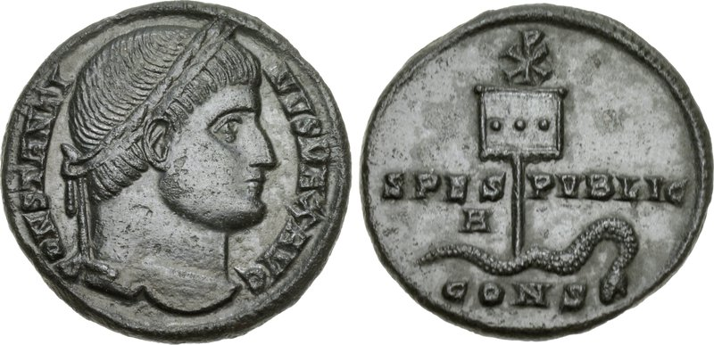

On 28 October 312 two Roman emperors fought at the **[Milvian Bridge](kloom:e/battle-of-the-milvian-bridge)**, where the Via Flaminia crosses the Tiber north of Rome. **[Maxentius](kloom:e/maxentius)**, who held the city, was routed and drowned in the river. The winner, **[Constantine](kloom:e/constantine-the-great)**, born in the Balkans around 272 and hailed emperor by his father's army at York in 306, was master of the West, and from 324 of the whole empire. He was the first emperor to call himself a Christian, and in his reign the church that Diocletian had tried to destroy became the one the state favored.

## Two visions

Two Christians who knew him tell how it began, and they disagree. **[Lactantius](kloom:e/lactantius)**, tutor to Constantine's son, wrote a few years after the battle that Constantine "was directed in a dream to cause the heavenly sign to be delineated on the shields of his soldiers", "the letter Χ, with a perpendicular line drawn through it and turned round thus at the top, being the cipher of Christ" (William Fletcher's translation). **[Eusebius](kloom:e/eusebius)** of Caesarea, in a _Life_ written after Constantine died in 337, gives what the emperor "long afterwards declared" to him under oath: on the march, at noon, he and his whole army saw "the trophy of a cross of light in the heavens, above the sun, and bearing the inscription, Conquer by this". Christ then came to him in a dream, and he had the sign made in gold and jewels as a standard, the **[labarum](kloom:e/labarum)**, topped by the **[Chi Rho](kloom:e/chi-rho)**, "the letter P being intersected by X" (Ernest Richardson's translation).

Eusebius's earlier history of the church mentions no vision at all. In 310 a pagan orator had praised Constantine for a vision of Apollo, and his coins showed the Sun god until about 325. Some historians think the army saw a halo around the sun that Constantine later read as Christ's sign; John Julius Norwich thought the cross in the sky "never occurred", though "some profound spiritual experience" did.

## Not an edict

In February 313 Constantine met the eastern emperor Licinius at Milan. What we call the **[Edict of Milan](kloom:e/edict-of-milan)** is neither an edict nor Constantine's. The text Lactantius preserves is a letter from Licinius to a provincial governor, posted at Nicomedia on 13 June 313, reporting the emperors' decision "that the Christians and all others should have liberty to follow that mode of religion which to each of them appeared best". It returned confiscated churches "without money demanded or price claimed", the treasury compensating buyers. It tolerated every religion and made none official.

## How a council worked

The church Constantine backed was quarreling. In Alexandria a priest, **[Arius](kloom:e/arius)**, taught that the Son was made by the Father, so that there was a time when he did not exist. In 325 Constantine called the bishops to the **[First Council of Nicaea](kloom:e/first-council-of-nicaea)**, and Eusebius, who sat in it, describes the proceedings:

| Stage        | What happened                                                                                                              |
| ------------ | -------------------------------------------------------------------------------------------------------------------------- |
| Summons      | Letters from the emperor, who lent the public post and horses                                                              |
| Who came     | "Exceeded two hundred and fifty" bishops, later remembered as 318; one from Persia; Rome's aged bishop sent two presbyters |
| Where        | The great hall of the palace at Nicaea, seats set by rank                                                                  |
| Opening      | Constantine in purple and gold, seated only when the bishops signaled; a speech in Latin, interpreted                      |
| Debate       | Charge and countercharge, the emperor arguing in Greek                                                                     |
| The creed    | One new word, _homoousios_, "of one substance"                                                                             |
| Signing      | All but two bishops subscribed; Socrates, a century later, says five objected at first                                     |
| Sanctions    | By imperial order Arius and the two, Theonas and Secundus, went into exile in Illyricum                                    |
| Also settled | One reckoning of Easter, Rome's and Alexandria's, not the Jewish calendar; twenty canons                                   |

The clause on the Son reads: "the only-begotten of his Father, of the substance of the Father, God of God, Light of Light, very God of very God, begotten, not made, being of one substance with the Father" (Henry Percival's translation). The **[Nicene Creed](kloom:e/nicene-creed)** then cursed anyone who said "that there was a time when the Son of God was not". It did not end the quarrel. Constantine let Arius return, and was baptized on his deathbed by Eusebius of Nicomedia, a bishop he had once banished for sheltering Arians. The emperor Valens later favored the Arians, and **[Basil of Caesarea](kloom:e/basil-of-caesarea)** defied his prefect to his face.

## New Rome

In 324 Constantine refounded Byzantium, on the Bosporus, as his own city, and on 11 May 330 dedicated it as **[Constantinople](kloom:e/constantinople)**. For its churches he ordered from Eusebius "fifty copies of the sacred Scriptures … written on prepared parchment in a legible manner, and in a convenient, portable form, by professional transcribers thoroughly practiced in their art".

## Who gained, who lost

The church gained tax privileges for its clergy, land and money, Sunday as a day of rest from 321, and buildings. Christians worshiped not in temples but in the shape of the Roman basilica, a hall of courts and business: a tall nave lit from above, lower aisles, an apse. Constantine gave Rome's bishop the Lateran palace, and over Peter's supposed tomb on the Vatican Hill he began **[Old St. Peter's Basilica](kloom:e/old-st-peters-basilica)**, whose roof trusses spanned some 23.7 meters (the plate).

Pagans kept most temples, though Constantine stripped many of statues for his new city and pulled down a few. Jews kept their rights, and their clergy the exemptions Christian clergy had, but they were forbidden to own Christian slaves or to attack Jews who converted, and his letter on Easter, kept by Eusebius, told the churches: "Let us then have nothing in common with the detestable Jewish crowd."

On 27 February 380 Theodosius I made the creed of Nicaea the law. His **[Edict of Thessalonica](kloom:e/edict-of-thessalonica)** ordered those who held it "to take the name of Catholic Christians", and branded the rest, "whom we judge demented and insane", as heretics (our translation). He renewed the ban on sacrifice and did not stop Christians from wrecking temples such as Alexandria's Serapeum. Within seventy years of the Milvian Bridge the persecuted faith had become the state's, and could persecute in its turn.
