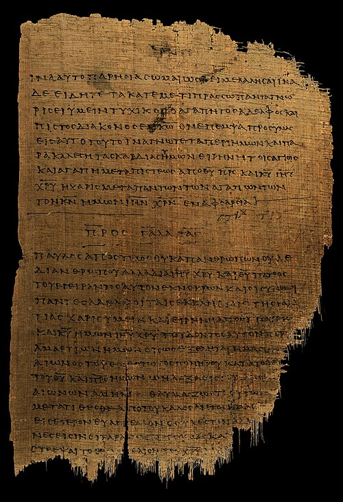

Around AD 30, in [Jerusalem](kloom:e/jerusalem), the Roman prefect of Judaea, **[Pontius Pilate](kloom:e/pontius-pilate)**, had a Jewish preacher from Galilee crucified. His followers said that God had raised him from the dead and that he was the Messiah, in Greek the _Christos_. Two centuries later their movement had a bishop in most cities of the **[Roman Empire](kloom:e/roman-empire)** and enough members for an emperor to try to stamp it out. This is how **[Christianity](kloom:e/christianity)** grew from one execution into a church.

## What a historian can know

**[Jesus](kloom:e/jesus)** wrote nothing. The earliest writings about him are the letters of **[Paul the Apostle](kloom:e/paul-the-apostle)**, from about 48 to 60. The Gospels followed, Mark's around 70 and the other three by early in the second century. Two outsiders mention him. **[Josephus](kloom:e/josephus)**, a Jewish historian writing in the 90s, names "the brother of Jesus, who was called Christ, whose name was James" (in William Whiston's translation), and has a longer passage on Jesus that most scholars think a Christian copyist later embellished. **[Tacitus](kloom:e/tacitus)**, about 116, says that "Christus … suffered the extreme penalty during the reign of Tiberius at the hands of one of our procurators, Pontius Pilatus" (in Church and Brodribb's).

Almost all historians of antiquity agree that Jesus lived, was baptized by John the Baptist and was crucified under Pilate, between 30 and 36. They disagree about much else, down to why Rome killed him. That he rose again is the faith's claim, not the historian's. His followers believed it from the first: Paul passes on a formula he had himself "received", that Christ "rose again the third day according to the scriptures" (1 Corinthians 15:4, King James Version).

## Letters, houses and Greek

Paul, a Jew of Tarsus who had once persecuted the believers, founded congregations in the cities of Asia Minor, Macedonia and Greece from the mid-40s to the mid-50s, and governed them by letter. Seven of the thirteen letters in his name are accepted by most scholars as his. A congregation met in a house: "greet the church that is in their house," he writes of Priscilla and Aquila, in the same chapter that commends "Phebe our sister, which is a servant of the church which is at Cenchrea" (Romans 16). The movement spoke Greek, and its Bible was the Greek translation of the Hebrew scriptures that the frame on the Hebrew Bible describes. Christians favored the codex, a book of bound pages, over the roll, and **[Papyrus 46](kloom:e/papyrus-46)**, from about 200, is the oldest copy of Paul's letters.

Nobody counted the early Christians. The sociologist Rodney Stark began from about a thousand believers in AD 40 and asked what steady rate would reach the six million or so, a tenth of the empire, that historians estimate for 300. His answer was 40 percent a decade, about 3.4 percent a year, and the historian Keith Hopkins reached nearly the same by another route. The chart and table work it through, by our arithmetic. Critics answer that both ends of the curve are guesses: Thomas Robinson argues that the population figures beneath them cannot bear such arithmetic, and one rate hides decades that ran faster and slower. The one independent check, Roger Bagnall's count of Christian names in Egyptian papyri, follows the curve closely by Stark's comparison.

| Year   | Christians, at 40% a decade | Share of 60 million people |
| ------ | --------------------------- | -------------------------- |
| AD 40  | 1,000                       |                            |
| AD 100 | 7,530                       | 0.01%                      |
| AD 200 | 217,795                     | 0.36%                      |
| AD 250 | 1,171,356                   | 1.9%                       |
| AD 300 | 6,299,832                   | 10.5%                      |
| AD 350 | 33,882,008                  | 56.5%                      |

## Neither Jew nor Greek

"There is neither Jew nor Greek, there is neither bond nor free, there is neither male nor female: for ye are all one in Christ Jesus," Paul wrote in his **[Epistle to the Galatians](kloom:e/epistle-to-the-galatians)** (3:28). It freed no slaves, and later letters in his name tell slaves to obey their masters. But a congregation gathered people whom a Roman city kept apart, and it kept its poor. The Gospel's "I was sick, and ye visited me" (Matthew 25:36) became a rule of life, and later the rule of Basil's hospital at Caesarea and of the infirmary in Benedict's Rule, which quotes it.

To Romans, people who would not sacrifice to the gods endangered everyone. Persecution was local until 250. **[Nero](kloom:e/nero)** blamed Christians for the fire of Rome in 64 and burned some as torches. About 111 **[Pliny the Younger](kloom:e/pliny-the-younger)**, governing Bithynia, asked the emperor **[Trajan](kloom:e/trajan)** what to do with them. He explained his practice, in William Melmoth's translation:

| Step                   | What Pliny did                                                                                   |
| ---------------------- | ------------------------------------------------------------------------------------------------ |
| The question           | "I asked them whether they were Christians"                                                      |
| If they said yes       | "I repeated the question twice, and threatened them with punishment"                             |
| If they persisted      | "I ordered them to be at once punished", or sent Roman citizens to Rome                          |
| If they denied it      | They invoked the gods, offered wine and incense to the emperor's statue and cursed Christ; freed |
| To learn what they did | "putting two female slaves to the torture, who were said to officiate"                           |
| What he found          | "an absurd and extravagant superstition"                                                         |

Trajan replied: "Do not go out of your way to look for them. If indeed they should be brought before you, and the crime is proved, they must be punished." Anonymous accusations were barred.

Some chose death. In Carthage in 203 a noblewoman, **[Vibia Perpetua](kloom:e/perpetua-and-felicity)**, and a pregnant slave, Felicity, died in the arena together. Her prison diary survives; to her pleading father she said, "Neither can I call myself anything else than what I am, a Christian" (R. E. Wallis's translation). Decius in 250 required everyone but Jews to sacrifice and carry a signed certificate, and many Christians complied. **[Diocletian](kloom:e/diocletian)**'s Great Persecution, from 303 to 311, ordered scriptures burned and churches pulled down; W. H. C. Frend estimated 3,000 to 3,500 dead, a disputed figure.

## A church by 250

Ignatius of Antioch, about 110, had urged one bishop to a city: "Wherever the bishop shall appear, there let the multitude also be." The four Gospels were settled by about 180; the full New Testament was first listed in 367. In 251 Cornelius, bishop of Rome, an office later called pope, counted his church in a letter quoted by Eusebius (Arthur McGiffert's translation):

| Who                                   | How many             |
| ------------------------------------- | -------------------- |
| Bishop                                | 1                    |
| Presbyters (priests)                  | 46                   |
| Deacons                               | 7                    |
| Subdeacons                            | 7                    |
| Acolytes                              | 42                   |
| Exorcists                             | 52                   |
| Readers and doorkeepers               | not counted          |
| Widows and persons in distress it fed | over fifteen hundred |

That was the church Constantine chose to back.
