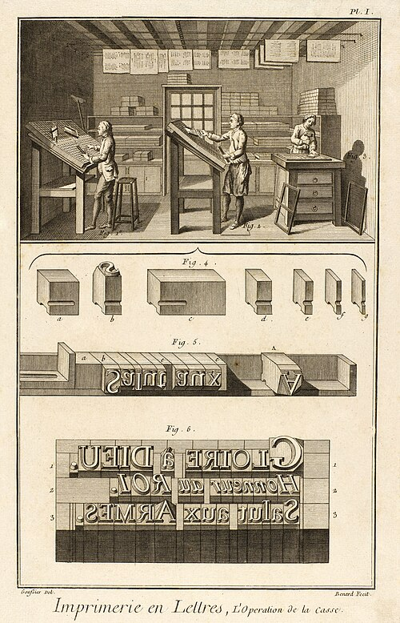

It began as a translation. In 1745 the bookseller **[André le Breton](kloom:e/andre-le-breton)** set out to publish a French version of **[Ephraim Chambers](kloom:e/ephraim-chambers)**'s **[_Cyclopaedia_](kloom:e/cyclopaedia-or-an-universal-dictionary-of-arts-and-sciences)**, a two-volume English dictionary of the arts and sciences of 1728. The translators fell out with him, one of them after Le Breton beat him with a cane, and in 1747 he and three partners gave the work to two men already on it: **[Denis Diderot](kloom:e/denis-diderot)**, a writer and translator, and **[Jean le Rond d'Alembert](kloom:e/jean-le-rond-dalembert)**, a mathematician. They turned the translation into something new. The **[_Encyclopédie_](kloom:e/encyclopedie)**, or _Dictionnaire raisonné des sciences, des arts et des métiers_, came out in **[Paris](kloom:e/paris)** from 1751 to 1772: seventeen folio volumes of text, about 72,000 articles in all, and eleven volumes of plates.

## A tree before the alphabet

The articles run from A to Z, but the first volume opens with a map of what they hold. D'Alembert's _Preliminary Discourse_ and Diderot's explanation of the "figurative system of human knowledge" divide knowledge, after **[Francis Bacon](kloom:e/francis-bacon)**, by the three faculties of the mind. As Diderot puts it, the understanding "makes a pure and simple enumeration of its perceptions by memory; or it examines, compares and digests them by reason; or it pleases itself in imitating and counterfeiting them by imagination" (our translation). The plate draws the tree:

| Faculty     | Branch     | Divided into                                       |
| ----------- | ---------- | -------------------------------------------------- |
| Memory      | History    | sacred, civil, natural (nature's uses: the crafts) |
| Reason      | Philosophy | the science of God, of man, of nature              |
| Imagination | Poetry     | narrative, dramatic, parabolic                     |

The tree made arguments by where it put things. Theology sits under reason, a branch of philosophy, and the same paragraph that derives religion from it derives "by abuse, superstition", and beside it divination and "the chimera of black magic". The crafts sit in history, beside the stars and the weather, as facts of nature put to use. Each article was to say where it hung: the article on the letter A begins with its place, "Understanding, science of man, logic, art of communicating, grammar". The editors kept to it loosely, and the rubrics soon drifted from the tree.

Cross-references, _renvois_, tied the articles together across the alphabet. Diderot, writing the article "Encyclopédie" in 1755, said that they could also "attack, shake, overturn in secret some ridiculous opinions that one would not dare insult openly", and that a good dictionary must "change the common way of thinking" (our translation). Readers have hunted for such references ever since. The historian Marie Leca-Tsiomis finds no evidence of a system of them: the most quoted example, the article on cannibals that refers the reader to "Eucharist" and "Communion", was translated from Chambers and signed by an orthodox clergyman.

## The crafts and the plates

Diderot meant to describe the trades as craftsmen practiced them, and sometimes went to the workshops himself. Much of the technical matter came from experts and books, the Académie des sciences' descriptions of the arts among them. The plates, about 2,800 of them, drew each trade as a scene and then its tools one by one.

This plate, drawn by **[Louis-Jacques Goussier](kloom:e/louis-jacques-goussier)** and engraved by Robert Bénard for the volume of 1769, shows compositors at the case, setting movable type by hand much as printers had since Gutenberg. The type they have set reads, backwards, "Glory to God, Honor to the King, Hail to the Arms".

## Banned, and finished anyway

The authorities watched from the start. Diderot had spent three months in prison at Vincennes in 1749. In 1752, after the second volume, a royal decree suppressed both, for "destroying royal authority, fomenting a spirit of independence and revolt". **[Guillaume-Chrétien de Lamoignon de Malesherbes](kloom:e/guillaume-chretien-de-lamoignon-de-malesherbes)**, the director of the book trade, who had to order a search of Diderot's papers, hid them in his own house. Work resumed. In 1759, after the seventh volume, the Parlement of Paris moved against it, the government withdrew its privilege, and d'Alembert gave up his share of the editing. Diderot went on, with **[Louis de Jaucourt](kloom:e/louis-de-jaucourt)**, who wrote 17,266 articles between 1759 and 1765, about a quarter of the whole. The last ten volumes of text were printed in secret and issued together in 1765, their title pages giving Neuchâtel, beyond the border.

In 1764 Diderot found that Le Breton, fearing prosecution, had cut passages he thought dangerous from the proofs after Diderot had passed them, and had destroyed the manuscript so that nothing could be restored.

## Who paid, and what it said

A set cost 980 livres. The first edition was printed in 4,225 copies, at a time when 2,000 was usual, and earned its four publishers more than two million livres. The money came from subscribers, 2,000 at first and 4,000 by 1757. Cheaper editions in quarto and octavo followed, bringing the price within reach of the prosperous middle class, and by 1789, the historian Robert Darnton estimated, some 25,000 sets had been sold across Europe.

More than 140 people wrote for it, **[Voltaire](kloom:e/voltaire)** (the article "History") and Rousseau (on music) among them. Diderot's article on political authority, in the first volume, begins: "No man has received from nature the right to command others" (our translation). On slavery the work was divided: some articles described it plainly or defended it, and in 1765 Jaucourt's "Slave trade" called the buying of Africans "a negotiation that violates all religion, morals, natural law, and human rights" (Stephanie Noble's translation). The next frame opens in a Scottish professor's pin factory, eighteen operations long: the number the _Encyclopédie_'s article on the pin had counted in 1755.
