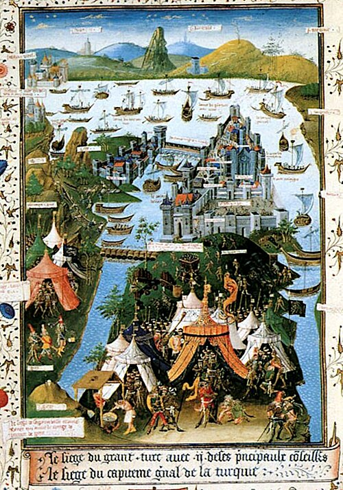

On 6 April 1453 the guns of the Ottoman sultan **[Mehmed II](kloom:e/mehmed-ii)**, aged twenty-one, began firing on the land walls of **[Constantinople](kloom:e/constantinople)**. Constantine the Great had refounded the old Greek town of Byzantium in 330 as a new Rome, and its emperor was still, in his own eyes and his people's, the emperor of the Romans. That emperor, **[Constantine XI Palaiologos](kloom:e/constantine-xi-palaiologos)**, now ruled little more than the city itself, and the city was a shadow: the Black Death had killed perhaps half its people a century before, and fewer than 50,000 lived inside walls built for many times that number. Western Europe called his empire Greek, and historians later called it the **[Byzantine Empire](kloom:e/byzantine-empire)**. Its people called themselves _Rhomaioi_, Romans.

## Walls against guns

For a thousand years the city's defense had been the **[Theodosian Walls](kloom:e/walls-of-constantinople)**, finished in 413 and rebuilt in sixty days after an earthquake in 447. They crossed the peninsula for about five and a half kilometers, and an attacker met them in layers, as the plate draws in section: a moat over 20 meters wide and up to 10 deep; a terrace; an outer wall 8.5 to 9 meters high; another terrace; and the inner wall, 12 meters high and 4.5 to 6 meters thick, with 96 towers. Only once, in 1204, had an army taken the city, and the crusaders of the Fourth Crusade had come in from the harbor, not through these walls.

Mehmed brought gunpowder against them, the mixture Chinese alchemists had found and which had reached Europe two centuries before. A founder named **[Orban](kloom:e/orban-ironmaster)**, probably Hungarian, had first offered his skills to the emperor, who could not pay him. For the sultan he cast at Edirne a bombard about 8 meters long that threw a stone ball of some 270 kilograms more than a mile. It took sixty oxen and some four hundred men to drag it to the walls, and three hours to reload. Ottoman founders cast more great guns, and by 28 May the besiegers had fired some 5,000 shots with about 55,000 pounds of powder. But the guns were slow, and the defenders repaired most of the damage between shots.

A chain floated on logs closed the harbor, the Golden Horn, to the Ottoman fleet. On 22 April Mehmed went around it. In **[Edward Gibbon](kloom:e/edward-gibbon)**'s retelling, a road of planks "anointed with the fat of sheep and oxen" was laid over the hill behind Galata, and "fourscore light galleys and brigantines" were hauled over it on rollers and launched into the harbor.

## How many

Before the siege the emperor had the city counted for men able to bear arms. His chancellor and friend **[George Sphrantzes](kloom:e/george-sphrantzes)** made the count and found 4,973, as one modern translation gives his figures (4,773 Greeks and 200 foreigners), or 4,970, as Gibbon read them. With the Genoese and Venetians, the defense came to under 8,000 men for some 20 kilometers of wall. For the attackers, the eyewitnesses gave numbers that modern historians reject:

| Source                                      |     Ottoman army |
| ------------------------------------------- | ---------------: |
| Nicolò Barbaro, Venetian ship's surgeon     |          160,000 |
| Jacopo Tedaldi, Florentine merchant         |          200,000 |
| George Sphrantzes, the emperor's chancellor |          200,000 |
| Isidore of Kiev, cardinal                   |          300,000 |
| Leonard of Chios, archbishop                |          300,000 |
| Modern estimate from Ottoman records        | 50,000 to 80,000 |
| The defenders, all told                     |      under 8,000 |

## 29 May

The last assault began after midnight on Tuesday 29 May. The **[Janissaries](kloom:e/janissary)**, the sultan's elite infantry, came in the last wave. The Genoese commander Giovanni Giustiniani was badly wounded and carried from the wall, his men followed him, and the Ottomans broke in. Constantine XI was last seen fighting near the gate of St. Romanus. Whether he died there, as most accounts say, or hanged himself, as the Venetian Barbaro heard, is not known, and his body was never surely identified. The soldiers were promised three days of plunder. Barbaro wrote that blood ran "like rainwater in the gutters after a sudden storm". Leonard of Chios put the captives at sixty thousand; modern estimates are about half that, most of the city's people, sold as slaves.

Mehmed rode to **[Hagia Sophia](kloom:e/hagia-sophia)**, the church Justinian had built nine centuries before, and ordered it made a mosque. It stayed one until the 1930s, was a museum from 1935, and in 2020 was made a mosque again. Mehmed moved his capital to the city and called himself _Kayser-i Rûm_, Caesar of the Romans. The **[Ottoman Empire](kloom:e/ottoman-empire)** was now a European power, and would reach the gates of Vienna in 1529.

## What went west

Greek learning had begun to move to Italy long before. **[Manuel Chrysoloras](kloom:e/manuel-chrysoloras)** came to teach Greek in Florence in 1397, and his pupil Leonardo Bruni remembered that no one in northern Italy had studied Greek for seven hundred years. Much of what they read had come down in Byzantine copies: Archimedes survives in one made in Constantinople around 950. After 1453 the scholar John Argyropoulos, who had copied Simplicius in Florence in 1441, came back to teach there, and in 1468 Cardinal **[Bessarion](kloom:e/bessarion)**, a Greek, gave Venice 482 Greek and 264 Latin manuscripts, calling the city "another Byzantium". Some scholars have seen the Greeks' flight to Italy after 1453 as the start of the Renaissance; few now date it so late, when Greek had been taught in Italy for half a century.

By one count the Roman state that **[Augustus](kloom:e/augustus)** founded in 27 BC ended with the **[fall of Constantinople](kloom:e/fall-of-constantinople)** on 29 May 1453, 1,479 years later by our arithmetic. Gibbon closed his history of the empire in the East there. The trail returns to the frame on Augustus.
