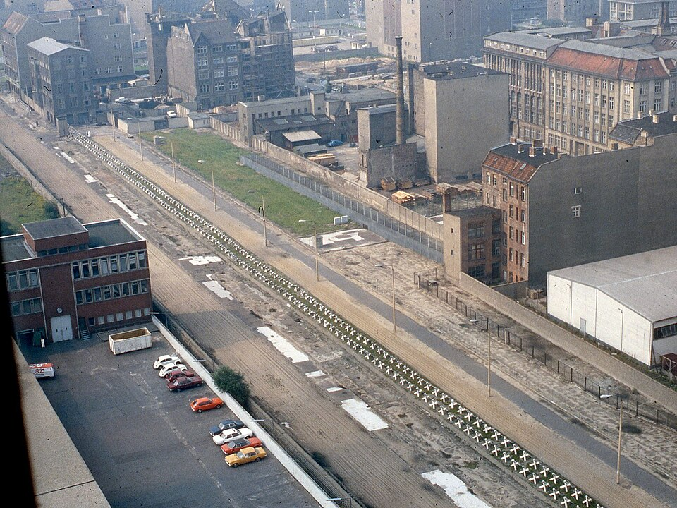

After midnight on Sunday 13 August 1961, East German police and soldiers began to seal off the western sectors of **[Berlin](kloom:e/berlin)** with barbed wire, and by morning the city was cut in two. Two months before, the party leader Walter Ulbricht had told a press conference, "No one has the intention of erecting a wall." But some 3.5 million East Germans, a fifth of the population, had already left for the West, many of them through West Berlin, and the young and the trained went first. Within days the wire became the **[Berlin Wall](kloom:e/berlin-wall)**, and for twenty-eight years it was the place where the **[Cold War](kloom:e/cold-war)** could be seen.

## A divided world

The division was older than the Wall. "From Stettin in the Baltic to Trieste in the Adriatic, an iron curtain has descended across the Continent," **Winston Churchill** said at Fulton, Missouri, on 5 March 1946. Berlin, deep inside the Soviet zone of Germany but shared among the four victors, was where the two sides touched. When the **[Soviet Union](kloom:e/soviet-union)** blockaded the city's western sectors in June 1948, American and British aircraft supplied them from the air: 278,228 flights and 2,334,374 tons, nearly two-thirds of it coal, until the airlift ended in September 1949. The West made **[NATO](kloom:e/nato)** on 4 April 1949, and the East the **[Warsaw Pact](kloom:e/warsaw-pact)** on 14 May 1955.

Behind the alliances stood the bomb. The Soviet Union tested its first atomic bomb in 1949, and the United States answered with a hydrogen bomb, which it first exploded in 1952. Rivalry reached space with Sputnik in 1957, and in 1961, the year the Wall went up, President Kennedy set the Moon as America's goal. In October 1962 Soviet missiles in Cuba brought the two to thirteen days of crisis, which is usually called the closest the Cold War came to nuclear war.

## How the Wall worked

The Wall was not one wall. By the 1980s, crossing it from the East meant passing, in order:

| From the East            | What it was                                                                  |
| ------------------------ | ---------------------------------------------------------------------------- |
| Inner wall               | The first barrier, sometimes built from house fronts and factory walls       |
| Signal fence             | Electrified; set off an alarm on contact (127.5 km of it)                    |
| Watchtowers and dog runs | 302 towers, about 250 meters apart                                           |
| Patrol road              | Paved, 7 meters wide, for patrol and supply vehicles                         |
| Lamps and control strip  | Floodlights over raked sand that showed footprints                           |
| Anti-vehicle trench      | 105.5 km of it                                                               |
| Border wall              | Precast concrete segments 3.6 meters high and 1.2 meters wide, a pipe on top |
| Outer strip              | East German ground, usually no more than 4 meters wide, then West Berlin     |

The last wall, "Border Wall 75", was built from 1975 in some 45,000 precast sections, so that a car could not be driven through it. The strip between the walls ran from five to several hundred meters wide; the plate draws a section through it. The ring around West Berlin was 155 km long, 43 km of it through the city itself. The walls were painted white on their inner faces, so that a running figure showed against them, and the guards had orders to shoot. At least 140 people died at the Wall between 1961 and 1989, 101 of them trying to escape; 91 of the 140 were shot by border soldiers. More than 5,000 escaped.

## 1989

The end came from the East. **[Mikhail Gorbachev](kloom:e/mikhail-gorbachev)**, Soviet leader from 1985, abandoned in 1988 Moscow's claim to hold the bloc together by force. On 2 May 1989 Hungary began taking down its border fence with Austria, and at the Pan-European Picnic on 19 August several hundred East Germans ran through a gate to the West. In Leipzig, after the Monday prayers at St. Nicholas Church, 70,000 marched on 9 October, past police and army units that had been allowed to use force, and not a shot was fired.

On 9 November the Politburo approved a looser travel rule, to take effect the next day, and handed it to its spokesman, **[Günter Schabowski](kloom:e/gunter-schabowski)**, who had not been at the discussion. At 6:53 that evening, near the end of a live press conference, a journalist asked when it took effect. Schabowski leafed through his papers. "That comes into force, as far as I know … that is immediately, without delay," he said, in our translation of the transcript. Thousands went to the crossings. At Bornholmer Straße, at about 10:45 or 11:30 that night by different accounts, the officer in charge, Harald Jäger, gave up checking and let them through. No one in the government would order the guards to shoot. The historian Mary Elise Sarotte calls the opening an accident.

The rest followed fast. Demolition began on 13 June 1990, **[German reunification](kloom:e/german-reunification)** came on 3 October 1990, and on 26 December 1991 the Soviet Union dissolved.

## What it meant

In the summer of 1989, before the Wall fell, Francis Fukuyama wrote that the world might be seeing "the end-point of mankind's ideological evolution and the universalization of Western liberal democracy as the final form of human government." Samuel Huntington answered in 1993 that conflict between civilizations would take the place of conflict between ideologies. What the West promised in 1990 is argued still: memoranda of private conversations show Western leaders assuring Gorbachev that NATO would not expand east, and Gorbachev said later that the talks had been about troops in the former East Germany. The spine turns from here to code and the cosmos, beginning with the double helix.
