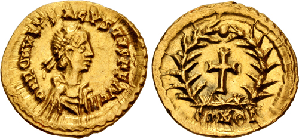
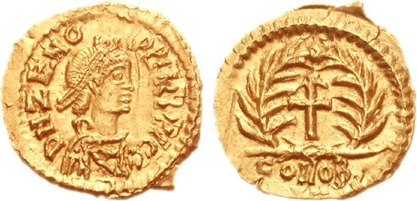

On 24 August 410 an army of Goths entered **[Rome](kloom:e/rome)** by the Salarian Gate and plundered the city for three days. Their king, **[Alaric I](kloom:e/alaric-i)**, a former Roman commander, had besieged the city twice before, bargaining for gold, land and a post the emperor in Ravenna would not give him. Rome was no longer the capital, but it had not fallen to a foreign enemy in almost 800 years. The **[sack of Rome](kloom:e/sack-of-rome-410)** was, by the standards of the age, restrained: the Goths, who were Christians, spared the basilicas of Peter and Paul and those who fled into them.

## "The City which had taken the whole world"

In Bethlehem the scholar **[Jerome](kloom:e/jerome)** later wrote a memoir of a friend, the Roman widow Marcella, whom the soldiers had beaten for treasure she did not have and who died a few days after. In it he remembered the news reaching Palestine: "My voice sticks in my throat," he wrote, in W. H. Fremantle's 1893 translation; "The City which had taken the whole world was itself taken."

Others drew a sharper lesson: Rome had abandoned its gods, and its gods had abandoned Rome. In North Africa the bishop **[Augustine of Hippo](kloom:e/augustine-of-hippo)** took up the charge. Looking back late in life he explained why: "Rome having been stormed and sacked by the Goths under Alaric their king, the worshippers of false gods, or pagans, as we commonly call them, made an attempt to attribute this calamity to the Christian religion." His answer, **[_The City of God_](kloom:e/the-city-of-god)**, was begun in 413 and finished in 426, in twenty-two books. The first ten argue that Rome's gods had never protected it (the barbarians had even spared pagans hiding in churches). The last twelve tell the history of two societies tangled together until the end of time. "Two cities have been formed by two loves," he wrote, in Marcus Dods's translation: "the earthly by the love of self, even to the contempt of God; the heavenly by the love of God, even to the contempt of self." No earthly city, Rome included, was the city of God, so none could be its downfall.

## A fall nobody marked

The western empire lasted another sixty-six years, losing its provinces one by one. In 476 the barbarian soldiers of the army in Italy, refused the land they had been promised, rose under one of their officers, **[Odoacer](kloom:e/odoacer)**. On 4 September he deposed the boy emperor **[Romulus Augustulus](kloom:e/romulus-augustulus)**, and pensioned him off to an estate near Naples. According to the historian Malchus, as **[Edward Gibbon](kloom:e/edward-gibbon)** retold him, the Roman Senate then wrote to the emperor Zeno in Constantinople that "the majesty of a sole monarch is sufficient", and the imperial regalia went east. Zeno replied that the West already had a lawful emperor, Julius Nepos, who still held Dalmatia, and Odoacer struck coins in the names of Nepos and Zeno.

Nothing ended on the coins: the mint at Milan struck the same small gold piece, with the same cross in a wreath, before and after. The date was fixed later, in Constantinople, where the chronicler Marcellinus, writing in the sixth century, said the western empire "perished with this Augustulus". Arnaldo Momigliano called it "the noiseless fall of an empire".

## Fall, or transformation?

For two centuries the argument over the **[fall of the Western Roman Empire](kloom:e/fall-of-the-western-roman-empire)** ran in Gibbon's terms. His **[_History of the Decline and Fall of the Roman Empire_](kloom:e/the-history-of-the-decline-and-fall-of-the-roman-empire)** (1776–1789) called the decline "the natural and inevitable effect of immoderate greatness", and its author summed up his own work: "I have described the triumph of barbarism and religion." In 1971 **[Peter Brown](kloom:e/peter-brown-historian)** changed the question. His _World of Late Antiquity_ saw the centuries from about 200 to 800 as a time of new religions and new art, not of decay, and his followers described barbarian settlement as an "accommodation" the Romans arranged. A large European research project was named "The Transformation of the Roman World".

In 2005 two Oxford historians pushed back. **[Peter Heather](kloom:e/peter-heather)** argued that the Huns had driven Goths and others into the empire in 376 and again in 405–408, and that "the external factor" was "the prime mover" of the collapse. **[Bryan Ward-Perkins](kloom:e/bryan-ward-perkins)**, an archaeologist, looked at what people owned. His evidence, much of it in his own words:

| Evidence | In the Roman West                                         | After it                                    |
| -------- | --------------------------------------------------------- | ------------------------------------------- |
| Roofs    | Tiled, "even in a peasant context"                        | Thatch; tiles "a great rarity and luxury"   |
| Houses   | Brick or stone floors, mortared walls                     | Beaten earth floors, wooden walls           |
| Pottery  | A peasant in upland Italy eating off a North African bowl | Almost all of it gone; in Britain, no wheel |
| Coins    | Copper small change in everyday use                       | Supply to Britain stops after Honorius      |
| Graffiti | Very common                                               | Virtually disappear                         |
| Cattle   | Bred large                                                | Back to prehistoric size                    |

In Britain, he argues, people ended poorer than before the Romans came. The reviewer James O'Donnell, who counted himself among the "reformers", granted the point ("stuff happened, bad stuff, lots of it") but found the book too western: in the East, as Ward-Perkins himself allowed, the cities went on thriving into the sixth century.

## What carried on

Emperors ruled in Constantinople until 1453, and much went on in the West. Bishops and monasteries kept the Latin Church: Benedict wrote his Rule around 530 in an Italy ruled by Goths, and Cassiodorus, who had served its Gothic king, founded Vivarium, where monks copied books, as the frame on the scriptoria tells. Roman law outlived Roman rule. In 506 the Visigothic king Alaric II issued the **[Breviary of Alaric](kloom:e/breviary-of-alaric)**, a digest of Roman law for his Roman subjects; until a manuscript turned up in Verona, it was the only known source for the textbook of the jurist Gaius. In 654 the Visigothic Code made one law for Goths and Romans alike, and later kings added to it a long series of laws against Jews. The next frame goes east, to Constantinople, where an emperor was putting that law in order.
