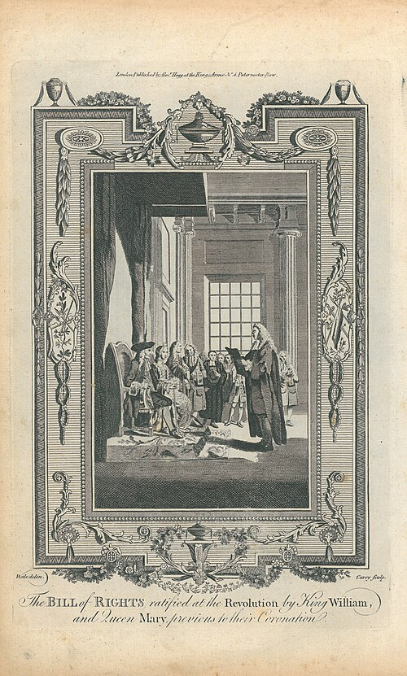

On 10 June 1688 the queen of England gave birth to a son. Her husband, **[James II](kloom:e/james-ii-of-england)**, king since 1685, was a Roman Catholic, but he was fifty-four and his heirs had been his Protestant daughters, so his reign had looked like an interlude. Now it looked like a Catholic dynasty. James had already suspended the Test Acts that kept Catholics out of office, purged the town corporations, and put seven bishops in the Tower for refusing to have his Declaration of Indulgence read from their pulpits. On 30 June a jury acquitted the bishops, and the same day seven men, Whigs and Tories with a bishop among them, sent a letter inviting James's Dutch son-in-law and nephew, **[William III](kloom:e/william-iii-of-england)** of Orange, to come over.

William had his own reason to come: he wanted England's fleet and money against Louis XIV. On 5 November 1688 his fleet, over 400 ships, put about 15,000 regular troops ashore at Torbay in Devon. James's army melted away as its officers deserted. On the night of 10 December James slipped out of London, dropping the Great Seal in the Thames so that no parliament could be lawfully summoned. Fishermen caught him in Kent, William let him go again, and on 23 December he sailed for France. The **[Glorious Revolution](kloom:e/glorious-revolution)** had taken seven weeks and two skirmishes.

## Rights read before a crown

A **[Convention Parliament](kloom:e/convention-parliament-1689)** met on 22 January 1689, and after two weeks of argument resolved that James, by leaving, had "abdicated the Government" and the throne was vacant. Its committee's list of grievances was sorted into "ancient rights", to be declared at once, and new laws, left for later. On 13 February, in the Banqueting House at Whitehall, the clerk of the House of Lords read this **[Declaration of Right](kloom:e/declaration-of-right-1689)** aloud to William and his wife **[Mary II](kloom:e/mary-ii)**, and only then did Lord Halifax, for the Lords and Commons, ask them to accept the crown. Wikipedia's account, after the historian Tim Harris, holds that the crown was not conditional on the Declaration, only on ruling by law. In December the Declaration was enacted, with the succession, as the **[Bill of Rights](kloom:e/bill-of-rights-1689)**.

An engraving of 1783 calls the scene the ratifying of the Bill of Rights, though what was read was the Declaration. Its method is the one the plate shows. It charges James with a list of acts, each beginning "By", then declares a right against each, beginning "That". In the text that legislation.gov.uk holds in force:

| James was charged with                                                 | So it was declared                                                                                                   |
| ---------------------------------------------------------------------- | -------------------------------------------------------------------------------------------------------------------- |
| "Suspending of Lawes … without Consent of Parlyament"                  | "the pretended Power of Suspending of Laws … without Consent of Parlyament is illegall"                              |
| "Levying Money … by pretence of Prerogative"                           | "levying Money … without Grant of Parlyament … is Illegall"                                                          |
| "keeping a Standing Army … in time of Peace without Consent"           | a standing army in peace "unlesse it be with Consent of Parlyament is against Law"                                   |
| "Violating the Freedome of Election"                                   | "Election of Members of Parlyament ought to be free"                                                                 |
| prosecuting "Matters … cognizable onely in Parlyament"                 | "Freedome of Speech and Debates … in Parlyament ought not to be impeached or questioned in any Court"                |
| requiring "excessive Baile"                                            | "excessive Baile ought not to be required nor excessive Fines imposed nor cruell and unusuall Punishments inflicted" |
| prosecuting the bishops "for humbly Petitioning"                       | "it is the Right of the Subjects to petition the King"                                                               |
| disarming "good Subjects being Protestants" while Catholics were armed | Protestants "may have Arms for their Defence suitable to their Conditions"                                           |

Thirteen rights in all. The same act shut Catholics out of the throne for good, since "it hath beene found by Experience" that a "Popish Prince" was inconsistent with "this Protestant Kingdome". Like **[Magna Carta](kloom:e/magna-carta)**, which seventeenth-century lawyers had turned against the Stuart kings, it presented itself as restating old liberties, "as their Auncestors in like Case have usually done", not inventing new ones.

## Toleration, for some

The **[Toleration Act](kloom:e/toleration-act-1688)**, which received the royal assent on 24 May 1689, gave "some ease to scrupulous Consciences" in order "to unite their Majesties Protestant Subjects". It worked by exemption, not repeal. A Baptist, a Presbyterian or a Congregationalist went to the justices at their general sessions, took the oaths of allegiance and supremacy, signed a declaration against transubstantiation, and was entered in a register for sixpence. His meeting house had to be registered, and if its doors were "locked barred or bolted" during worship, the old penalties came back. He still paid tithes and was still kept out of office. And the act gave nothing to "any Papist or Popish Recusant", nor to anyone who denied the Trinity. Catholics waited for emancipation until 1829.

## How glorious?

**[Thomas Babington Macaulay](kloom:e/thomas-babington-macaulay)**, whose history of it came out in 1848 as revolutions broke across Europe, wrote that it was "of all revolutions the least violent" and "of all revolutions the most beneficent". In England, nearly so. In Ireland James landed with French troops and the war ran from 1689 to 1691, through the **[Battle of the Boyne](kloom:e/battle-of-the-boyne)**, and the penal laws that followed took more and more of Irish Catholics' civic rights away. In Scotland, in February 1692, government soldiers killed some thirty MacDonalds in the **[Massacre of Glencoe](kloom:e/massacre-of-glencoe)**, nominally for their chief's late oath of allegiance.

Historians have argued since. J. R. Jones saw a Dutch invasion, "the first and arguably the only decisive phase" of a European war. **[Steven Pincus](kloom:e/steven-pincus)**, in _1688: The First Modern Revolution_ (2009), argues that it was, as his reviewer Mark Knights sums it up, "violent, popular, and divisive", a contest between James's French-style Catholic state and a Whig vision of toleration and commerce.

What crossed the Atlantic was the text. **[John Locke](kloom:e/john-locke)**, back from Dutch exile, published his _Two Treatises of Government_ anonymously in the same month as the Bill of Rights. Virginia's Declaration of Rights of 1776 copied the article on bail word for word, and the Eighth Amendment of 1791 still reads: "Excessive bail shall not be required, nor excessive fines imposed, nor cruel and unusual punishments inflicted." It is part of the **[United States Bill of Rights](kloom:e/united-states-bill-of-rights)**, the subject of the rights trail. The Bill of Rights of 1689 is still in force in the United Kingdom, as of October 2026. The next frame of this trail turns to a revolution that the declarations of rights did not foresee, made by the enslaved of Saint-Domingue.
