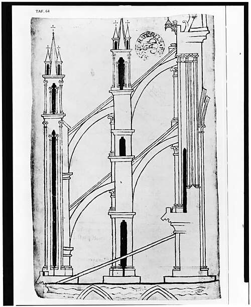

On 11 June 1144, in the presence of King **[Louis VII](kloom:e/louis-vii-of-france)**, the monks of **[Saint-Denis](kloom:e/basilica-of-saint-denis)**, just north of [Paris](kloom:e/paris), consecrated a new east end for their abbey church. Their abbot, **[Suger](kloom:e/suger)**, wrote that the whole of it, crypt and high vaults together, had been built in three years and three months, and that it would shine, in our translation of his Latin, with "the wonderful and continuous light of most sacred windows". Its pointed arches, ribbed vaults and walls opened up for glass make it the first building of a style that the Italian painter Giorgio Vasari, in 1550, thought barbarous and blamed on the Goths. It has been called **[Gothic architecture](kloom:e/gothic-architecture)** ever since.

## How it stands

A stone vault pushes outward as well as down, and a Roman builder answered with mass: thick walls, small windows. The Gothic answer was a system of parts working together, the boldest of them the **[flying buttress](kloom:e/flying-buttress)**.

| Part            | What it does                                                                                              |
| --------------- | --------------------------------------------------------------------------------------------------------- |
| Pointed arch    | Can be raised or lowered to reach one height over a short span or a long one, as a round arch cannot      |
| Rib vault       | A frame of stone ribs, thin panels of small stones filling between them, much lighter than a barrel vault |
| Piers           | Each bay's four-part vault comes down onto four of them, not onto a continuous wall                       |
| Flying buttress | An arch over the aisle roof that catches the vault's outward push high on the wall                        |
| Buttress pier   | A tower of masonry outside the aisle that carries that push down to the ground                            |
| Pinnacle        | Weight on top of the pier, which turns the push more nearly downward                                      |

With the push carried outside, the wall between the piers holds up almost nothing, and can be glass. The plate draws a section through the nave of **[Amiens Cathedral](kloom:e/amiens-cathedral)**, begun in 1220: its vault stands 42.3 meters above the floor and its aisles 19.7. None of the parts was new. Pointed arches had been used for centuries in the Byzantine and Islamic Near East and at Cluny; Islamic builders at Córdoba had crossed ribs under a dome; Durham had rib vaults by 1096. What was new in France was putting them together, and pushing the system higher with each new cathedral.

## Who built it, and who paid

A cathedral was designed and run by a master mason, a layman paid by the cathedral's chapter. A labyrinth laid in the floor at Amiens in 1288 named the first, **[Robert of Luzarches](kloom:e/robert-of-luzarches)**, and his successors Thomas and Renaud de Cormont, father and son. Robert is credited with cutting the number of stone shapes to a few standard ones, each cut to a template, so that blocks could be made in advance. An inventory of the masons' lodge at **[York Minster](kloom:e/york-minster)** taken around 1400 lists 96 iron chisels, two "tracyngbordes" for drawing out the work, lead for the templates, and a great wheel with four cables for hoisting stone. The chapter at York wrote down the lodge's rules in 1370, in English:

| Rule          | In the ordinance of 1370                                                          |
| ------------- | --------------------------------------------------------------------------------- |
| Hours, winter | From "als erly als yai may see skilfully by day lyghte for till wyrke" until dark |
| Hours, summer | From sunrise until the time it takes to walk a mile before sunset                 |
| Meals         | An hour for dinner; a winter drink no longer than it takes to walk half a mile    |
| Sleep         | An afternoon sleep only in high summer, from St Helen's day to Lammas             |
| Absence       | Docked pay, "atte ye loking ande devys of ye maistyr masonn"                      |
| Hiring        | A week's trial first, then an oath on the book to keep the rules                  |

The money came from bishops and their families, from kings and nobles, and in small sums from everyone else. Relics drew pilgrims and their gifts. Amiens had received in 1206 a head said to be John the Baptist's, loot from the sack of Constantinople, and when its old cathedral burned in 1218 the new one was begun in a city pilgrims already came to. When **[Chartres Cathedral](kloom:e/chartres-cathedral)**, which kept a tunic said to be the Virgin's, burned in 1194, a papal legate in the town spread the word, money came from kings, nobles and ordinary people, and most of the new church was standing within about twenty-five years. A cathedral was also its town's market, with wine sold in the nave until an ordinance moved it to the crypt, and its chapter fought the counts of Blois, sometimes in bloody riots, over the taxes of the trade around it. The tradesmen pictured at the foot of several Chartres windows were long taken to be guilds that paid for them. Historians now doubt it: a window cost about as much as a large house, and those trades had no guilds yet.

## A book of light

Suger had verses cast on the gilded doors of his church's west front, which in our translation read: "Bright is the noble work; but the work that nobly shines should brighten minds, so that they go through true lights to the True Light, where Christ is the true door." The art historian Erwin Panofsky read in such lines the theology of light of Pseudo-Dionysius, a mystic of the sixth century, built in stone. Later historians have found the link too neat. So has the old idea that windows were the "Bible of the poor", a modern phrase for a thought from **[Pope Gregory I](kloom:e/pope-gregory-i)**, who around 600 wrote that "what writing presents to readers, this a picture presents to the unlearned". Historians have asked how much a window high in a wall could teach anyone who did not already know its story; Lawrence Duggan put the question in the title of an essay of 1989, "Was art really the 'book of the illiterate'?" The drawing of the buttresses of Reims comes from the portfolio of **[Villard de Honnecourt](kloom:e/villard-de-honnecourt)**, about 1230.

## Falling down

The system could be pushed too far. **[Beauvais Cathedral](kloom:e/beauvais-cathedral)** raised its choir vault to about 48 meters, and on 29 November 1284 part of its vault fell. The engineer Jacques Heyman found that the structure was stable and had stood twelve years, so that something small set it off; Maury Wolfe and Robert Mark tested a model and blamed the wind; Stephen Murray points to bays over 15 meters wide, built in stages as the money ran short. On 15 April 2019 fire destroyed the timber roof and spire of **[Notre-Dame de Paris](kloom:e/notre-dame-de-paris)**, and its stone vault, though broken in places, caught most of the burning debris. Some 320,000 donors gave more than €840 million, the cathedral reopened on 7 December 2024, and as of October 2026 work on its east end and buttresses continues, planned to 2028. The next frame turns from stone to parchment: a charter sealed in 1215.
