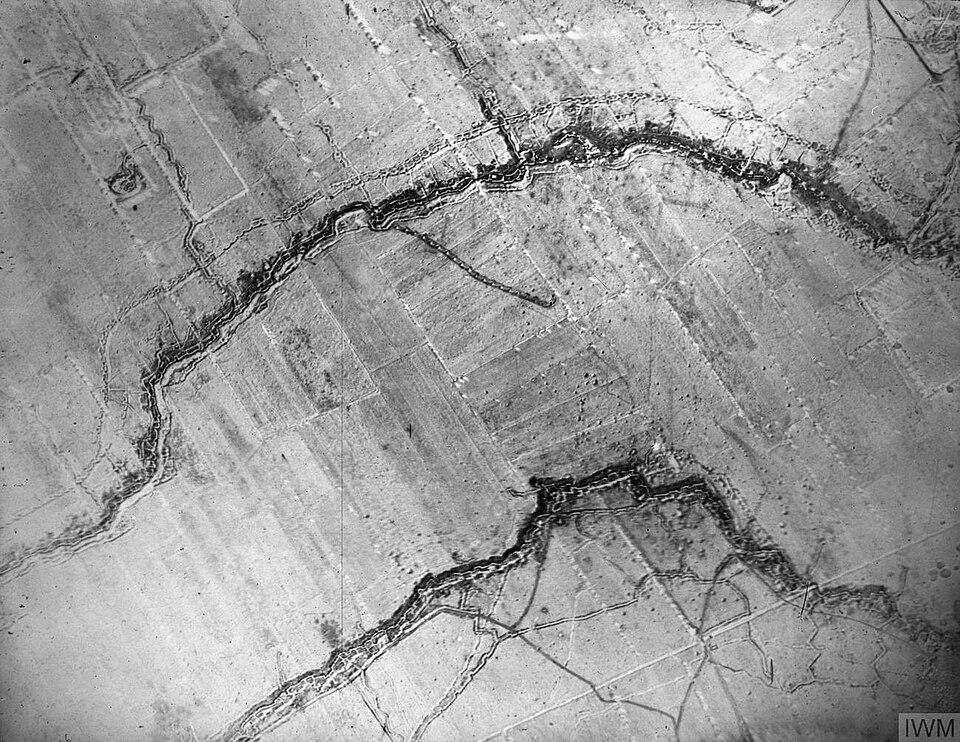

On Sunday, 28 June 1914, in **[Sarajevo](kloom:e/sarajevo)**, a nineteen-year-old Bosnian Serb student named **[Gavrilo Princip](kloom:e/gavrilo-princip)** shot dead **[Archduke Franz Ferdinand](kloom:e/archduke-franz-ferdinand-of-austria)**, heir to the throne of **[Austria-Hungary](kloom:e/austria-hungary)**, and his wife Sophie. The **[assassination of Archduke Franz Ferdinand](kloom:e/assassination-of-archduke-franz-ferdinand)** was the work of young nationalists helped by the Black Hand, a secret society led by the chief of Serbian military intelligence. Five weeks later the great powers of Europe were at war, and the **[First World War](kloom:e/world-war-i)** they began killed some nine to eleven million soldiers before it ended.

## Five weeks

The **[July Crisis](kloom:e/july-crisis)** turned a murder into a world war in a few steps:

| Date       | Step                                                                                                    |
| ---------- | ------------------------------------------------------------------------------------------------------- |
| 5–6 July   | Germany promises Austria-Hungary its support against Serbia, whatever Russia does: the "blank cheque"   |
| 23 July    | Austria-Hungary's ultimatum gives Serbia 48 hours, in terms drafted so that it could hardly be accepted |
| 28 July    | Austria-Hungary declares war on Serbia                                                                  |
| 30 July    | Russia orders general mobilization                                                                      |
| 1–3 August | Germany declares war on Russia, then on France                                                          |
| 4 August   | Germany invades Belgium, whose neutrality Britain had guaranteed; Britain declares war on Germany       |

Who was to blame has been argued ever since. In 1961 the Hamburg historian **[Fritz Fischer](kloom:e/fritz-fischer-historian)** argued in _Griff nach der Weltmacht_ (_Germany's Aims in the First World War_) that Germany's leaders had deliberately sought a war to make Germany a world power. Few accepted all of it, but by the 1980s, as Annika Mombauer sums up, it was generally accepted that Germany's share of the responsibility was larger than that of the other powers. In 2012 **[Christopher Clark](kloom:e/christopher-clark)**'s _The Sleepwalkers_ spread the blame. Every power took risks, he argued, and none sought a general war; Russia was the first to order general mobilization, and the protagonists of 1914 were "sleepwalkers, watchful but unseeing". Mombauer and others answer that this blurs the deliberate decisions taken in Berlin and Vienna.

## How the trenches worked

By the end of 1914 the war in the west had dug itself into two lines of trenches from the North Sea to Switzerland. The British General Staff's _Notes for Infantry Officers on Trench Warfare_, reprinted by the US Army in 1917, sets out the system each side built:

| Line                   | What it was for                                                                                           | Where                            |
| ---------------------- | --------------------------------------------------------------------------------------------------------- | -------------------------------- |
| Fire trench            | Riflemen on a firing step "4 feet 6 inches below the crest of the parapet"                                | The front                        |
| Traverses              | Buttresses of earth "9 to 12 feet thick", to stop fire along the trench and keep a shell burst to one bay | Every 18 to 30 feet              |
| Support line           | A second line of resistance, and cover from bombardment                                                   | 70 to 100 yards behind           |
| Reserve line           | Dugouts for the battalion's counterattack                                                                 | 400 to 600 yards behind          |
| Communication trenches | Men, food, ammunition and the wounded, moved under cover                                                  | One behind every second traverse |

The zigzag was the point: "the trace of a trench should not be straight", the manual says, so that machine guns could sweep the ground in front from the flank, and no enemy who got in could fire down its length. The plate draws a sector to these measurements. Defended this way, by wire, machine guns and artillery, a line could be broken into but hardly through. On 1 July 1916, the first day of the **[Battle of the Somme](kloom:e/battle-of-the-somme)**, after a bombardment of more than 1.5 million shells, the British Army lost 57,470 men, 19,240 of them killed, the worst day in its history. Poison gas was tried against the deadlock from 22 April 1915, when German troops released chlorine at Ypres: the chemistry of that is its own frame.

## The cost

The war killed some nine to eleven million soldiers and six to thirteen million civilians, though the civilian dead are "hazardous to estimate". It was a war of whole societies. Britain brought in conscription in January 1916, and its factories redesigned their work so that women and unskilled men could make shells. Its naval blockade cut Germany off from imported food, and from the Chilean nitrate that explosives were made from; Germany made its nitrates instead by the **[Haber process](kloom:e/haber-process)**, from ammonia drawn out of the air. The German government blamed 763,000 civilian deaths on the blockade, and a study of 1928 put them at 424,000.

In the **[Ottoman Empire](kloom:e/ottoman-empire)**, allied to Germany, the ruling Committee of Union and Progress used the war to destroy the Ottoman Armenians. From April 1915 some 800,000 to 1.2 million were driven on death marches into the Syrian desert, and 600,000 to 1.5 million died in the **[Armenian genocide](kloom:e/armenian-genocide)**. The American ambassador, Henry Morgenthau, wrote in 1918 that the deportation orders were "merely giving the death warrant to a whole race", and that the ministers who gave them did not hide it from him. In May 1915 Britain, France and Russia condemned "crimes against humanity and civilization", words that the tribunal at Nuremberg would make a charge in 1945.

Medicine went to war too. A store of blood kept on ice was first laid in for a battle in 1917, and the US Army's nurse corps grew from 403 to more than 21,000. In 1918 the **[Spanish flu](kloom:e/spanish-flu)** swept armies and cities alike and killed more nurses than the enemy did.

## The end

The armistice came into force at 11 a.m. on 11 November 1918. The **[Treaty of Versailles](kloom:e/treaty-of-versailles)**, signed on 28 June 1919, five years to the day after Sarajevo, limited Germany's army to 100,000 men and opened its reparations section with Article 231:

> The Allied and Associated Governments affirm and Germany accepts the responsibility of Germany and her allies for causing all the loss and damage to which the Allied and Associated Governments and their nationals have been subjected as a consequence of the war imposed upon them by the aggression of Germany and her allies.

Germans called it the war guilt clause. The bill was fixed in 1921 at 132 billion gold marks, of which only 50 billion were really expected; Germany paid less than 21 billion. John Maynard Keynes called it a "Carthaginian peace", though most historians now think the reparations were within Germany's power to pay. Four empires were gone: the Russian, the German, the Austro-Hungarian and the Ottoman. Twenty years later Germany went to war again, which is the next frame.
