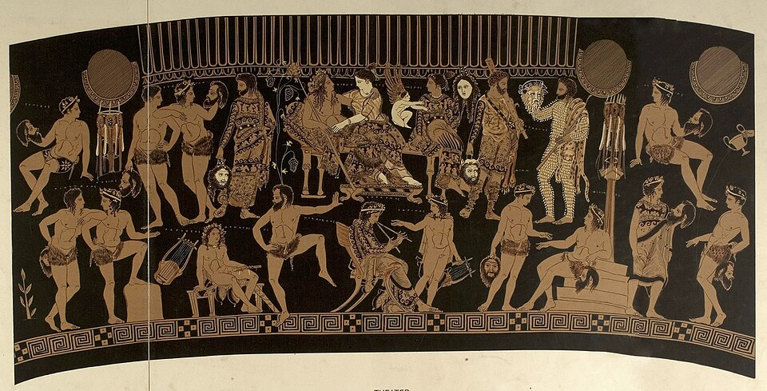

In the spring of 458 BC, at the festival of the City **[Dionysia](kloom:e/dionysia)**, **[Aeschylus](kloom:e/aeschylus)** won first prize with four plays performed in a single day: three tragedies, _Agamemnon_, _The Libation Bearers_ and _The Eumenides_, and a comic **[satyr play](kloom:e/satyr-play)**, _Proteus_, of which one line survives. The three tragedies are the **[Oresteia](kloom:e/oresteia)**, the only trilogy left whole from the Greek theater. Aeschylus was about sixty-seven. He had fought the Persians at Marathon in 490, and his epitaph would mention that, not his plays. He died two or three years later in Sicily. With his younger rivals **[Sophocles](kloom:e/sophocles)** and **[Euripides](kloom:e/euripides)** he is one of the three poets whose plays are all we have of **[Greek tragedy](kloom:e/greek-tragedy)**.

## A contest the city paid for

The Dionysia was a festival of the god Dionysus, held in the month Elaphebolion, March to April. After a procession and sacrifices came the contests. Three tragic poets each presented three tragedies and a satyr play, one poet a day, and judges chosen by lot ranked them. Each poet was assigned a **[choregos](kloom:e/choregos)**, a rich citizen who paid, as a duty to the city, for the chorus: its costumes, masks, musicians, training and keep through weeks of rehearsal. One choregos of the late fifth century listed 3,000 drachmas spent on a tragic chorus, which the _Oxford Dictionary of the Classical World_ reckons ten times a skilled worker's yearly wage. The prize went to poet and choregos together. In 472 the choregos for Aeschylus's _The Persians_ was the young **[Pericles](kloom:e/pericles)**.

The plays were given in the **[Theatre of Dionysus](kloom:e/theatre-of-dionysus)**, on the south slope of the Acropolis. In Aeschylus's day it was a circular dancing floor, the _orchestra_, with an altar, wooden benches on the hillside and, the plays suggest, a wooden stage building, the _skene_, behind: the _Oresteia_ needs a palace door and a roof for its watchman. The stone theater whose ruins stand today was built under the statesman Lycurgus later in the fourth century BC, with seventy-eight rows of seats in thirteen wedges. How many it held is disputed: the theater historian Arthur Pickard-Cambridge put it at 14,000 to 17,000, others at up to 25,000, and a line in Plato has been read to mean 30,000.

## How a tragedy was played

All the performers were men, and all wore masks, which covered the whole head and let one actor play several parts. The _Oresteia_ already has a scene with three speakers, **[Orestes](kloom:e/orestes)**, his friend Pylades and his mother Clytemnestra.

| Element | What it was                                                                           |
| ------- | ------------------------------------------------------------------------------------- |
| Actors  | one, then two under Aeschylus, then three under Sophocles                             |
| Chorus  | twelve singers and dancers in Aeschylus, fifteen from Sophocles on, with their leader |
| Speech  | the iambic trimeter, a line close to talk                                             |
| Song    | choral odes in lyric meters, sung and danced; anapests for entrances and exits        |

**[Aristotle](kloom:e/aristotle)**'s _Poetics_, written a century later, tells the history in two sentences: "Aeschylus first introduced a second actor; he diminished the importance of the Chorus, and assigned the leading part to the dialogue. Sophocles raised the number of actors to three, and added scene-painting" (S. H. Butcher's translation). The iambic line, he adds, "is, of all measures, the most colloquial".

## Revenge on trial

In _Agamemnon_ the king comes home from Troy and is killed in his bath by his wife Clytemnestra, for the daughter he sacrificed to get a wind for the fleet. In _The Libation Bearers_ their son Orestes kills his mother to avenge his father, and the Furies, the old spirits of vengeance, drive him mad. Each killing answers the one before. In _The Eumenides_ the chain is broken. Orestes flees to Athens, and the goddess **[Athena](kloom:e/athena)** will not judge him alone. She founds a court of citizens on the hill of Ares, the **[Areopagus](kloom:e/areopagus)**, "Here to all time for Aegeus' Attic host / Shall stand this council-court of judges sworn", and charges it: "Let no man live / Uncurbed by law nor curbed by tyranny" (E. D. A. Morshead's translation, 1881). The votes fall equal, Athena's own breaks the tie for Orestes, and the Furies, persuaded rather than beaten, take a home under the city.

The play is honest about its own limits. Athena gives her vote, she says, because "I vouch myself the champion of the man, / Not of the woman", and Apollo has argued that "Not the true parent is the woman's womb". And it was topical: in 462 the democrat Ephialtes had stripped the real Areopagus of nearly every power but trying murder, and some scholars read the play as Aeschylus's approval.

## What survives

Aeschylus wrote seventy to ninety plays, and seven survive, one of them, [_Prometheus Bound_](kloom:e/prometheus-bound), perhaps not his. Sophocles, who wrote _Oedipus the King_ and _Antigone_, made plots more intricate and characters more human. Euripides, of _Medea_ (431 BC) and _The Trojan Women_ (415 BC), drew women and their lives in Athens with a sympathy that still draws readers, and won only five times.

| Poet      | Plays, ancient count | Victories at the Dionysia | Surviving whole |
| --------- | -------------------: | ------------------------: | --------------: |
| Aeschylus |                70–90 |                        13 |               7 |
| Sophocles |                 120+ |                        18 |               7 |
| Euripides |                c. 90 |                         5 |           18–19 |

The losses were a matter of selection. Lycurgus had official copies of the three poets made for the city's archive, and at Alexandria the scholar Aristophanes of Byzantium edited Euripides, but around AD 200 a school edition of a few plays each began to circulate, and the copies of those were the ones that kept being made. Only for Euripides did a second set of nine plays come through as well, in two medieval manuscripts. The plate lays out a Greek theater by the rule the Roman architect Vitruvius gives, three squares inscribed in the orchestra's circle. The next frame follows a citizen of the same Athens, Socrates, into a court of his fellow citizens.
