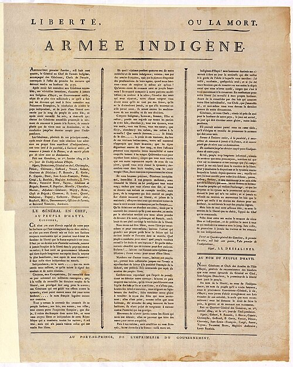

In 1789 the French colony of **[Saint-Domingue](kloom:e/saint-domingue)**, the western third of the island of Hispaniola, grew about 60 percent of the world's coffee and 40 percent of the sugar that France and Britain imported. More than 450,000 enslaved people lived there, against about 40,000 whites and some 28,000 to 30,000 free people of color. Deaths outran births: without new arrivals the enslaved population fell by two to five percent a year, so the planters kept buying, and between 1785 and 1790 the colony took about 37 percent of the whole Atlantic slave trade. Many historians, **[_The New York Times_](kloom:e/the-new-york-times)** reported in 2022, call it the most brutal colony in the world.

## The rising

The [French Revolution](kloom:e/french-revolution)'s promise that men "are born and remain free and equal in rights" reached the colony first as a quarrel between white planters and free people of color. Then, on the night of 21–22 August 1791, the enslaved people of the northern plain rose. Within weeks some 100,000 had joined; in two months they killed about 4,000 whites and burned some 180 sugar plantations, and white militias killed perhaps 15,000 Black people in return. This was the beginning of the **[Haitian Revolution](kloom:e/haitian-revolution)**.

Haitian tradition begins it a week earlier, at a vodou ceremony in a wood called **[Bois Caïman](kloom:e/bois-caiman)**, where the priest **[Dutty Boukman](kloom:e/dutty-boukman)** and a priestess, Cécile Fatiman, swore the conspirators to the rising. Boukman was real, and the French killed him and showed his head in Le Cap. But no first-hand account of the ceremony survives. It was first written down in 1814 by Antoine Dalmas, a white colonist, and its famous speech in 1824 by the Haitian writer Hérard Dumesle, from oral testimony; the scholar Léon-François Hoffmann doubts it happened at all.

## Abolition, decree by decree

Freedom came to the colony in steps, each forced by the war:

| Date            | What was decreed                                                              |
| --------------- | ----------------------------------------------------------------------------- |
| 29 August 1793  | Commissioner Sonthonax frees the enslaved of the northern province            |
| 31 October 1793 | Commissioner Polverel does the same in the west and south                     |
| 4 February 1794 | The Convention in Paris abolishes slavery in all French colonies              |
| 1801            | Toussaint Louverture's constitution: "servitude is therein forever abolished" |
| 20 May 1802     | A French law keeps slavery where abolition was never applied                  |
| 16 July 1802    | Slavery is restored in Guadeloupe                                             |
| 1 January 1804  | Haiti declares its independence                                               |

The commissioner **[Léger-Félicité Sonthonax](kloom:e/leger-felicite-sonthonax)** freed the north on the day that a formerly enslaved general, **[Toussaint Louverture](kloom:e/toussaint-louverture)**, issued a proclamation of his own: "Brothers and friends, I am Toussaint Louverture; perhaps my name has made itself known to you. I have undertaken vengeance." The Convention, in the **[Law of 4 February 1794](kloom:e/law-of-4-february-1794)**, declared in our translation "the slavery of the Blacks in all the colonies abolished", and decreed that all men living there, "without distinction of color", were French citizens. Toussaint, until then fighting for Spain, joined the Republic that May, drove the British out, and by 1801 ruled the whole island. His constitution kept the colony French, made him governor for life, and bound the freed workers to their plantations.

In November 1801 **[Napoleon](kloom:e/napoleon)** assured the people of Saint-Domingue, in our translation, "whatever your origin and your color, you are all French; you are all free and equal before God and before the Republic." Six months later, by the Council of State's record, he said: "I am for the whites, because I am white; I have no other reason, and that one is good." Charles Leclerc landed with an army in February 1802. Toussaint surrendered in May, was seized at a parley in June and shipped to France, saying, as it was later recorded, that his captors had cut down "only the trunk of the tree of liberty". He died in a cell in the Jura on 7 April 1803. **[Yellow fever](kloom:e/yellow-fever)** destroyed Leclerc's army and killed Leclerc, and his successor answered with mass drownings. Black and mixed-race soldiers rose again under **[Jean-Jacques Dessalines](kloom:e/jean-jacques-dessalines)**, who had been born enslaved, and beat the French at Vertières on 18 November 1803.

## Independence, and its price

On 1 January 1804, at Gonaïves, Dessalines declared the independence of Haiti, giving it an Arawak name for the island. "We have dared to be free," says the **[Haitian Declaration of Independence](kloom:e/haitian-declaration-of-independence)**, in Laurent Dubois and John Garrigus's translation, "let us be thus by ourselves and for ourselves." No printed copy was known until 2010, when the historian Julia Gaffield found one in Britain's National Archives. The same text vowed death to anyone "born French" who set foot on Haiti. Between February and April 1804, on Dessalines's orders, soldiers killed most of the French who remained: between 3,000 and 5,000 people by one estimate, as many as 7,000 by another. The **[1804 Haitian massacre](kloom:e/1804-haitian-massacre)** is called genocide by the historian Philippe Girard; others, among them Adam Jones and Dirk Moses, call it a "subaltern genocide", the destruction of former oppressors by the oppressed.

France did not recognize Haiti until 1825, when Charles X sent warships to demand 150 million francs for the planters' lost property, the people they had owned included. The first of five installments was about six times the Haitian government's revenue that year, so Haiti borrowed from French banks to pay it. The **[Haitian independence debt](kloom:e/haitian-independence-debt)** was cut to 90 million in 1838. The _Times_'s investigation of 2022 found that Haitians paid about 112 million francs, some $560 million today, the last loans taken to pay it settled in 1947. Kept at home, it reckoned, that money would have added $21 billion to Haiti's economy, and as much as $115 billion had Haiti grown like its neighbors; all but one of the fifteen economists it consulted accepted the lower figure or called it conservative. France repealed the ordinance in 2016 and has offered no reparations. Slavery in France's remaining colonies, Guadeloupe and Martinique among them, lasted until 1848, the year of the next frame.
