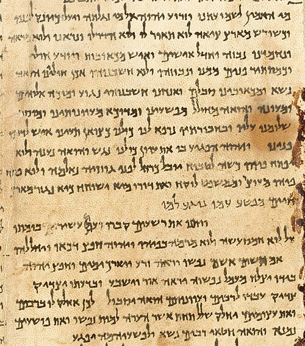

In 587 or 586 BC, in the nineteenth year of **[Nebuchadnezzar II](kloom:e/nebuchadnezzar-ii)**, says the Second Book of Kings, the captain of the Babylonian guard came to **[Jerusalem](kloom:e/jerusalem)** "and he burnt the house of the LORD, and the king's house, and all the houses of Jerusalem." The **Kingdom of Judah** ended, and its leading families were marched to **[Babylon](kloom:e/babylon)**. The Bible's own counts disagree: Kings has ten thousand captives from an earlier siege, in 597, alone; Jeremiah, 4,600 in three deportations. Clay tablets from Nebuchadnezzar's palace record the oil issued to "Ya'u-kīnu, king of the land of Yahudu", the exiled King Jehoiachin, and his five sons.

In 539 BC **[Cyrus the Great](kloom:e/cyrus-the-great)**, founder of the **[Achaemenid Empire](kloom:e/achaemenid-empire)**, took Babylon, and the Book of Ezra says he let the exiles go home to rebuild their temple. His own clay **Cyrus Cylinder** speaks of returning peoples and gods to their homes, but names no Jews. Out of the **[Babylonian captivity](kloom:e/babylonian-captivity)** and the return came the **[Hebrew Bible](kloom:e/hebrew-bible)** much as we have it, the scriptures that **[Judaism](kloom:e/judaism)** kept and Christianity inherited as its Old Testament.

## Three parts, many hands

Jews call it the Tanakh, from the initials of its three parts: the **Torah**, "instruction", the five books of Moses; the Prophets; and the Writings, twenty-four books in all. Tradition gave the Torah to Moses; scholars, reading its doubled stories and its shifts of style and of the name it gives God, to many hands. The **documentary hypothesis**, as **Julius Wellhausen** set it out in 1878, found four sources: J and E, of the tenth and ninth centuries BC, D, the law code of King Josiah's reign around 620 BC, and P, a priestly source of the sixth century. That consensus broke in the 1970s, when John Van Seters and others dated J to the exile and doubted E; most scholars now date the finished Torah to the Persian period, about 450 to 350 BC. Archaeology supports little of the patriarchs or the exodus, but from the ninth century BC outside records match the Bible's kings, as the Babylonian tablets do.

## Law from God

Here the lawgiver is not a king but God, and the law is a covenant with a whole people. The **[Ten Commandments](kloom:e/ten-commandments)** of Exodus 20 begin, in the King James Version, "I am the LORD thy God, which have brought thee out of the land of Egypt, out of the house of bondage," and then use a form the Babylonian stele never does: "Thou shalt not kill." In 1934 the German scholar Albrecht Alt named the two forms: _casuistic_ law, "if a man does this, then that", and _apodictic_ law, the bare command. The **[Covenant Code](kloom:e/covenant-code)** that follows, Exodus 21–23, returns to cases, and beside the **[Code of Hammurabi](kloom:e/code-of-hammurabi)** (in L. W. King's 1910 translation) it reads like a revision:

| Case                      | Laws of Hammurabi                                     | Covenant Code                                                             |
| ------------------------- | ----------------------------------------------------- | ------------------------------------------------------------------------- |
| A debt slave              | 117: serves three years, "in the fourth year" is free | 21:2: "six years he shall serve: and in the seventh he shall go out free" |
| An eye put out            | 196: "his eye shall be put out"                       | 21:24: "Eye for eye, tooth for tooth"                                     |
| A slave's eye             | 199: "he shall pay one-half of its value"             | 21:26: "he shall let him go free for his eye's sake"                      |
| A known gorer kills a man | 251: the owner "shall pay one-half a mina"            | 21:29: "his owner also shall be put to death"                             |
| It kills a slave          | 252: "one-third of a mina"                            | 21:32: "thirty shekels of silver"                                         |

Both know the **[eye for an eye](kloom:e/eye-for-an-eye)**, but the Covenant Code kills where Hammurabi fines, and frees the blinded slave where Hammurabi pays his master. Most scholars credit a shared Near Eastern legal tradition; David P. Wright argued in 2009 that the Covenant Code is "directly, primarily, and throughout dependent upon the Laws of Hammurabi."

## One God, and justice

Israel was to worship its God alone, but the claim that no other god exists at all is first plain in the exile, in the anonymous prophet of Isaiah 40 to 55: "I am the first, and I am the last; and beside me there is no God." Earlier, in the eighth century BC, the herdsman-prophet **Amos** had condemned those who "sold the righteous for silver, and the poor for a pair of shoes", and had God reject their feasts: "But let judgment run down as waters, and righteousness as a mighty stream."

## Scripture in Greek

The **synagogue**, a place to pray and hear the law read, may have begun in the exile; its first firm evidence is inscriptions of the third century BC in Ptolemaic Egypt, whose Greek-speaking Jews needed a Greek law. The **[Septuagint](kloom:e/septuagint)**, the Torah translated in or near **Alexandria** in the third century BC, takes its name from a legend in the **Letter of Aristeas**: seventy-two elders, sent at the request of **Ptolemy II Philadelphus**, finished "in seventy-two days, as though this coincidence had been intended" (H. St. J. Thackeray's translation, 1917). It became the early Church's Greek Old Testament. Around AD 400 Jerome went back to the Hebrew for his Latin Vulgate, the text the Gutenberg Bible would print.

## How old the words are

Until 1947 the oldest Hebrew Bibles were codices of the tenth century AD. That winter Bedouin shepherds found scrolls in a cave near Qumran, by the Dead Sea; by 1956 eleven caves had given up 981 manuscripts, mostly fragments, in carbon ink made chiefly of lamp soot. About two-fifths of the **[Dead Sea Scrolls](kloom:e/dead-sea-scrolls)** are biblical, every book but Esther.

The **[Isaiah Scroll](kloom:e/isaiah-scroll)**, seventeen sheets sewn into a roll 7.34 meters long, holds the whole book in 54 columns. Radiocarbon dating and its handwriting put it around 125 BC, a thousand years before those codices. Millar Burrows found it "a matter for wonder that through something like a thousand years the text underwent so little alteration"; Paul Kahle answered that its many variants showed Hebrew Bibles before they were made to conform.

| Book        | Copies at Qumran | In the later canon |
| ----------- | ---------------: | ------------------ |
| Psalms      |               39 | yes                |
| Deuteronomy |               33 | yes                |
| 1 Enoch     |               25 | no                 |
| Genesis     |               24 | yes                |
| Isaiah      |               22 | yes                |
| Jubilees    |               21 | no                 |
| Exodus      |               18 | yes                |
| Leviticus   |               17 | yes                |

1 Enoch and Jubilees never became Jewish scripture: the canon was still open. The plate draws the scroll to scale. The next frame goes west, to Athens, where in 508 BC citizens took power themselves.
