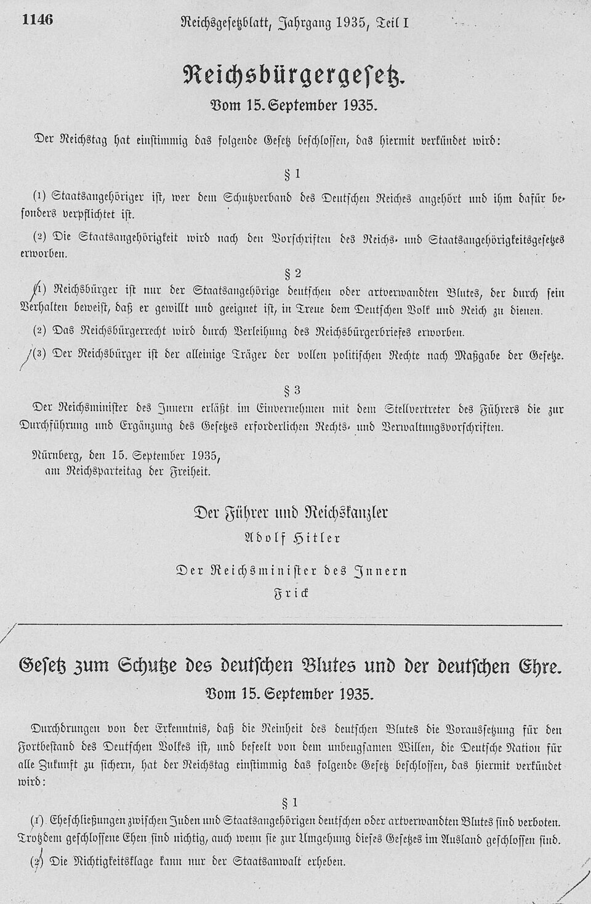

On 7 April 1933, ten weeks after **[Adolf Hitler](kloom:e/adolf-hitler)** became chancellor, **[Nazi Germany](kloom:e/nazi-germany)** passed a law ordering civil servants "not of Aryan descent" into retirement. Judges, teachers and professors lost their posts, the mathematician **Emmy Noether** among them. Twelve years later about six million Jews, two in every three in Europe, had been murdered by the German state and its allies and collaborators. That murder, **[the Holocaust](kloom:e/the-holocaust)** (in Hebrew the _Shoah_), was not one decision but a series of steps, and the officials who took them wrote them down.

## Step by step

| Date               | Step               | What it did                                                                            |
| ------------------ | ------------------ | -------------------------------------------------------------------------------------- |
| 7 April 1933       | Civil Service Law  | Retired "non-Aryan" officials                                                          |
| 15 September 1935  | Nuremberg Laws     | Citizenship only for "German or kindred blood"; marriage of Jews and Germans forbidden |
| 9–10 November 1938 | Kristallnacht      | Over 1,400 synagogues and prayer rooms wrecked; 30,000 Jewish men sent to camps        |
| 1939–1941          | Ghettos            | Jews of occupied Poland shut into sealed quarters                                      |
| From June 1941     | Einsatzgruppen     | Mass shootings behind the army in the Soviet Union                                     |
| 20 January 1942    | Wannsee Conference | The ministries enlisted in the "final solution"                                        |
| December 1941–1944 | Killing centers    | Gas chambers at Chełmno, Bełżec, Sobibór, Treblinka and Auschwitz-Birkenau             |

The **[Nuremberg Laws](kloom:e/nuremberg-laws)** of 1935 were printed in the Reich's law gazette, and the American prosecutors at Nuremberg translated them in 1946: "Marriages between Jews and nationals of German or kindred blood are forbidden." A citizen was "only that subject, who is of German- or kindred blood". After the pogrom of 9 November 1938, **[Kristallnacht](kloom:e/kristallnacht)**, the Jews of Germany were fined a billion Reichsmarks for the damage done to them. The same machinery turned on other victims. From 1939 the "euthanasia" program, **[Aktion T4](kloom:e/aktion-t4)**, gassed patients from asylums, and many of its staff went on to the killing centers in occupied Poland.

When Germany invaded the Soviet Union in June 1941, four **[Einsatzgruppen](kloom:e/einsatzgruppen)**, mobile units of the SS and police, followed the army and shot Jews: first men, by August women and children too. They counted. At **Babi Yar**, a ravine at Kyiv, by their own Operational Situation Report, they shot 33,771 Jews on 29 and 30 September 1941.

## Ninety minutes at Wannsee

On 20 January 1942 **Reinhard Heydrich** of the SS chaired a meeting of fifteen officials of the ministries, the party and the SS at a villa by the lake, the **[Wannsee Conference](kloom:e/wannsee-conference)**. **Adolf Eichmann** wrote the minutes in office language. "Emigration has now been replaced by evacuation of the Jews to the East," they say, and "roughly eleven million Jews will be taken into consideration", Britain's and Ireland's among them. In the House of the Wannsee Conference's translation, those fit to work would build roads: "In the process, a large portion will undoubtedly drop out through natural reduction." Thirty copies were made. Only the sixteenth survived, found in Foreign Office files in 1947. Historians such as Peter Longerich read the meeting not as the decision, which had been taken by then, but as the SS taking charge of it.

## How we know

No single document counts every death. One that counts many is a radio message of 11 January 1943 from **Hermann Höfle**, on the staff of Operation Reinhard, the murder of the Jews of occupied Poland. Its "arrivals" were people killed. It was enciphered on the **Enigma**, read at **[Bletchley Park](kloom:e/bletchley-park)**, filed as miscellaneous, and recognized only in 2001, by Peter Witte and Stephen Tyas:

| Camp in the telegram | "Arrivals" to 31 December 1942 |
| -------------------- | -----------------------------: |
| L, Lublin (Majdanek) |                         24,733 |
| B, Bełżec            |                        434,508 |
| S, Sobibór           |                        101,370 |
| T, Treblinka         |                        713,555 |
| Together             |                      1,274,166 |

The decrypt reads 71,355 for Treblinka, a digit dropped; by our arithmetic only 713,555 gives the total, which matches the report of Himmler's statistician, Richard Korherr.

Historians count two ways. The demographic method compares prewar censuses with postwar populations; the documentary method adds up the killers' records. **Raul Hilberg**, from the documents, reached 5.1 million; the demographer Jacob Leschinsky 5.95 million; later studies 5.59 to 5.86 million and 5.29 to 6 million. Yad Vashem has gathered the names of more than 4.7 million victims. Survivors testified at the **[Nuremberg trials](kloom:e/nuremberg-trials)** and at Eichmann's trial in Jerusalem in 1961, and gave over 50,000 recorded interviews to Steven Spielberg's Shoah Foundation from 1994 to 1999. The liberators wrote too. "The things I saw beggar description," **Dwight D. Eisenhower** told George Marshall after Ohrdruf on 15 April 1945; he went, he said, "to give firsthand evidence of these things if ever, in the future, there develops a tendency to charge these allegations merely to 'propaganda.'"

| Victims, by the US Holocaust Memorial Museum | Number                            |
| -------------------------------------------- | --------------------------------- |
| Jews                                         | 6 million                         |
| Soviet prisoners of war                      | around 3.3 million                |
| Non-Jewish Poles                             | around 1.8 million                |
| Serb civilians, killed by Croatia's Ustaša   | more than 310,000                 |
| People with disabilities                     | 250,000–300,000                   |
| Roma and Sinti                               | at least 250,000, perhaps 500,000 |

## One voice

**[Primo Levi](kloom:e/primo-levi)**, a chemist from Turin, was deported from the Fossoli camp in February 1944 with about 650 Italian Jews to **[Auschwitz](kloom:e/auschwitz-concentration-camp)**; he was one of twenty of them to come back. Of his first day in the camp he wrote: "Then for the first time we became aware that our language lacks words to express this offence, the demolition of a man."

## Resisting, rescuing, standing by

On 19 April 1943 about a thousand fighters in the **[Warsaw Ghetto](kloom:e/warsaw-ghetto)**, from which more than a quarter of a million people had been sent to Treblinka the summer before, rose against the SS and held out for four weeks; by the SS commander's count 56,065 Jews were killed or captured. Marek Edelman, one of their commanders, said they fought "not to allow the Germans alone to pick the time and place of our deaths". In October 1943 the Danish resistance and ordinary Danes ferried some 7,500 of Denmark's 8,000 Jews to Sweden. Elsewhere it went the other way. Some 200,000 to 250,000 Germans took part in the killing directly; it needed the consent, active or tacit, of millions of Germans and non-Germans, and at Kristallnacht most onlookers watched in silence.

In 1944 the Polish Jewish lawyer **[Raphael Lemkin](kloom:e/raphael-lemkin)**, who lost 49 relatives, named the crime _genocide_, from Greek _genos_, a people, and Latin _-cide_, killing. The **[Genocide Convention](kloom:e/genocide-convention)** was adopted on 9 December 1948, a day before the Universal Declaration of Human Rights, which the next frame takes up.
