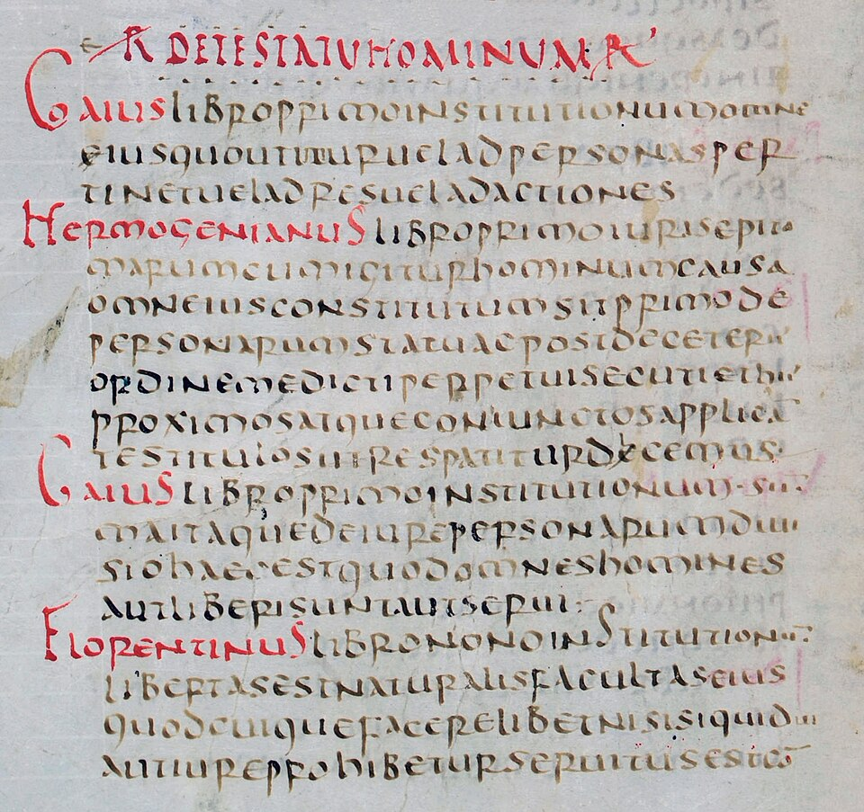

Fifty years after the last emperor in the West was deposed, the empire was still Roman in Constantinople. Its people called themselves _Romaioi_, Romans; "Byzantine" is a name modern scholars gave them after it had ended. **[Justinian I](kloom:e/justinian-i)**, emperor from 527 to 565, was a Latin speaker from a peasant family in the Balkans, and he set out to restore the empire: its law, its churches and, by war, its lost western provinces. The law came first, and lasted longest.

## Fifty books out of two thousand

Roman law had grown for a thousand years in two piles: emperors' statutes, and the books of the jurists who interpreted the law, chiefly in the second and third centuries. Justinian's minister **[Tribonian](kloom:e/tribonian)** took on both. A first Code of imperial statutes was issued on 7 April 529. In December 530 Justinian ordered the jurists' books cut down too, and Tribonian gathered sixteen men to do it: one official, four law professors and eleven advocates. The decree that gave it force in December 533 tells the result in numbers. In C. H. Monro's 1904 translation, Tribonian had found "nearly two thousand books written by the old lawyers, and more than three million lines", all of which had to be read and weighed, and the commission had brought "everything of great importance" into fifty books "in the space of about one hundred and fifty thousand lines". By our arithmetic, about one line in twenty survived. They called it the **[Digest](kloom:e/digest-roman-law)**.

It was a book made of quotations, and it kept their sources. "Everyone of the old lawyers who wrote on law has been mentioned in our Digest," the decree says, and each extract is headed by its author, his work and the book it came from. About two-fifths of it is Ulpian. The commissioners were also free to cut and rewrite, and the decree forbade anyone to compare their text with the originals, or to write commentaries on it. The whole **[Corpus Juris Civilis](kloom:e/corpus-juris-civilis)**, as it was later called, had four parts:

| Part       | Issued           | What it holds                             |
| ---------- | ---------------- | ----------------------------------------- |
| Code       | 529; revised 534 | Emperors' statutes, in twelve books       |
| Digest     | December 533     | Extracts from the jurists, in fifty books |
| Institutes | November 533     | A textbook for students, in four books    |
| Novels     | After 534        | New laws issued after the Code            |

The Institutes open with a line taken from Ulpian, in J. B. Moyle's translation: "Justice is the set and constant purpose which gives to every man his due." Two titles later they divide the law of persons into free men and slaves, and define slavery as "an institution of the law of nations, against nature subjecting one man to the dominion of another." The manuscript page is the same passage in the Digest's oldest copy, with Gaius and Florentinus named in red.

## The dome on four triangles

In January 532 the Blues and Greens, the chariot-racing factions of the capital, rose together in the **[Nika riots](kloom:e/nika-riots)** and burned the city's center, the cathedral among it. The court debated flight by sea. The historian **[Procopius](kloom:e/procopius)**, who was there, gives the empress **[Theodora](kloom:e/theodora-wife-of-justinian-i)** a speech that held him: "royalty is a good burial-shroud". The rising ended in the Hippodrome, where, Procopius says, more than thirty thousand were killed. Procopius praised the couple in his public histories and savaged them in the _Secret History_, which was unknown until a copy turned up in the Vatican Library in 1623, and neither portrait can be taken whole.

Within weeks Justinian began a new cathedral, **[Hagia Sophia](kloom:e/hagia-sophia)**, dedicated on 27 December 537. Its designers were mathematicians. **[Anthemius of Tralles](kloom:e/anthemius-of-tralles)** wrote on burning mirrors and conic sections, and **[Eutocius of Ascalon](kloom:e/eutocius-of-ascalon)** dedicated his commentary on Apollonius' _Conics_ to him; **[Isidore of Miletus](kloom:e/isidore-of-miletus)** taught geometry and edited Archimedes. They set a dome about 31 meters across over a square, on four arches, and filled the corners between the arches with what Procopius, in Dewing's translation, called "four triangles", curving up to a circle. Upon that rests the dome, which "seems not to rest upon solid masonry, but to cover the space with its golden dome suspended from Heaven." The Pantheon's dome sits on a solid drum of wall; this one sits on four points. The plate draws the geometry: the triangles, now called pendentives, are what is left of one sphere when the four sides of the square cut it. The first dome was too flat. After earthquakes it fell in 558, and Isidore's nephew rebuilt it 6.25 meters higher.

## Rome again, briefly

Justinian's general Belisarius took Vandal Africa in 533–534, and Ostrogothic Italy was won back after a war of nearly twenty years. In 541 plague reached Egypt, and the next year Constantinople, where Procopius counted five thousand dead a day and then ten thousand. Ancient DNA has shown it was _Yersinia pestis_, the bacterium of the Black Death. How much the **[Plague of Justinian](kloom:e/plague-of-justinian)** cost the empire is disputed: Lee Mordechai and Merle Eisenberg argue its toll has been exaggerated, and others, among them Peter Sarris, reject their reading. Justinian was also a persecutor: his laws barred pagans, Jews, Samaritans and heretics from office and closed their places of worship.

## The book that came back

In the West the Digest was all but forgotten. A copy made within a generation of 533, the **[Littera Florentina](kloom:e/littera-florentina)**, was at Amalfi and then Pisa, and in the late eleventh century the Digest began to be taught at Bologna, where **[Irnerius](kloom:e/irnerius)** explained it in glosses between the lines. From Bologna it spread through Europe's universities and courts, and it is still the foundation of the civil law of continental Europe and the countries that took their codes from it. The universities themselves are the story of the frame on Thomas Aquinas.
